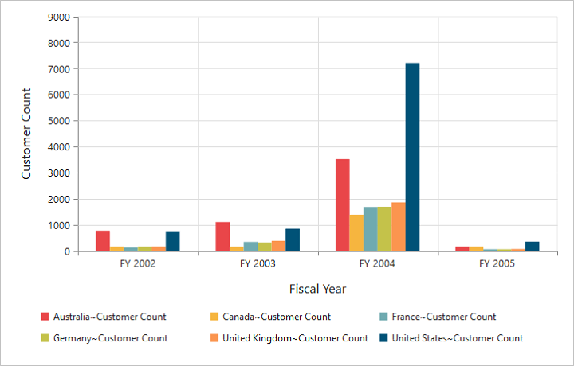

#Dimensions

##Set size in percentage

You can customize the OlapChart dimension by setting the width and height of the widget in percentage.



//Set size to Chart container
@Html.EJ().Olap().OlapChart("OlapChart1").Url(Url.Content("~/wcf/OlapChartService.svc")).Size(size => size.Height("80%").Width("80%"))



##Set size in pixels

You can customize the OlapChart dimension by setting the width and height of the widget in pixels.



//Set size to Chart container
@Html.EJ().Olap().OlapChart("OlapChart1").Url(Url.Content("~/wcf/OlapChartService.svc")).Size(size => size.Height("460px").Width("950px"))



 

##Responsive

OlapChart widget supports responsive rendering based on the target device (desktop & tablet) resolution. It supports resolution upto 1024x600. You can enable responsiveness in OlapChart by setting `isResponsive` property to true.



//Enable responsiveness to change the Chart size dynamically.
@Html.EJ().Olap().OlapChart("OlapChart1").Url(Url.Content("~/wcf/OlapChartService.svc")).Size(size => size.Height("460px").Width("950px")).IsResponsive(true)



_Normal View_

_ResponsiveView_