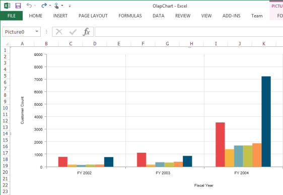
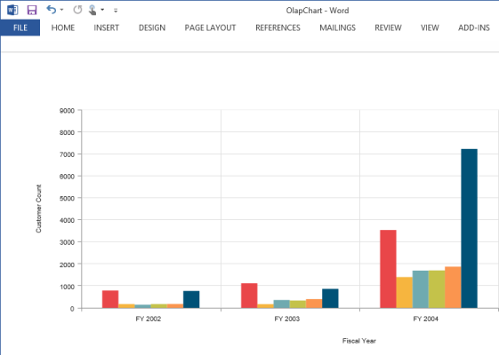
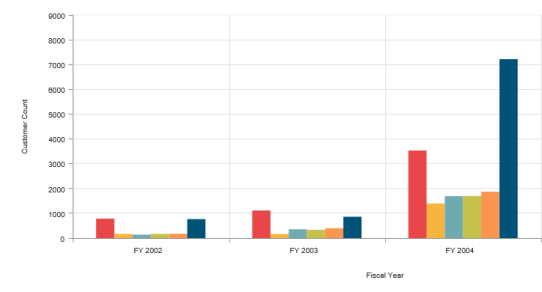

# Exporting

The OLAP Chart control can be exported to the following formats:

* Excel
* Word
* PDF
* CSV
* PNG
* EMF
* GIF
* JPG
* BMP



@Html.EJ().Olap().OlapChart("OlapChart1").Url(Url.Content("~/wcf/OlapChartService.svc"))

@Html.EJ().Button("Button1").ClientSideEvents(clientSideEvents => { clientSideEvents.Click("ExportBtnClick"); }).Text("Export")

function ExportBtnClick(args) 
{

    var chartObj = $('#OlapChart1').data("ejOlapChart");

    chartObj.exportOlapChart(ej.olap.OlapChart.ExportOptions.Excel);   

}


The Export type that is to be mentioned in the parameter takes any one of the following enumerated values:

* Excel
* Word
* PDF
* CSV
* PNG
* EMF
* GIF
* JPG
* BMP

The following code example of the service method needs to be added in-order to perform exporting in the OlapChart.

public void Export(System.IO.Stream stream)

{

    System.IO.StreamReader sReader = new System.IO.StreamReader(stream);

    string args = System.Web.HttpContext.Current.Server.UrlDecode(sReader.ReadToEnd());

    OlapDataManager DataManager = new OlapDataManager(connectionString);

    string fileName = "OlapChart";

    htmlHelper.ExportOlapChart(DataManager, args, fileName,

    System.Web.HttpContext.Current.Response);

}



Exported OlapChart in Word
{:.caption}

