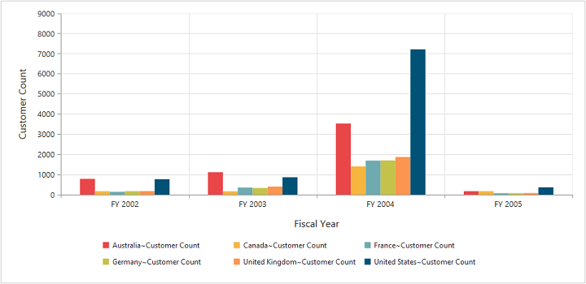

# Getting Started

## Creating a simple application with OlapChart 

This section covers the information required to create a simple OlapChart bound to OLAP datasource.

N> ASP.NET MVC Web Application will contain a service that transfers data to server-side, processes and returns back to client-side for control rendering and re-rendering. The service utilized for communication could be either WCF or WebAPI based on user requirement.

###Project Initialization

Create a new **ASP.NET MVC Web Application** using Visual Studio IDE and name the project as **“OlapChartDemo”**. 

Select the View engine as **‘Razor’** and Project template as **‘Internet Application’** and finally click **OK** button to create an application.

Now add the following dependency libraries as references into your MVC Web Application. In order to add them to your application, right-click on **References** in Solution Explorer and select **Add Reference**. Now in the **Reference Manager** dialog, under **Assemblies > Extension**, the following Syncfusion libraries will be found.

* Microsoft.AnalysisServices.AdomdClient.dll
* Syncfusion.Compression.Base.dll
* Syncfusion.Linq.Base.dll
* Syncfusion.Olap.Base.dll
* Syncfusion.EJ.dll
* Syncfusion.EJ.MVC.dll
* Syncfusion.EJ.Olap.dll
* Syncfusion.XlsIO.Base.dll
* Syncfusion.DocIO.Base.dll
* Syncfusion.Pdf.Base.dll

N> If any version of SQL Server Analysis Service (SSAS) or Microsoft ADOMD.NET utility is installed, then the location of Microsoft.AnalysisServices.AdomdClient library is [system drive:\Program Files (x86)\Microsoft.NET\ADOMD.NET].

The version of Syncfusion libraries based on .NET framework and MVC version are classified below. For example, 13.3 version is illustrated as,

<table>
<tr>
<th>
MVC Version</th><th>
MVC Version of Syncfusion dlls</th><th>
Base Version of Syncfusion dlls</th><th>
System.Web.Mvc</th><th>
System.Web.WebPages</th>
</tr>
<tr><td>
MVC3</td><td>
{{ site.mvc3releaseversion }}</td><td>    
{{ site.35esreleaseversion }}</td><td>
3.0</td><td>
1.0</td>
</tr>
<tr><td>
MVC4</td><td>
{{ site.mvc4releaseversion }}</td><td>    
{{ site.40esreleaseversion }}</td><td>
4.0</td><td>
2.0</td>
</tr>
<tr><td>
MVC5</td><td>
{{ site.mvc5releaseversion }}</td><td>    
{{ site.45esreleaseversion }}</td><td>
5.0</td><td>
3.0</td>
</tr>
</table>

Register the referenced assemblies in Web.config files available inside Views folder and also at the root of the application.



<compilation debug="true" targetFramework="4.5">
    <assemblies> 
        …… 
        ……
        <add assembly="Syncfusion.EJ, Version= {{ site.40esreleaseversion }}, Culture=neutral, PublicKeyToken=3d67ed1f87d44c89" />
        <add assembly="Syncfusion.EJ.Olap, Version= {{ site.40esreleaseversion }}, Culture=neutral, PublicKeyToken=3d67ed1f87d44c89" />
        <add assembly="Syncfusion.EJ.Mvc, Version= {{ site.40esreleaseversion }}, Culture=neutral, PublicKeyToken=3d67ed1f87d44c89" />
        <add assembly="Syncfusion.Linq.Base, Version= {{ site.40esreleaseversion }}, Culture=neutral, PublicKeyToken=3d67ed1f87d44c89" />
        <add assembly="Syncfusion.Olap.Base, Version= {{ site.40esreleaseversion }}, Culture=neutral, PublicKeyToken=3d67ed1f87d44c89" />
        <add assembly="Syncfusion.Compression.Base, Version= {{ site.40esreleaseversion }}, Culture=neutral, PublicKeyToken=3d67ed1f87d44c89" />
        <add assembly="Syncfusion.Pdf.Base, Version= {{ site.40esreleaseversion }}, Culture=neutral, PublicKeyToken=3d67ed1f87d44c89" />
        <add assembly="Syncfusion.XlsIO.Base, Version= {{ site.40esreleaseversion }}, Culture=neutral, PublicKeyToken=3d67ed1f87d44c89" />
        <add assembly="Syncfusion.DocIO.Base, Version= {{ site.40esreleaseversion }}, Culture=neutral, PublicKeyToken=3d67ed1f87d44c89" /> 
    </assemblies>
</compilation>



Register the required namespaces in Web.config files available inside Views folder and also at the root of the application



<namespaces> 
  	……
  	……
    <add namespace="Syncfusion.MVC.EJ" />
    <add namespace="Syncfusion.JavaScript" /> 
</namespaces>



N> Registering assemblies and namespaces earlier helps to include the control in view page with the help of intellisense.

Set the **UnobtrusiveJavaScriptEnabled** property to false under **appSettings** tag in Web.config file at the root folder.
    


<configuration> 
  	…… 
  	……
    <appSettings> 
      	…… 
      	……
        <add key="UnobtrusiveJavaScriptEnabled" value="false" /> 
   </appSettings>
        
</configuration>



###Scripts and CSS Initialization

The scripts and style sheets that are mandatorily required to render OlapChart widget in a MVC Web Application are mentioned in an appropriate order below:

1.  ej.widgets.all.min.css
2.	jquery-1.10.2.min.js
3.	jquery.easing.1.3.min.js
4.	jquery.globalize.min.js
5.	ej.web.all.min.js 

[Click here](http://help.syncfusion.com/js/cdn) here to know more about scripts and style sheets available online (CDN Link).

Scripts and style sheets are referred under the **head** tag in **_Layout.cshtml** file which is found inside **Views > Shared folder**.
    


<head>
    <link href="http://cdn.syncfusion.com/{{ site.releaseversion }}/js/web/flat-azure/ej.web.all.min.css" rel="stylesheet" />
    
    
    
    
</head>



The script manager is initialized immediately after the `RenderBody()` function call in **_Layout.cshtml** file in-order to generate widget related scripts.



<body> 
  …… 
  …… 
  @RenderBody() @(Html.EJ().ScriptManager()) 
</body>



### Control Initialization

Before initializing, empty the contents of **Index.cshtml** file under **Views > Home** folder and add the following codes. Register the namespaces at the top of the page and then add the control.


    
@using Syncfusion.JavaScript.Olap;

 @Html.EJ().Olap().OlapChart("OlapChart1").Url(Url.Content("~/OlapChart")).Size(size => size.Height("460px").Width("950px")) 



The **“Url”** property in OlapChart widget points the service endpoint, where data are processed and fetched in the form of JSON. The services used in OlapChart widget as endpoint are WCF and WebAPI.

N> The above "Index.cshtml" contains WebAPI Url, which is, "~/OlapChart". If WCF service is used as endpoint, the Url would look like "~/OlapChartService.svc".

###WebAPI

**Adding a WebAPI Controller**

To add a WebAPI controller in an existing Web Application, right-click on the project in Solution Explorer and select **Add > New Item**. In the **Add New Item** window, select **WebAPI Controller Class** and name it as `OlapChartController.cs`, click Add.

Now, WebAPI controller is added into the application successfully with the file **“OlapChartController.cs”**.

N> While adding WebAPI Controller Class, name it with the suffix ‘Controller’ which is mandatory. For example, in this demo the controller is named as “OlapChartController”.

Next, remove all the existing methods such as “Get”, “Post”, “Put” and “Delete” present inside `OlapChartController.cs` file.



namespace OlapChartDemo
{
    public class OlapChartController: ApiController
    {
    
    }
}



**Adding the List of Namespaces**

The following are the list of namespaces to be added on top of the main class inside `OlapChartController.cs` file.



using System;
using System.Collections.Generic;
using System.Configuration;
using System.Linq;
using System.Net;
using System.Net.Http;
using System.Web;
using System.Web.Http;
using System.Web.Script.Serialization;
using Syncfusion.JavaScript.Olap;
using Syncfusion.Olap.Manager;
using Syncfusion.Olap.Reports;

namespace OlapChartDemo
{
    public class OlapChartController: ApiController
    {
    
    }
}



**Datasource Initialization**

Now, the connection string to connect OLAP Cube, OlapChart and JavaScriptSerializer instances are created immediately inside the main class in `OlapChartController.cs` file.



namespace OlapChartDemo
{
    public class OlapChartController: ApiController
    {
        OlapChart htmlHelper = new OlapChart();
        string connectionString = "Data Source=http://bi.syncfusion.com/olap/msmdpump.dll; Initial Catalog=Adventure Works DW 2008 SE;";
        JavaScriptSerializer serializer = new JavaScriptSerializer();
    }
}



**Service methods in WebAPI Controller**

Define the service methods inside OlapChartController class, found inside `OlapChartController.cs` file, created while adding WebAPI Controller Class to the application.



namespace OlapChartDemo
{
    public class OlapChartController: ApiController
    {
        OlapChart htmlHelper = new OlapChart();
        string connectionString = "Data Source=http://bi.syncfusion.com/olap/msmdpump.dll; Initial Catalog=Adventure Works DW 2008 SE;";
        JavaScriptSerializer serializer = new JavaScriptSerializer();
        [System.Web.Http.ActionName("InitializeChart")]
        [System.Web.Http.HttpPost]
        public Dictionary < string, object > InitializeChart(Dictionary < string, object > jsonResult)
            {
                OlapDataManager DataManager = new OlapDataManager(connectionString);
                DataManager.SetCurrentReport(CreateOlapReport());
                return htmlHelper.GetJsonData(jsonResult["action"].ToString(), DataManager);
            }
            [System.Web.Http.ActionName("DrillChart")]
            [System.Web.Http.HttpPost]
        public Dictionary < string, object > DrillChart(Dictionary < string, object > jsonResult)
            {
                OlapDataManager DataManager = new OlapDataManager(connectionString);
                DataManager.SetCurrentReport(Syncfusion.JavaScript.Olap.Utils.DeserializeOlapReport(jsonResult["olapReport"].ToString()));
                return htmlHelper.GetJsonData(jsonResult["action"].ToString(), DataManager, jsonResult["drilledSeries"].ToString());
            }
            [System.Web.Http.ActionName("Export")]
            [System.Web.Http.HttpPost]
        public void Export()
        {
            string args = HttpContext.Current.Request.Form.GetValues(0)[0];
            OlapDataManager DataManager = new OlapDataManager(connectionString);
            string fileName = "Sample";
            htmlHelper.ExportOlapChart(DataManager, args, fileName, System.Web.HttpContext.Current.Response);
        }
        private OlapReport CreateOlapReport()
        {
            OlapReport olapReport = new OlapReport();
            olapReport.Name = "Default Report";
            olapReport.CurrentCubeName = "Adventure Works";
            DimensionElement dimensionElementColumn = new DimensionElement();
            dimensionElementColumn.Name = "Customer";
            dimensionElementColumn.AddLevel("Customer Geography", "Country");
            MeasureElements measureElementColumn = new MeasureElements();
            measureElementColumn.Elements.Add(new MeasureElement
            {
                Name = "Customer Count"
            });
            DimensionElement dimensionElementRow = new DimensionElement();
            dimensionElementRow.Name = "Date";
            dimensionElementRow.AddLevel("Fiscal", "Fiscal Year");
            olapReport.SeriesElements.Add(dimensionElementRow);
            olapReport.CategoricalElements.Add(dimensionElementColumn);
            olapReport.CategoricalElements.Add(measureElementColumn);
            return olapReport;
        }
    }
}



**Configure routing in Global Application Class**

If Global.asax file is not found in your MVC Web Application then add a new one. To add a **Global.asax** in your existing MVC Web Application, right-click on the project in Solution Explorer and select **Add > New Item**. In the **Add New Item** window, select **Global Application Class** and name it as “Global.asax”, click **Add.**
 
Once the Global.asax file is created, remove all the existing code inside the “Application_Start” function. Then routing could be configured as shown in the following code example.



public class Global: System.Web.HttpApplication
{
    protected void Application_Start(object sender, EventArgs e)
    {
        GlobalConfiguration.Configuration.Routes.MapHttpRoute(name: "DefaultApi", routeTemplate: "{controller}/{action}/{id}", defaults: new
        {
            id = RouteParameter.Optional
        });
        AppDomain.CurrentDomain.SetData("SQLServerCompactEditionUnderWebHosting", true);
        RouteConfig.RegisterRoutes(RouteTable.Routes);
    }
}



Now, **OlapChart** is rendered with Customer Count over a period of fiscal years across different customer geographic locations.

 

###WCF

This section demonstrates the utilization of WCF service as endpoint binding OLAP datasource to a simple OlapChart. For more details on this topic, [click here](http://help.syncfusion.com/aspnetmvc/olapchart/data-binding#wcf).
