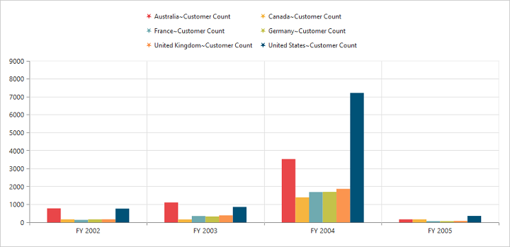
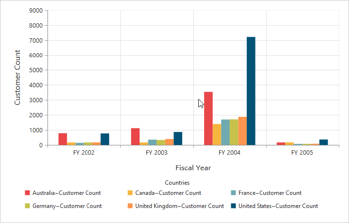

# Legend

Legend is a color code that helps to differentiate between chart items. Legend also has labels beside each color to indicate that it applies to information from Series 1, Series 2, and so on.

## Legend Symbol

In OlapChart, you can customize the legend symbol with different shapes like rectangle, circle, cross, diamond, pentagon, hexagon, star, ellipse, triangle etc. Default value of legend shape is “Rectangle”.



@Html.EJ().Olap().OlapChart("OlapChart1").Url("../wcf/OlapChartService.svc").Title(title
 => title.Text("OlapChart in Essential Studio")).Legend(legend => 
 legend.Visible(true).RowCount(3).Shape(ChartShape.Star)) 



## Legend Position

You can customize the legend position in top, bottom, left and right position of the Chart. Default value of legend position is “bottom”. 


@Html.EJ().Olap().OlapChart("OlapChart1").Url("../wcf/OlapChartService.svc").Legend(legend =>
legend.Visible(true).RowCount(3).Shape(ChartShape.Star).Position(LegendPosition.Top))



## Legend Arrangement

You can align the legend using alignment property of legend. This allows you to align the legend in center, far and near position of Chart Area. The Default value of legend alignment is “Center”.



@Html.EJ().Olap().OlapChart("OlapChart1").Url("../wcf/OlapChartService.svc").Legend(legend => legend.Visible(true).RowCount(3).Alignment(TextAlignment.Near))



## Legend Style 

You can draw and customize the outline of Chart legend using border property of legend. Default value of legend border color is “Transparent”.



@Html.EJ().Olap().OlapChart("OlapChart1").Url("../wcf/OlapChartService.svc").Legend(legend => 
legend.Visible(true).RowCount(3).Border(border=>border.Color("red").Width(2)))



## Legend Item 

Legend item is represented by an icon or image and a text. This gets rendered automatically corresponding to each Series in the OlapChart. You can customize the Legend item.



@Html.EJ().Olap().OlapChart("OlapChart1").Url("../wcf/OlapChartService.svc").Legend(legend => 
legend.Visible(true).RowCount(3).ItemStyle(ItemSize =>ItemSize.Border(border =>border.Color("green").Width(0.5))))



## Legend Text

You can customize the legend text - font family, font style, font weight and size using font property of legend. The following code illustrates this.



@Html.EJ().Olap().OlapChart("OlapChart1").Url("../wcf/OlapChartService.svc").Title(title => title.Text("OlapChart in Essential Studio")).Legend(legend => legend.Visible(true).RowCount(3).Shape(ChartShape.Star))



