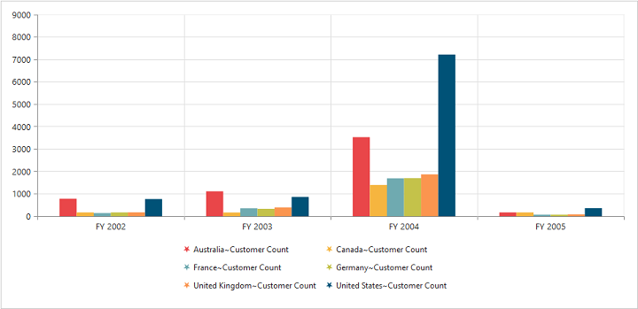

#Legend

##Legend Visibility

You can enable or disable legend using the `Visible` property inside the `legend` object. By default, legend is enabled in OlapChart.



//Legend Visibility set as true
@Html.EJ().Olap().OlapChart("OlapChart1").Url(Url.Content("~/wcf/OlapChartService.svc")).Size(size => size.Height("460px").Width("950px")).Legend(legend => legend.Visible(true))



 

##Legend Shape
You can customize the legend `Shape` in OlapChart widget to rectangle, circle, cross, diamond, pentagon, hexagon, star, ellipse, triangle etc. Default value of legend shape is “Rectangle”.



//Applying legend shape
@Html.EJ().Olap().OlapChart("OlapChart1").Url(Url.Content("~/wcf/OlapChartService.svc")).Size(size => size.Height("460px").Width("950px")).Legend(legend => legend.Visible(true).Shape(ChartShape.Star))



 

##Legend Position
By using the `Position` property, you can place the legend at top, bottom, left or right of the OlapChart. Default value of legend position is “bottom”.



//Place the legend at top of the Chart
@Html.EJ().Olap().OlapChart("OlapChart1").Url(Url.Content("~/wcf/OlapChartService.svc")).Size(size => size.Height("460px").Width("950px")).Legend(legend => legend.Visible(true).Shape(ChartShape.Star).Position(LegendPosition.Top))



 

##Legend Title
To add the legend title, you have to specify the title text in `title.Text` property.



//Add title to the Chart legend
@Html.EJ().Olap().OlapChart("OlapChart1").Url(Url.Content("~/wcf/OlapChartService.svc")).Size(size => size.Height("460px").Width("950px")).Legend(legend => legend.Visible(true).Title(title => title.Text("Countries")))



 

##Legend Alignment
You can align the legend to center, far and near based on its position in the Chart area using the `Alignment` option.
 


//Aligning the legend near to the Chart
@Html.EJ().Olap().OlapChart("OlapChart1").Url(Url.Content("~/wcf/OlapChartService.svc")).Size(size => size.Height("460px").Width("950px")).Legend(legend => legend.Visible(true).Shape(ChartShape.Star).Alignment(TextAlignment.Near))



##Legend Items - Size and Border
By using the legend `ItemStyle.width`, `ItemStyle.height` and `ItemStyle.border` properties, you can change the legend items - size and border.



//Changing legend items border, height and width
@Html.EJ().Olap().OlapChart("OlapChart1").Url(Url.Content("~/wcf/OlapChartService.svc")).Size(size => size.Height("460px").Width("950px")).Legend(legend => legend.Visible(true).ItemStyle(ItemSize => ItemSize.Border(border => border.Color("magenta").Width(1.5)).Height(12).Width(12)))



 
##Legend Border
By using the `Border` option in legend, you can customize border color and width.



//Setting border color and width to legend
@Html.EJ().Olap().OlapChart("OlapChart1").Url(Url.Content("~/wcf/OlapChartService.svc")).Size(size => size.Height("460px").Width("950px")).Legend(legend => legend.Visible(true).Border(border => border.Color("red").Width(2)))



##Legend Text
By using the `Font` option, you can customize the font family, font style, font weight and size of the legend text. 



///Customizing the legend text @Html.EJ().Olap().OlapChart("OlapChart1").Url(Url.Content("~/wcf/OlapChartService.svc")).Size(size => size.Height("460px").Width("950px")).Legend(legend => legend.Visible(true).Font(font => font.FontFamily("Segoe UI").FontWeight(ChartFontWeight.Bold).FontStyle(ChartFontStyle.Italic).Size("13px")))



