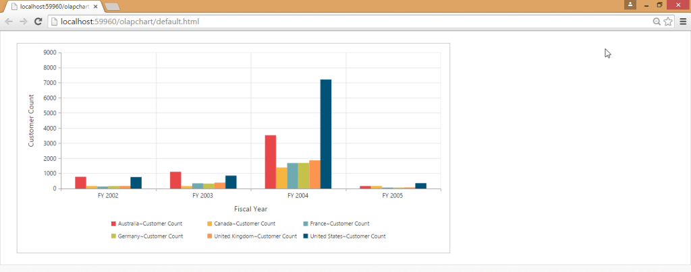
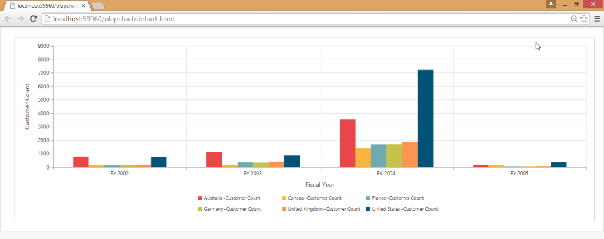

# Responsive Layout

Responsive layout is aimed at crafting sites to provide an optimal viewing experience - easy reading. It also provides navigation with a minimum of resizing, panning, and scrolling across a wide range of devices from tablet to desktop. To get responsive layout for OLAP Chart, enable IsResponsive API to true. By using this feature, you can achieve an effective view of the OLAP Chart control in all devices including desktops, tablets, mobiles, etc. 



@using Syncfusion.JavaScript;

@using Syncfusion.JavaScript.Olap;

@Html.EJ().Olap().OlapChart("OlapChart1").Url(Url.Content("~/wcf/OlapChartService.svc")).CommonSeriesOptions(comm 
=> { comm.Tooltip(tool => { tool.Visible(true); }); }).Size(size => 
size.Height("460px").Width("100%")).ClientSideEvents(
oEve => { oEve.Load("loadTheme"); }).IsResponsive(true)



