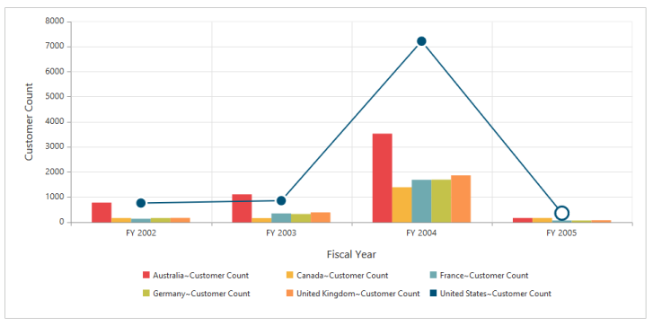

## Series

Series is a collection of series items that contain the actual data points to be displayed on the chart. Series type allows you to customize the chart type whose appearance/style is customized.

Series Type Customization

A combination Chart combines two or more series types in a single Chart. But there are some limitations in the combination Chart. They are:

1. Can’t combine Column and Bar series.
2. Pie Chart can’t be used with other series types.

[MVC]

@Html.EJ().Olap().OlapChart("OlapChart1").Url("../wcf/OlapChartService.svc").CommonSeriesOptions(comm => { comm.Type(SeriesType.Column).Tooltip(tool => { tool.Visible(true); }); }).Size(size => size.Height("460").Width("950")).ClientSideEvents(oEve => { oEve.SeriesRendering("onSeriesRenders"); })

{{ '' | markdownify }}
{:.image }

Series Points Customization

OlapChart series is customized using fill, border width and border color. The stroke-width of the line, spline series is customized using width property of series.  The series color is customized using fill property of series. The border color and width of the column/bar is customized using border property of series. And the column/bar chart are customized using the ‘fill’ and ‘border’ property of each point.

[MVC]

@Html.EJ().Olap().OlapChart("OlapChart1").Url("../wcf/OlapChartService.svc").CommonSeriesOptions(comm => { comm.Type(SeriesType.Column); }).ClientSideEvents(oEve => { oEve.SeriesRendering("onSeriesRenders"); })

