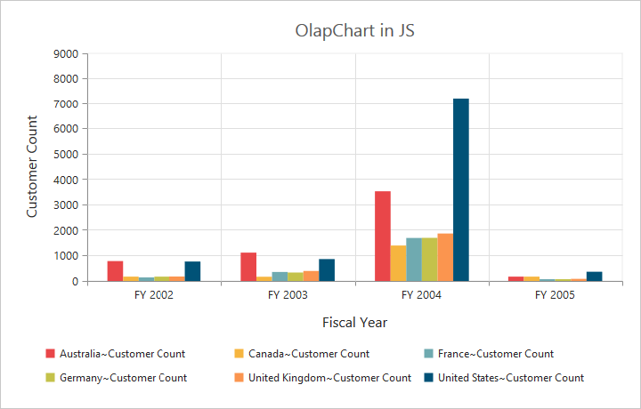

# Title

Title is the area on top of the Chart control that displays the text explaining the OlapChart data. Title text is displayed in a customizable format.  

## Setting value to Chart Title

Title property allows you to set the default title for a Chart as follows. 



@Html.EJ().Olap().OlapChart("OlapChart1").Url("../wcf/OlapChartService.svc").Title(title => 
title.Text("OLAP Chart in Essential Studio"))



## Title Text Customization 

You can customize the title text font using title.font property.



@Html.EJ().Olap().OlapChart("OlapChart1").Url("../wcf/OlapChartService.svc").Title(title => title.Text("OlapChart in Essential Studio")).ClientSideEvents(oEve => { oEve.Load("load"); })



