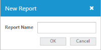
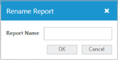
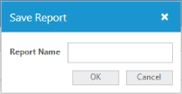
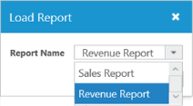

# Data Binding

OLAP Client control enables you to retrieve multidimensional data either from SSAS or from any XMLA provider and present the OLAP information in a meaningful way.

## SSAS

### Bind OLAP Client to the Offline Cube

The following code example illustrates how to connect to an offline cube.



string connectionString = @"DataSource= C:\Users\<UserName>\appdata\local\syncfusion\essentialstudio\x.x.x.x\Common\Data\OfflineCube\Adventure_Works_Ext.cub; Provider = MSOLAP;";

OlapDataManager DataManager = new OlapDataManager(connectionString);



### Bind OLAP Client to the SQL Server (Local)

The following code example illustrates how to connect to a local cube in SQL Server.



string connectionString = "Data source=localhost; Initial Catalog=Adventure Works DW;";

OlapDataManager DataManager = new OlapDataManager(connectionString);



## XML/A

XML for Analysis (XML/A) is a standard that allows the client applications to transfer multi-dimensional or OLAP data sources from an OLAP Server which is available online. The back and forth communication is done using the web standards – HTTP, SOAP, and XML. The query language used is MDX, which is most widely supported for reporting from multi-dimensional data stores.

### Use Case Scenarios

XML/A provides the most efficient way to access an OLAP database over the Internet.

### Connecting to SSAS Server (Online)

The following code example illustrates how to connect to the SSAS server available online.



static string connectionString = "Data Source=http://bi.syncfusion.com/olap/msmdpump.dll; Initial Catalog=Adventure Works DW 2008 SE;";   

OlapDataManager DataManager = new OlapDataManager(connectionString);



### Connect to Mondrian Server

The following code example illustrates how to connect to the Mondrian Server.

#### Add Report

Add a new report along with the existing report collection.

Replace the existing report name with the altered report name.

#### Remove Report

Removes the current report from the report collection. If only one report is available in the report list, it doesn’t remove it.

#### Save and Load Report

The OLAPReport collection bound to the OLAPClient component can be passed to a web service, to save the reports in a database. Similarly, the saved OLAPReport collection can be loaded back into the control. Two toolbar items have been added in the control to save and load an OLAPReport collection to the database and to the component respectively.

On clicking the Save icon, a dialog is displayed to enter the name with which the OLAP Report collection is to be saved. On clicking OK, the OLAP Report collection associated is passed to the web service and saved in the database connected with the name provided. 

Similarly, on clicking the load icon, a pop-up window is displayed, containing a drop-down with a list of saved OLAP Reports in the connected database. On selecting the name containing the OLAP Report collection and clicking OK, the selected OLAP Report collection is loaded into the control.

