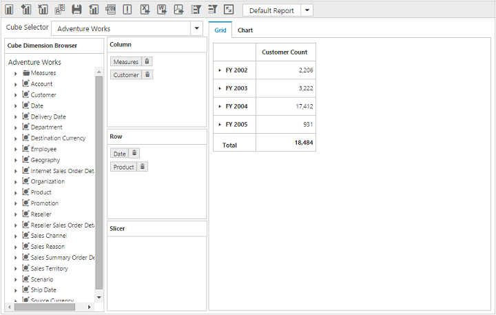

# Defer Update

Defer Update support will allow user to refresh the control only on-demand and not during every UI interaction.  To enable this functionality set the `enableDeferUpdate` property to "true".

The following code example explains on how to enable Defer Update in the OlapClient control.



    @Html.EJ().Olap().OlapClient("OlapClient1").Url(Url.Content("~/wcf/OlapClientService.svc")).EnableDeferUpdate(true).Title("OLAP Browser"))



_Before Defer Update_

_After Defer Update_

