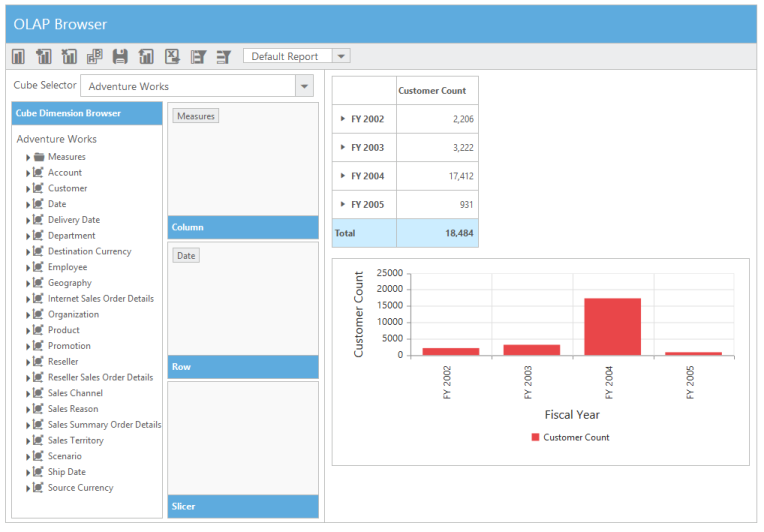
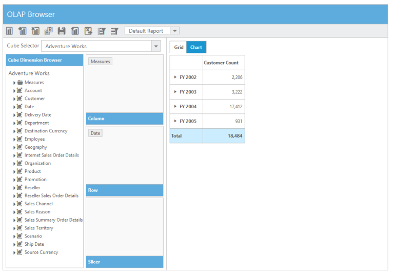
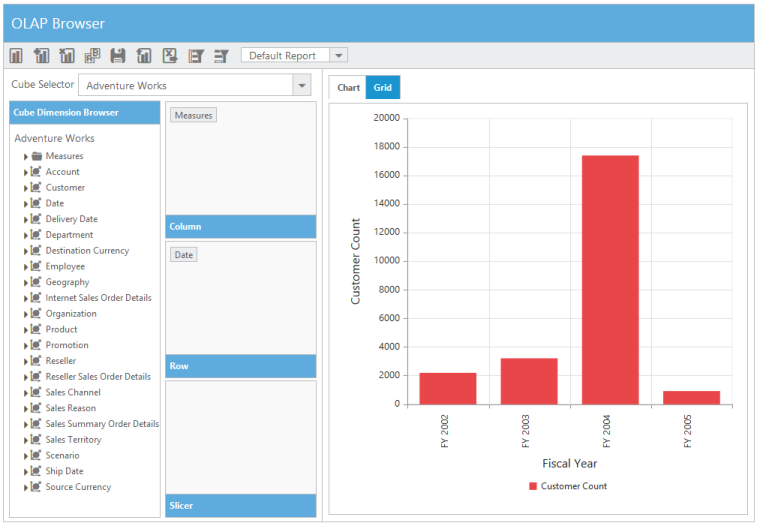
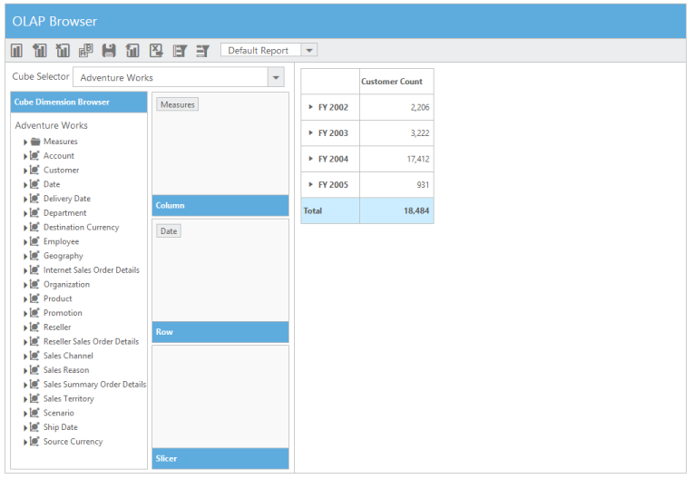
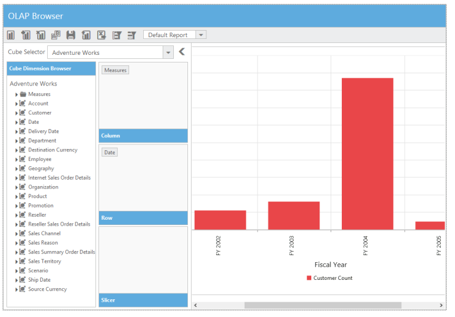
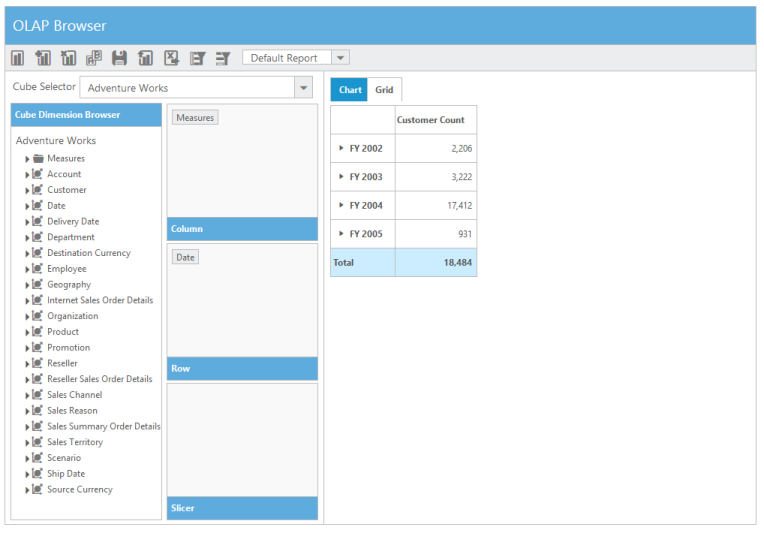
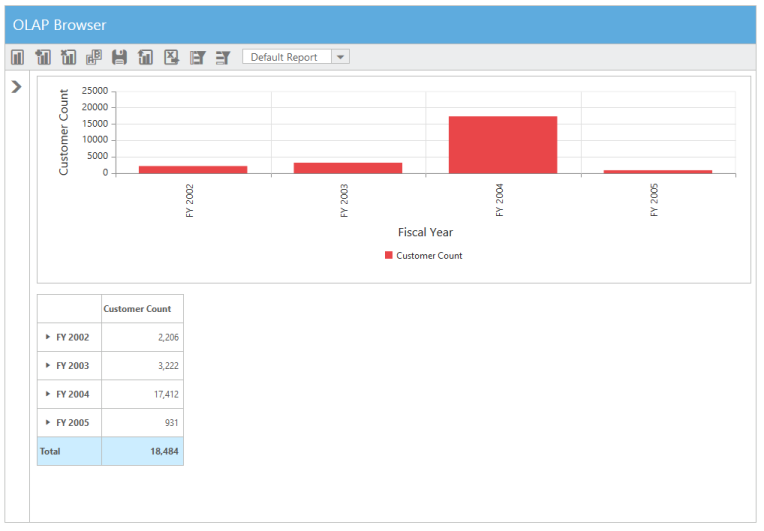
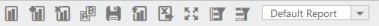
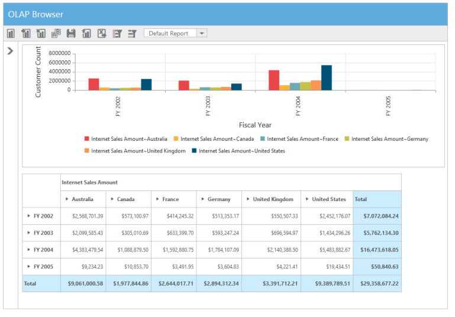

## Layout Customization

OLAP Client UI comes with options to customize the Grid and Chart layout, such as:

1. Default View - Sets the start-up control. 
2. Tab/Tile View – Tab or Tile view to visualize the controls separately or in the same layout. 
3. Hide Grid/Chart - Hides any one of the control by default. 
4. Toggle Panel – Turns On/Off the visibility of Cube Browser and Axis Element Builder panels.  
5. Maximized/Fullscreen view of the control(s) providing a precise view.
### Display View

Tile View

In Tile View representation, both Grid and Chart will be displayed one over the other, in the same layout. 

[MVC]

@Html.EJ().Olap().OlapClient("OlapClient1").Url("../wcf/OlapClientService.svc").Title("OLAP Browser").DisplaySettings(disp => { disp.ControlPlacement(OlapClientControlPlacement.Tile); });

{{ '' | markdownify }}
{:.image }

Tab View

In Tab View representation, both Grid and Chart will be displayed in a separate tab.

[MVC]

@Html.EJ().Olap().OlapClient("OlapClient1").Url("../wcf/OlapClientService.svc").Title("OLAP Browser").DisplaySettings(disp => { disp.ControlPlacement(OlapClientControlPlacement.Tab); });

{{ '' | markdownify }}
{:.image }

### Default View

After you set defaultView property either to Chart or Grid, the corresponding control is selected for initial view/visualization, within the layout when the OLAPClient control is loaded for the first time. 

Chart View

To display/visualize Chart control by default, set defaultView to Chart.

[MVC]

@Html.EJ().Olap().OlapClient("OlapClient1").Url("../wcf/OlapClientService.svc").Title("OLAP Browser").DisplaySettings(disp => { disp.DefaultView(OlapClientDefaultView.Chart); });

{{ '' | markdownify }}
{:.image }

Grid View

To display/visualize Grid control by default, set defaultView to Grid.

[MVC]

@Html.EJ().Olap().OlapClient("OlapClient1").Url("../wcf/OlapClientService.svc").Title("OLAP Browser").DisplaySettings(disp => { disp.DefaultView(OlapClientDefaultView.Grid); });

{{ '' | markdownify }}
{:.image }

### Hide Grid/Chart

Grid Only

After you set thedisplayMode option to GridOnly, the Chart is hidden and the data is displayed only in Grid.

 [MVC]

@Html.EJ().Olap().OlapClient("OlapClient1").Url("../wcf/OlapClientService.svc").Title("OLAP Browser").DisplaySettings(disp => { disp.Mode(OlapClientDisplayMode.GridOnly); });

{{ '' | markdownify }}
{:.image }

Chart Only

After you set the displayMode option to ChartOnly, the Grid is hidden and data is displayed only in Chart.

[MVC]

@Html.EJ().Olap().OlapClient("OlapClient1").Url("../wcf/OlapClientService.svc").Title("OLAP Browser").DisplaySettings(disp => { disp.Mode(OlapClientDisplayMode.ChartOnly); });

{{ '' | markdownify }}
{:.image }

Both Grid and Chart

After you set the displayMode option to ChartAndGrid, data is displayed in both Grid and Chart.

[MVC]

@Html.EJ().Olap().OlapClient("OlapClient1").Url("../wcf/OlapClientService.svc").Title("OLAP Browser").DisplaySettings(disp => { disp.Mode(OlapClientDisplayMode.ChartAndGrid); });

{{ '' | markdownify }}
{:.image }

### Toggle Panel

You are provided with an option to toggle the visibility of Axis Element Builder and Cube Dimension Browser panels in OLAPClient.

[MVC]

@Html.EJ().Olap().OlapClient("OlapClient1").Url("../wcf/OlapClientService.svc").Title("OLAP Browser").DisplaySettings(disp => { disp.EnableTogglePanel(true); });

{{ '' | markdownify }}
{:.image }

### Maximized/Full Screen View

You can maximize OLAP Grid and OLAP Chart to full screen mode inside OLAP Client for a precise view. By selecting Full Screen icon in the toolbar, OLAP Grid and OLAP Chart are maximized depending on the current tab. You can also perform drilldown action in both OLAP Grid and OLAP Chart in the maximized view.

{{ '' | markdownify }}
{:.image }

__

[MVC]

@Html.EJ().Olap().OlapClient("OlapClient1").Url("../wcf/OlapClientService.svc").Title("OLAP Browser").DisplaySettings(disp => { disp.EnableFullScreen(true); });

The following screenshot shows the maximized view of OLAP Grid and OLAP Chart.

{{ '' | markdownify }}
{:.image }

