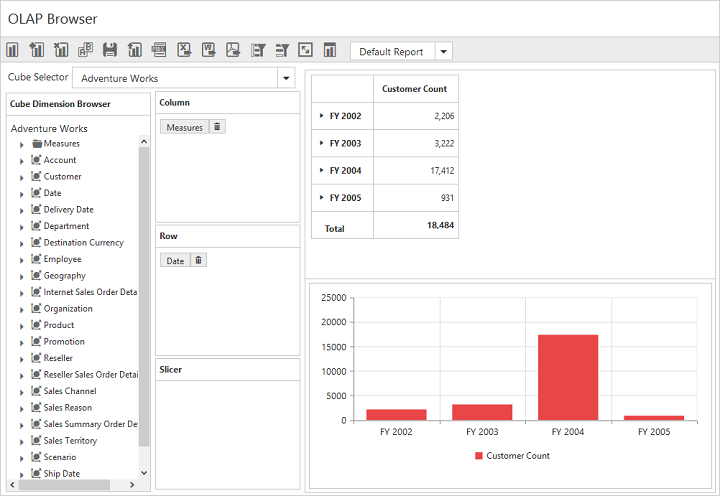

# Layout Customization

## Display View

### Tab View

In Tab View representation, both Grid and Chart will be displayed in a separate tab.  This could be set using the `ControlPlacement` property under the `DisplaySettings` option.  By default, **Tab** value is set.



    @Html.EJ().Olap().OlapClient("OlapClient1").Url(Url.Content("~/OlapClient")).Title( "OLAP Browser").DisplaySettings(displaySettings=>displaySettings.ControlPlacement( OlapClientControlPlacement.Tab))



### Tile View

In Tile View representation, both Grid and Chart will be displayed one over the other, in the same layout.  Tile view can be set by using the `ControlPlacement` property under the `DisplaySettings` option.



    @Html.EJ().Olap().OlapClient("OlapClient1").Url(Url.Content("~/OlapClient")).Title("OLAP Browser").DisplaySettings(displaySettings=>displaySettings.ControlPlacement(OlapClientControlPlacement.Tile))



## Default View

### Grid View

To display Grid control by default, set `DefaultView` property under `DisplaySettings` option to **Grid**, which is the default value of the property.



    @Html.EJ().Olap().OlapClient("OlapClient1").Url(Url.Content("~/OlapClient")).Title( "OLAP Browser").DisplaySettings(displaySettings=>displaySettings.DefaultView( OlapClientDefaultView.Grid))



### Chart View

To display Chart control by default, set the property `DefaultView` property to **Chart**.



    @Html.EJ().Olap().OlapClient("OlapClient1").Url(Url.Content("~/OlapClient")).Title( "OLAP Browser").DisplaySettings(displaySettings=>displaySettings.DefaultView( OlapClientDefaultView.Chart))



## Display Mode

### Grid Only

After setting the `Mode` property under `DisplaySettings` option to **GridOnly**, the Chart is hidden and the data is displayed only in the Grid.



   @Html.EJ().Olap().OlapClient("OlapClient1").Url(Url.Content("~/OlapClient")).Title( "OLAP Browser").DisplaySettings(displaySettings=>displaySettings.Mode( OlapClientDisplayMode.GridOnly))



### Chart Only

After setting the `Mode` property under `DisplaySettings` option to **ChartOnly**, the Grid is hidden and data is displayed only in the Chart.



   @Html.EJ().Olap().OlapClient("OlapClient1").Url(Url.Content("~/OlapClient")).Title( "OLAP Browser").DisplaySettings(displaySettings=>displaySettings.Mode( OlapClientDisplayMode.ChartOnly))



### Both Chart and Grid

After setting the `Mode` property under `DisplaySettings` option to **ChartAndGrid**, data is displayed in both Grid and Chart.  This is the default value of the property.



   @Html.EJ().Olap().OlapClient("OlapClient1").Url(Url.Content("~/OlapClient")).Title( "OLAP Browser").DisplaySettings(displaySettings=>displaySettings.Mode( OlapClientDisplayMode.ChartAndGrid))



## Toggle Panel

Toggle panel option lets the user to toggle the visibility of Axis Element Builder and Cube Dimension Browser panels in OlapClient with a use of a button. The button could be added to the control by using the `EnableTogglePanel` property under `DisplaySettings` option.  This property is disabled by default.



  @Html.EJ().Olap().OlapClient("OlapClient1").Url(Url.Content("~/OlapClient")).Title("OLAP Browser").DisplaySettings(displaySettings=>displaySettings.EnableTogglePanel(true))



## Maximized/Full Screen View

Full screen view helps to visualize the PivotGrid and OlapChart controls inside OlapClient precisely according to the browser window size.  By selecting full screen icon in the toolbar, PivotGrid/OlapChart is maximized depending on the selected tab.  Drilldown action can also be performed in both PivotGrid and OlapChart in the maximized view.  This option is enabled by setting the `EnableFullScreen` property under `DisplaySettings` option to true.  The value is false by default.



  @Html.EJ().Olap().OlapClient("OlapClient1").Url(Url.Content("~/OlapClient")).Title("OLAP Browser").DisplaySettings(displaySettings=>displaySettings.EnableFullScreen(true))



The following screenshot shows the maximized view of PivotGrid.

## Grid Layout

PivotGrid inside OlapClient control can be rendered in any of the following layouts.

* Normal
* NormalTopSummary
* NoSummaries
* ExcelLikeLayout

The layout is set using the `GridLayout` property. By default, normal layout is set.



  @Html.EJ().Olap().OlapClient("OlapClient1").Url(Url.Content("~/OlapClient")).Title("OLAP Browser").GridLayout(PivotGridLayout.NoSummaries)



## Chart Types

While loading the OlapClient initially, the OlapChart widget can be rendered in any one of the available chart types using the `ChartType` property.



  @Html.EJ().Olap().OlapClient("OlapClient1").Url(Url.Content("~/OlapClient")).Title("OLAP Browser").ChartType(OlapChartType.Column)



The `ChartType` property takes Column Chart by default. The types available are Column, Stacking Column, Bar, Stacking Bar, Line, Spline, Step Line, Area, Spline Area, Step Area, Stacking Area, Pie, Funnel and Pyramid.

The Chart Type can also be changed dynamically through the toolbar icon.

 

