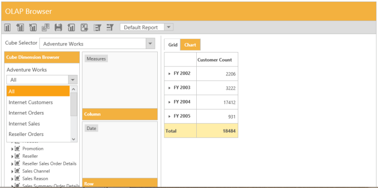
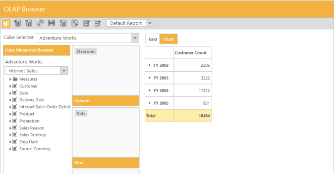

# Measure Groups 

In Cube Dimension Browser tree-view can be viewed in a filtered manner through the Measure Groups option. This feature allows you to view the list of measure groups and dimensions associated with the selected measure group from the cube.



	@Html.EJ().Olap().OlapClient("OlapClient1")
	.EnableMeasureGroups(true)
	.Url(Url.Content("~/wcf/OlapClientService.svc"))



On selecting a measure group from the drop-down list, the Cube Dimension Browser tree-view displays the related dimensions as follows.

