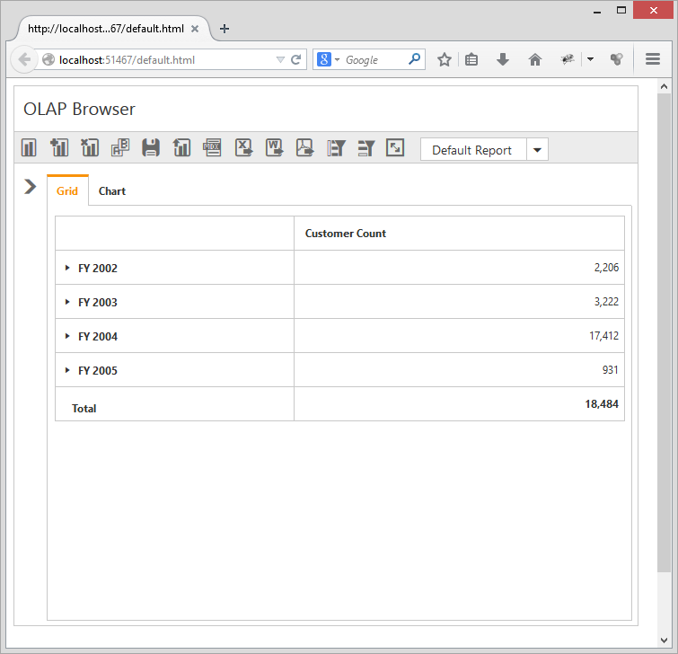

# Responsive Layout

OlapClient widget supports responsive rendering based on the target device (desktop & tablet) resolution. It supports resolution upto 1024x600. You can enable responsiveness in OlapClient by setting `IsResponsive` property to true.



@Html.EJ().Olap().OlapClient("OlapClient1").Url(Url.Content("~/OlapClient")).Title("OLAP Browser").IsResponsive(true)



