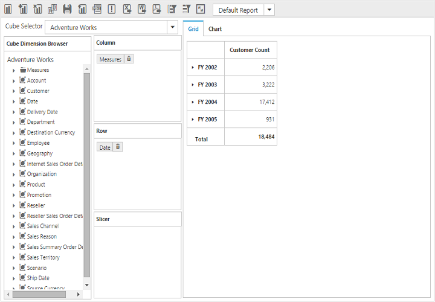
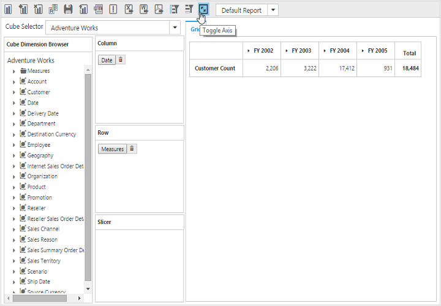

# Toggle Axis

Toggle Axis support swaps dimensions, measures and named sets, between column and row axes, thereby refreshing OLAP Chart and OLAP Grid accordingly.

Before toggl axis
{:.caption}

After toggle axis
{:.caption}
