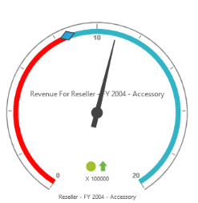
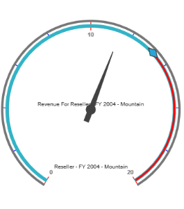
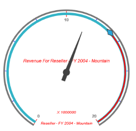

# Custom Label

Custom label provides information about the members associated behind each OlapGauge. You can define multiple labels for OlapGauge and it can be positioned along X and Y co-ordinates based on location settings.

## Positioning the Custom Label

You can set the location of the custom label in circular gauge using “location” property. Refer the following code example.



[MVC]

@Html.EJ().Olap().OlapGauge("OlapGauge1").Url("../wcf/OlapGaugeService.svc").BackgroundColor("transparent").EnableTooltip(true).Scales(scale =>

{

    scale.ShowRanges(true).Radius(150).ShowScaleBar(true).Size(1).Border(bor=>bor.Width(0.5)).ShowIndicators(false).ShowLabels(true).ShowTicks(false).Pointers(pointer =>

        {

           pointer.Type(PointerType.Needle).ShowBackNeedle(true).BackNeedleLength(20).Length(120).NeedleType(NeedleType.Rectangle).Width(7).Add();

            pointer.Type(PointerType.Marker).DistanceFromScale(5).Placement(PointerPlacement.Center).BackgroundColor("#29A4D9").Length(25).Width(15).MarkerType(MarkerType.Diamond).Add();

        }).

    Ticks(ticks =>

    {

        ticks.Type(CircularTickTypes.Major).DistanceFromScale(15).Height(16).Width(1).Color("red").Add();

        ticks.Type(CircularTickTypes.Minor).Height(6).Width(1).DistanceFromScale(2).Color("#8c8c8c").Add();

    })

    .Labels(labels => { labels.Color("#8c8c8c").Add(); })

    .Ranges(ranges =>

    {

        ranges.DistanceFromScale(-5).BackgroundColor("black").Border(bor=> bor.Color("red")).Size(7).Add();

        ranges.DistanceFromScale(-5).Size(7).Add();

    })

    .CustomLabels(customLabel =>

    {

customLabel.Position(location => location.X(280).Y(390)).Add();

        customLabel.Position(location => location.X(180).Y(280)).Add();

        customLabel.Position(location => location.X(180).Y(170)).Add();

    }).Add();

})



## Font and Style Customization of Custom Label

You can customize the custom label font with fontstyle, font family, and size properties.



[MVC]

@Html.EJ().Olap().OlapGauge("OlapGauge1").Url("../wcf/OlapGaugeService.svc").BackgroundColor("transparent").EnableTooltip(true).Scales(scale =>

{

    scale.ShowRanges(true).Radius(150).ShowScaleBar(true).Size(1).Border(bor=>bor.Width(0.5)).ShowIndicators(false).ShowLabels(true).ShowTicks(false).Pointers(pointer =>

        {

            pointer.Type(PointerType.Needle).ShowBackNeedle(true).BackNeedleLength(20).Length(120).NeedleType(NeedleType.Rectangle).Width(7).Add();

            pointer.Type(PointerType.Marker).DistanceFromScale(5).Placement(PointerPlacement.Center).BackgroundColor("#29A4D9").Length(25).Width(15).MarkerType(MarkerType.Diamond).Add();

        }).

    Ticks(ticks =>

    {

        ticks.Type(CircularTickTypes.Major).DistanceFromScale(15).Height(16).Width(1).Color("red").Add();

        ticks.Type(CircularTickTypes.Minor).Height(6).Width(1).DistanceFromScale(2).Color("#8c8c8c").Add();

    })

    .Labels(labels => { labels.Color("#8c8c8c").Add(); })

    .Ranges(ranges =>

    {

        ranges.DistanceFromScale(-5).BackgroundColor("black").Border(bor=> bor.Color("red")).Size(7).Add();

        ranges.DistanceFromScale(-5).Size(7).Add();

    })

    .CustomLabels(customLabel =>

    {

        customLabel.Position(location => location.X(280).Y(390)).Font(font => font.Size("10px").FontFamily("Segoe UI").FontStyle("Normal")).Color("red").Add();

        customLabel.Position(location => location.X(180).Y(280)).Font(font => font.Size("10px").FontFamily("Segoe UI").FontStyle("Normal")).Color("red").Add();

        customLabel.Position(location => location.X(180).Y(170)).Font(font => font.Size("12px").FontFamily("Segoe UI").FontStyle("Normal")).Color("red").Add();

    }).Add();

})



