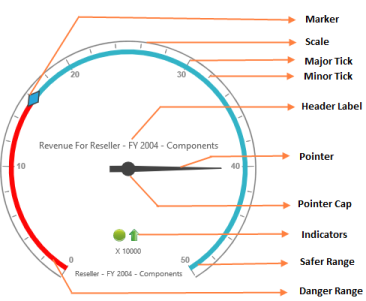
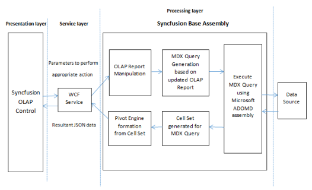
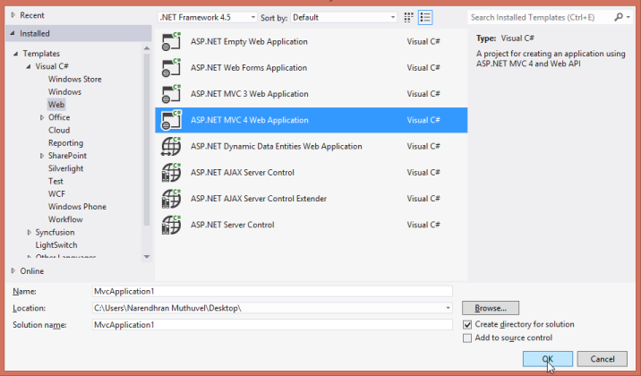
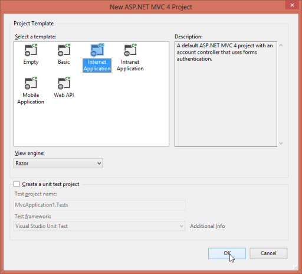
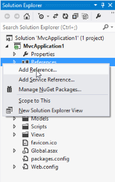
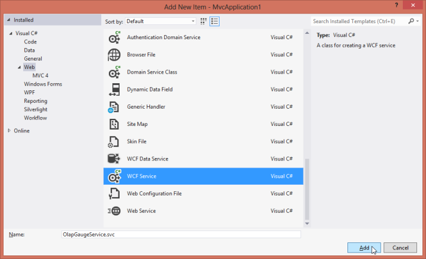
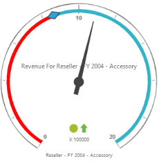

# Getting Started 

This section briefly explains how you can create an OLAP Gauge in your application with ASP.NET MVC.

## Create your first OLAP Gauge in MVC

## Control structure

The following screenshot shows the structure of an OLAP Gauge control.

## Syncfusion OLAP Controls – Architecture

As shown in the above architecture, control rendering takes place at client-side and all other analytical operations on each action takes place at server-side.

## Service for OLAP Controls

The primary reasons for using service in an OLAP processing are:

1. DataSource Connectivity: In order to establish a connection between different cube data sources such as
	1. Offline Cube
	2. Online Cube (XML/A)
	3. Cube within SQL Server, locally or through remote, you can move the connectivity related coding to service-side as it is impossible at client-side other than Online Cube (XML/A) option. Using service, you can connect any type of cube data source without any limitation.
2. Cube Schema: As the connection is moved to service side, you obviously use Microsoft ADOMD assembly, to get the entire cube schema. Only with the cube schema the following details are achieved for control rendering.
	1. Availability of cubes.
	2. A complete end-to-end details such as name, caption, unique name, parent information, child information, its properties etc. about the dimension, hierarchy, level, members are available in cube schema only. 
	3. Localized information is also be available in cube schema.  
3. MDX Generator: You can frame the MDX query using an MDX generator in Syncfusion.Olap.Base assembly. To execute the framed MDX from the cube data source, you need to sent framed MDX via Microsoft ADOMD assembly The executed query is returned in the form of cell set (contains values) that is converted to Pivot Engine and then to JSON data to render any OLAP controls.
4. OLAP Report: The OlapReport class in the Syncfusion.Olap.Base holds the complete information of each axes such as column, row and slicer. Using OlapReport class, you can maintain the dimension element, measure element, hierarchy name, level name as well as the member information that is included and excluded.  

As the OlapControl is the key for each and every operation, initially you need to serialize the OlapReport and send to client-side in a form of string.

When you perform any operation, such as drill up or down, filtering, sorting etc., you need to send OlapReport from the client-side to the service in a de-serialized and updated format.

Further operations are carried with updated OlapReports only and you can send the updated OlapReport back to client-side with JSON data in a serialized format again. 

This process has the OlapReport always updated. You cannot operate serialized OlapReport in client-side and it is carried to service having its class in Syncfusion.Olap.Base assembly to perform the update operation_._

## Create an application

This section explains how you can configure the OLAP Gauge control in applications. You can also learn how to pass the required data to OLAP Gauge and to customize its various options according to your requirements. 

In the following example, OLAP gauge is used to visualize the Revenue for Reseller over a Fiscal Year 2004 on the product category - Accessories.

Open Visual Studio and create a new project by clicking New Project. Select the Web category, select the ASP.NET MVC4 Web Application template, and then click OK.

Select Internet application template with razor view engine.

## Add References, Scripts, Styles and Control

### Add References

1. In the Solution Explorer, right-click the References folder and then click Add Reference.

1. Select the following assemblies: 

   * Microsoft.AnalysisServices.AdomdClient.dll
   * Syncfusion.Linq.Base.dll 
   * Syncfusion.EJ.dll 
   * Syncfusion.EJ.MVC.dll 
   * Syncfusion.EJ.Olap.dll
   * Syncfusion.Olap.Base.dll

2. Click OK.

### Adding Scripts and Styles

1. Add the script files and CSS files in the head tag of the _Layout.cshtml page.
  
   N>
   >
   > 1. Follow the given order while adding scripts and styles.
   > 2. Apart from the cdn files, the rest of it can be acquired from the following location
   > C:\Users\<UserName>\AppData\Local\Syncfusion\EssentialStudio\<Version>\JavaScript\assets\

   ~~~ html

		<head>

		<link href="http://cdn.syncfusion.com/{{ site.releaseversion }}/js/web/flat-azure/ej.web.all.min.css" rel="stylesheet" />
		
		
		

		</head>

   ~~~
   {:.prettyprint }

2. Add the following code example in the body tag of the _Layout.cshtml page.

   ~~~ html

		<body>
		   @RenderBody()
		   @Html.EJ().ScriptManager()   
		</body>
		
   ~~~
   {:.prettyprint }

### Add Control in View page

Add the following code in the Index.cshtml page

  
@using Syncfusion.JavaScript;
@using Syncfusion.JavaScript.Olap;

@Html.EJ().Olap().OlapGauge("OlapGauge1").Url(Url.Content("~/wcf/OlapGaugeService.svc")).BackgroundColor("transparent").EnableTooltip(true).Scales(scale =>
{
    scale.ShowRanges(true).Radius(150).ShowScaleBar(true).Size(1).Border(bor=>bor.Width(0.5)).ShowIndicators(true).ShowLabels(true).
        Pointers(pointer =>
        {
            pointer.ShowBackNeedle(true).BackNeedleLength(20).Length(120).Width(7).Add();
            pointer.Type(PointerType.Marker).DistanceFromScale(5).Placement(PointerPlacement.Center).BackgroundColor("#29A4D9").Length(25).Width(15).MarkerType(MarkerType.Diamond).Add();
        }).Ticks(ticks =>
        {
        ticks.Type(CircularTickTypes.Major).DistanceFromScale(2).Height(16).Width(1).Color("#8c8c8c").Add();
        ticks.Type(CircularTickTypes.Minor).Height(6).Width(1).DistanceFromScale(2).Color("#8c8c8c").Add();
        }).Labels(labels => { labels.Color("#8c8c8c").Add(); }).Ranges(ranges =>
        {
        ranges.DistanceFromScale(-5).BackgroundColor("#fc0606").Border(bor=> bor.Color("#fc0606")).Add();
        ranges.DistanceFromScale(-5).Add();
        }).CustomLabels(customLabel =>
        {
        customLabel.Position(location => location.X(180).Y(290)).Font(font => font.Size("10px").FontFamily("Segoe UI").FontStyle("Normal")).Color("#666666").Add();
        customLabel.Position(location => location.X(180).Y(320)).Font(font => font.Size("10px").FontFamily("Segoe UI").FontStyle("Normal")).Color("#666666").Add();
        customLabel.Position(location => location.X(180).Y(150)).Font(font => font.Size("12px").FontFamily("Segoe UI").FontStyle("Normal")).Color("#666666").Add();
        }).Add();
}).ClientSideEvents(oCli => { oCli.RenderSuccess("loadOLAPGaugeTheme"); })



## Add WCF service for OLAP Gauge

### Create WCF Services

1. Right-click on the project and select Add > New Folder.  Name the folder as wcf. Let the folder name "wcf" be in lower case.
2. Now right-click the wcf folder created and select Add > New Item. In the Add New Item window, select WCF Service and name it OlapGaugeService.svc
3. Click Add. 

### Add service methods inside Interface

Add the following code inside the IOlapGaugeService interface available in the IOlapGaugeService.cs file.


public interface IOlapGaugeService
{
    [OperationContract]
    Dictionary<string, object> InitializeGauge(string action,string customObject);                 
}



### Add Namespaces

Add the following namespaces required to implement the service methods.



using System;
using System.Collections.Generic;
using System.Linq;
using System.Runtime.Serialization;
using System.ServiceModel;
using System.Text;
using System.ServiceModel.Activation;
using Syncfusion.JavaScript.Olap;
using System.Web.Script.Serialization;
using Syncfusion.Olap.Manager;
using Syncfusion.Olap.Reports;



### Create Class in Service file

Create the OlapGaugeService class to implement the service methods. Inherit the class from the IOlapGaugeService interface created automatically when any new service is added.



namespace MvcApplication1.wcf
{
    [AspNetCompatibilityRequirements(RequirementsMode = AspNetCompatibilityRequirementsMode.Allowed)]
    public class OlapGaugeService : IOlapGaugeService
    {

    }
}



### Implement Service Methods

Add the following methods to the service invoked for any server-side operations to be performed in OlapGauge.

1. Initialize the OlapGauges helper class.

   ~~~ cs

    OlapGauge htmlHelper = new OlapGauge();       
    static string connectionString = "Data Source=http://bi.syncfusion.com/olap/msmdpump.dll; Initial Catalog=Adventure Works DW 2008 SE;";
    JavaScriptSerializer serializer = new JavaScriptSerializer();

   ~~~
   {:.prettyprint }

2. Initialize the following relevant service methods need to be added.

   ~~~ cs

    //This method provides the required information from the server side for initializing the OlapGauge.
	public Dictionary<string, object> InitializeGauge(string action,string customObject)
    {
        OlapDataManager DataManager = null;
        dynamic customData = serializer.Deserialize<dynamic>(customObject.ToString());
        DataManager = new OlapDataManager(connectionString);                         
        DataManager.SetCurrentReport(CreateOlapReport());
        return htmlHelper.GetJsonData(action, DataManager);
     }                

     //This method carries the information about the default report to be rendered within OlapGauge initially. 
     private OlapReport CreateOlapReport()
     {
        OlapReport report = new OlapReport();
        report.CurrentCubeName = "Adventure Works";
     
        KpiElements kpiElement = new KpiElements();
        kpiElement.Elements.Add(new KpiElement { Name = "Revenue", ShowKPIGoal = true, ShowKPIStatus = true, ShowKPIValue = true, ShowKPITrend = true });
     
        DimensionElement dimensionElement1 = new DimensionElement();
        DimensionElement dimensionElement2 = new DimensionElement();
        DimensionElement dimensionElement3 = new DimensionElement();
     
        MeasureElements measureElement = new MeasureElements();
        measureElement.Elements.Add(new MeasureElement { UniqueName = "[Measures].[Customer Count]" });
     
        dimensionElement1.Name = "Date";
        dimensionElement1.AddLevel("Fiscal Year", "Fiscal Year");
        dimensionElement1.Hierarchy.LevelElements["Fiscal Year"].Add("FY 2004");
        dimensionElement1.Hierarchy.LevelElements["Fiscal Year"].IncludeAvailableMembers = true;
         
        dimensionElement2.Name = "Sales Channel";
        dimensionElement2.AddLevel("Sales Channel", "Sales Channel");
        dimensionElement2.Hierarchy.LevelElements["Sales Channel"].Add("Reseller");
        dimensionElement2.Hierarchy.LevelElements["Sales Channel"].IncludeAvailableMembers = true;
     
        dimensionElement3.Name = "Product";
        dimensionElement3.AddLevel("Product Model Lines", "Product Line");

        report.CategoricalElements.Add(new Item { ElementValue = dimensionElement2 });
        report.CategoricalElements.Add(new Item { ElementValue = dimensionElement1 });
        report.CategoricalElements.Add(new Item { ElementValue = kpiElement });
        report.SeriesElements.Add(new Item { ElementValue = dimensionElement3 });

        return report;

     }
     
   ~~~
   {:.prettyprint }

### Configure Web.Config
   
1. Register the assemblies by adding the given code inside the <system.web> tag in web_._config__file at root folder_._



<compilation debug="true" targetFramework="4.5">
    <assemblies>
        <add assembly="System.Web.Abstractions, Version=4.0.0.0, Culture=neutral, PublicKeyToken=31BF3856AD364E35" />
        <add assembly="System.Web.Helpers, Version=2.0.0.0, Culture=neutral, PublicKeyToken=31BF3856AD364E35" />
        <add assembly="System.Web.Routing, Version=4.0.0.0, Culture=neutral, PublicKeyToken=31BF3856AD364E35" />
        <add assembly="System.Web.Mvc, Version= X.X.X.X, Culture=neutral, PublicKeyToken=31BF3856AD364E35" />
        <add assembly="System.Web.WebPages, Version= X.X.X.X, Culture=neutral, PublicKeyToken=31BF3856AD364E35" />
        <add assembly="Syncfusion.EJ, Version= X.X.X.X, Culture=neutral, PublicKeyToken=3d67ed1f87d44c89" />
        <add assembly="Syncfusion.EJ.Olap, Version= X.X.X.X, Culture=neutral, PublicKeyToken=3d67ed1f87d44c89" />
        <add assembly="Syncfusion.EJ.Mvc, Version= X.X.X.X, Culture=neutral, PublicKeyToken=3d67ed1f87d44c89" />
        <add assembly="Syncfusion.Linq.Base, Version= X.X.X.X, Culture=neutral, PublicKeyToken=3d67ed1f87d44c89" />
        <add assembly="Syncfusion.Olap.Base, Version= X.X.X.X, Culture=neutral, PublicKeyToken=3d67ed1f87d44c89" />
      </assemblies>
</compilation>



N> x.x.x.x in the above code example refers to the current version of the Essential Studio running in your system.

The version of Syncfusion dlls according to the .NET framework and MVC version are as follows.  For example, 12.1 version is illustrated here.

_Table: List of MVC versions_

<table>
<tr>
<th>
MVC Version</th><th>
MVC Version of Syncfusion dlls</th><th>
Base Version of Syncfusion dlls</th><th>
System.Web.Mvc</th><th>
System.Web.WebPages</th></tr>
<tr>
<td>
MVC3</td><td>
12.1300.0.43</td><td>
12.1350.0.43</td><td>
3.0</td><td>
1.0</td></tr>
<tr>
<td>
MVC4</td><td>
12.1400.0.43</td><td>
12.1400.0.43</td><td>
4.0</td><td>
2.0</td></tr>
<tr>
<td>
MVC5</td><td>
12.1500.0.43</td><td>
12.1450.0.43</td><td>
5.0</td><td>
3.0</td></tr>
</table>

1. Add the following Namespaces to the web.config files in both root folder and View folder.

   ~~~ html

		<namespaces>
			<add namespace="System.Web.Helpers" />
			<add namespace="System.Web.Mvc" />
			<add namespace="System.Web.Mvc.Ajax" />
			<add namespace="System.Web.Mvc.Html" />	
			<add namespace="System.Web.Optimization" />
			<add namespace="System.Web.Routing" />
			<add namespace="System.Web.WebPages" />
			<add namespace="Syncfusion.MVC.EJ"/>
			<add namespace="Syncfusion.JavaScript"/>
			<add namespace="Syncfusion.JavaScript.DataVisualization"/>
		</namespaces>

   ~~~
   {:.prettyprint }

2. Register the wcf services in web.config file at root folder by adding given code examples.
   iv). You can expose services through the properties such as binding, contract and address etc. using an endpoint. In this application the service name is "MvcApplication1.wcf.OlapGaugeService" where "OlapGaugeService" is the service class name and “MvcApplication1.wcf" is the namespace name under which the service class appears.

   The following are the properties that meet the appropriate endpoint.  

   contract: This property indicates the contract that the endpoint is exposing. Here you are referring IOlapGaugeService contract and it is "MvcApplication1.wcf.IOlapGaugeService".

   binding: In this application you can use webHttpBinding to post and receive the requests and responses between client-end and service-end.

   behaviorConfiguration: This property contains the name of the behavior to be used in the endpoint. endpointBehaviors are illustrated as follows.

   ~~~ html

		<system.serviceModel>
			<services>
			  <service name="MvcApplication1.wcf.OlapGaugeService">
				<endpoint address="" behaviorConfiguration="MvcApplication1.wcf.OlapGaugeServiceAspNetAjaxBehavior"
				  binding="webHttpBinding" contract="MvcApplication1.wcf.IOlapGaugeService" />
			  </service>
			</services>
		</system.serviceModel>

   ~~~
   {:.prettyprint }

   v) The endpointBehaviors contains all the behavior for an endpoint.  You can link each endpoint to the respective behavior only using the name property. In the following code example "MvcApplication1.wcf.OlapGaugeServiceAspNetAjaxBehavior" refers to the OlapGaugeService class under the namespace MvcApplication1.wcf in OlapGaugeService.svc.cs file, which is the appropriate behavior for the endpoint. 

   ~~~ html

		<system.serviceModel>
			<behaviors>
			  <endpointBehaviors>
				<behavior name="MvcApplication1.wcf.OlapGaugeServiceAspNetAjaxBehavior">
				  <enableWebScript />
				</behavior>
			  </endpointBehaviors>
			</behaviors>
		</system.serviceModel>

   ~~~
   {:.prettyprint }

   N> In this example, “MvcApplication1.wcf” indicates the namespace in the WCF Service and “OlapGaugeService” indicates the class name in the WCF Service.

3. Set the UnobtrusiveJavaScriptEnabled value to false under appsettings tag as shown here.
  
   ~~~ html
   
		<appSettings>
			<add key="webpages:Version" value="2.0.0.0" />
			<add key="webpages:Enabled" value="false" />
			<add key="PreserveLoginUrl" value="true" />
			<add key="ClientValidationEnabled" value="true" />
			<add key="UnobtrusiveJavaScriptEnabled" value="false" />
		</appSettings>

   ~~~
   {:.prettyprint }

### Configure routing file

Add the following highlighted line in RouteConfig.cs file to avoid issues while picking the WCFservice methods.



public class RouteConfig
{
    public static void RegisterRoutes(RouteCollection routes)
    {
        routes.IgnoreRoute("{resource}.axd/{*pathInfo}");
        //NOTE: In the below highlighted lines _wcf_ is just the folder name inside which service files(*.svc) are present.
        routes.IgnoreRoute("wcf/{resource}.svc/{*pathInfo}");
        routes.IgnoreRoute("wcf/{resource}.svc");
        routes.MapRoute(
            name: "Default",
            url: "{controller}/{action}/{id}",
            defaults: new { controller = "Introduction", action = "Index", id = UrlParameter.Optional },
            namespaces: new[] { "MvcApplication1.wcf.Controllers" }
        );
    }
}



This getting started tutorial give you an overview of OlapGauge, its architecture, process flow, how to configure and integrate with a VS application using a simple example.

