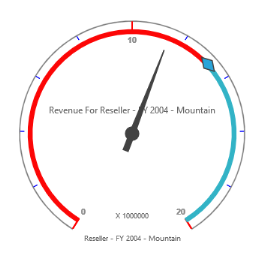

# Indicators

KPIs are displayed with Trend and Status visualizations that supports Traffic Light, Road Signs and Standard Arrow .Status and Trend values are highlighted through user friendly images__within the OlapGauge that is known as indicators.

## Hiding Indicators

You can hide the Indicator by changing the “showIndicator” property to “false”.



@Html.EJ().Olap().OlapGauge("OlapGauge1").Url("../wcf/OlapGaugeService.svc").BackgroundColor("transparent").EnableTooltip(true).Scales(scale =>

{

    scale.ShowRanges(true).Radius(150).ShowScaleBar(true).Size(1).Border(bor=>bor.Width(0.5)).ShowIndicators(false).ShowLabels(true).ShowTicks(false).Pointers(pointer =>

        {

            pointer.Type(PointerType.Needle).ShowBackNeedle(true).BackNeedleLength(20).Length(120).NeedleType(NeedleType.Rectangle).Width(7).Add();

            pointer.Type(PointerType.Marker).DistanceFromScale(5).Placement(PointerPlacement.Center).BackgroundColor("#29A4D9").Length(25).Width(15).MarkerType(MarkerType.Diamond).Add();

        }).

    Ticks(ticks =>

    {

        ticks.Type(CircularTickTypes.Major).DistanceFromScale(15).Height(16).Width(1).Color("red").Add();

        ticks.Type(CircularTickTypes.Minor).Height(6).Width(1).DistanceFromScale(15).Color("#8c8c8c").Add();

    })

    .Labels(labels => { labels.Color("#8c8c8c").Add(); })

    .Ranges(ranges =>

    {

        ranges.DistanceFromScale(-5).BackgroundColor("#fc0606").Border(bor=> bor.Color("#fc0606")).Add();

        ranges.DistanceFromScale(-5).Add();

    })

    .CustomLabels(customLabel =>

    {

        customLabel.Position(location => location.X(180).Y(290)).Font(font => font.Size("10px").FontFamily("Segoe UI").FontStyle("Normal")).Color("#666666").Add();

        customLabel.Position(location => location.X(180).Y(320)).Font(font => font.Size("10px").FontFamily("Segoe UI").FontStyle("Normal")).Color("#666666").Add();

        customLabel.Position(location => location.X(180).Y(150)).Font(font => font.Size("12px").FontFamily("Segoe UI").FontStyle("Normal")).Color("#666666").Add();

    }).Add();

})



