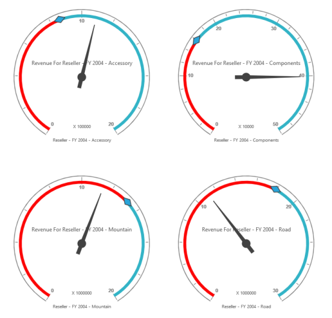
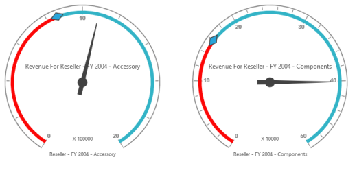

# Layout 

The OLAP Gauge control provides support to display multiple gauges in a structured layout. You can customize the layout using the ColumnsCount and RowsCount properties. These properties are used to specify the number of columns and rows for displaying controls.

## Supported Layouts

* Wrap Layout: Based on the available space, gauges are aligned and displayed automatically. 
* Row count: Specifies the number of gauge controls to be displayed row-wise.
* Column count: Specifies the number of gauge controls to be displayed column-wise.
## Layout Customization 

You can customize/limit the number of gauges to be displayed in the table with the help of the rowsCount and columnsCount properties.

## Row Count

You can set the number of gauges to be displayed in row using rowsCount property. By default the value is 0.



    @Html.EJ().Olap().OlapGauge("OlapGauge1").Url("../wcf/OlapGaugeService.svc").BackgroundColor("transparent").EnableTooltip(true).RowsCount(2).Scales(scale =>

{

    scale.ShowRanges(true).Radius(150).ShowScaleBar(true).Size(1).Border(bor=>bor.Width(0.5)).ShowIndicators(true).ShowLabels(true).

        Pointers(pointer =>

        {

            pointer.ShowBackNeedle(true).BackNeedleLength(20).Length(120).Width(7).Add();

            pointer.Type(PointerType.Marker).DistanceFromScale(5).Placement(PointerPlacement.Center).BackgroundColor("#29A4D9").Length(25).Width(15).MarkerType(MarkerType.Diamond).Add();

        }).

    Ticks(ticks =>

    {

        ticks.Type(CircularTickTypes.Major).DistanceFromScale(2).Height(16).Width(1).Color("#8c8c8c").Add();

        ticks.Type(CircularTickTypes.Minor).Height(6).Width(1).DistanceFromScale(2).Color("#8c8c8c").Add();

    })

    .Labels(labels => { labels.Color("#8c8c8c").Add(); })

    .Ranges(ranges =>

    {

        ranges.DistanceFromScale(-5).BackgroundColor("#fc0606").Border(bor=> bor.Color("#fc0606")).Add();

        ranges.DistanceFromScale(-5).Add();

    })

    .CustomLabels(customLabel =>

    {

        customLabel.Position(location => location.X(180).Y(290)).Font(font => font.Size("10px").FontFamily("Segoe UI").FontStyle("Normal")).Color("#666666").Add();

        customLabel.Position(location => location.X(180).Y(320)).Font(font => font.Size("10px").FontFamily("Segoe UI").FontStyle("Normal")).Color("#666666").Add();

        customLabel.Position(location => location.X(180).Y(150)).Font(font => font.Size("12px").FontFamily("Segoe UI").FontStyle("Normal")).Color("#666666").Add();

    }).Add();

})



## Column Count

You can set the number of gauges to be displayed in column using columnsCount property. By default the value is 0.



@Html.EJ().Olap().OlapGauge("OlapGauge1").Url("../wcf/OlapGaugeService.svc").BackgroundColor("transparent").EnableTooltip(true).ColumnsCount(2).Scales(scale =>

{

    scale.ShowRanges(true).Radius(150).ShowScaleBar(true).Size(1).Border(bor=>bor.Width(0.5)).ShowIndicators(true).ShowLabels(true).

        Pointers(pointer =>

        {

            pointer.ShowBackNeedle(true).BackNeedleLength(20).Length(120).Width(7).Add();

            pointer.Type(PointerType.Marker).DistanceFromScale(5).Placement(PointerPlacement.Center).BackgroundColor("#29A4D9").Length(25).Width(15).MarkerType(MarkerType.Diamond).Add();

        }).

    Ticks(ticks =>

    {

        ticks.Type(CircularTickTypes.Major).DistanceFromScale(2).Height(16).Width(1).Color("#8c8c8c").Add();

        ticks.Type(CircularTickTypes.Minor).Height(6).Width(1).DistanceFromScale(2).Color("#8c8c8c").Add();

    })

    .Labels(labels => { labels.Color("#8c8c8c").Add(); })

    .Ranges(ranges =>

    {

        ranges.DistanceFromScale(-5).BackgroundColor("#fc0606").Border(bor=> bor.Color("#fc0606")).Add();

        ranges.DistanceFromScale(-5).Add();

    })

    .CustomLabels(customLabel =>

    {

        customLabel.Position(location => location.X(180).Y(290)).Font(font => font.Size("10px").FontFamily("Segoe UI").FontStyle("Normal")).Color("#666666").Add();

        customLabel.Position(location => location.X(180).Y(320)).Font(font => font.Size("10px").FontFamily("Segoe UI").FontStyle("Normal")).Color("#666666").Add();

        customLabel.Position(location => location.X(180).Y(150)).Font(font => font.Size("12px").FontFamily("Segoe UI").FontStyle("Normal")).Color("#666666").Add();

    }).Add();

})



