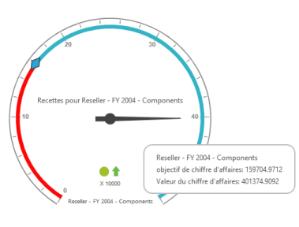

# Localization and Translation Support

Localization is the process of customizing the user interface (UI) as locale-specific in order to display regional data. Using this feature, you can display the data in a specific language and culture, of a particular country or region. The ASP.NET MVC OlapGauge control provides inherent support to localize its UI.

The following table lists the default English localization User Interface based on French culture.

_Table: List of default English localization User Interface based on French culture_

<table>
<tr>
<th>
KEYWORDS</th><th>
VALUES</th></tr>
<tr>
<td>
RevenueGoal</td><td>
"Revenu Objectifs",</td></tr>
<tr>
<td>
RevenueValue</td><td>
"Revenu Valeurs",</td></tr>
<tr>
<td>
RevenueFor</td><td>
"Revenu Pour",</td></tr>
<tr>
<td>
MDXqueryExecutionFailed</td><td>
"L'exécution de la requête MDX pas",</td></tr>
<tr>
<td>
PreparingAndExecutingMDXquery</td><td>
"Préparation et exécution d'une Requête MDX",</td></tr>
<tr>
<td>
MDXqueryExecutedSuccessfully</td><td>
"Requête MDX exécutée avec succès",</td></tr>
<tr>
<td>
RenderingStarted</td><td>
"Rendu en route",</td></tr>
<tr>
<td>
RenderingSucceeded</td><td>
"Rendu Réussi",</td></tr>
<tr>
<td>
RenderingFailed</td><td>
"Rendant pas"</td></tr>
</table>

The following code example illustrates you on how to localize OlapGuage’s User Interface (UI) based on “French” culture.


[MVC]

@ScriptSection{

    

}


@Controlsection{

@Html.EJ().Olap().OlapGauge("OlapGauge1").Url("../wcf/OlapGaugeService.svc").Locale("fr-FR").BackgroundColor("transparent").EnableTooltip(true).Scales(scale =>

{

    scale.ShowRanges(true).Radius(150).ShowScaleBar(true).Size(1).Border(bor=>bor.Width(0.5)).ShowIndicators(false).ShowLabels(true).ShowTicks(false).Pointers(pointer =>

        {

            pointer.Type(PointerType.Needle).ShowBackNeedle(true).BackNeedleLength(20).Length(120).NeedleType(NeedleType.Rectangle).Width(7).Add();

            pointer.Type(PointerType.Marker).DistanceFromScale(5).Placement(PointerPlacement.Center).BackgroundColor("#29A4D9").Length(25).Width(15).MarkerType(MarkerType.Diamond).Add();

        }).

    Ticks(ticks =>

    {

        ticks.Type(CircularTickTypes.Major).DistanceFromScale(15).Height(16).Width(1).Color("red").Add();

        ticks.Type(CircularTickTypes.Minor).Height(6).Width(1).DistanceFromScale(2).Color("#8c8c8c").Add();

    })

    .Labels(labels => { labels.Color("#8c8c8c").Add(); })

    .Ranges(ranges =>

    {

        ranges.DistanceFromScale(-5).BackgroundColor("black").Border(bor=> bor.Color("red")).Size(7).Add();

        ranges.DistanceFromScale(-5).Size(7).Add();

    })

    .CustomLabels(customLabel =>

    {

        customLabel.Position(location => location.X(280).Y(390)).Font(font => font.Size("10px").FontFamily("Segoe UI").FontStyle("Normal")).Color("red").Add();

        customLabel.Position(location => location.X(180).Y(280)).Font(font => font.Size("10px").FontFamily("Segoe UI").FontStyle("Normal")).Color("red").Add();

        customLabel.Position(location => location.X(180).Y(170)).Font(font => font.Size("12px").FontFamily("Segoe UI").FontStyle("Normal")).Color("red").Add();

    }).Add();

})



> Note: In order to render the localized OLAP Gauge, You are required to reset the content available in both

1. _OLAP Gauge Control_
2. _OLAP Cube_

## Localizing Control Information:

To apply control side localization, refer the following code example:



[HTML]

ej.olap.OlapGauge.locale["zh-CN"] = {

//Corresponding keyword values needs to be set here.

}


### Localizing Cube Information:

To render the localized Cube information,__set “_Locale__Identifier”___in the connection string.



[C#]

//1036 refers to “fr-FR” culture.

string connectionString = "Data Source=localhost; Initial Catalog=Adventure Works DW; Locale Identifier=1036;";

DataManager = new OlapDataManager(connectionString);

DataManager.Culture = new System.Globalization.CultureInfo(1036);

DataManager.OverrideDefaultFormatStrings = true;


The following screenshot displays the OlapGauge with French localization.

