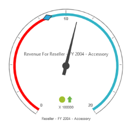
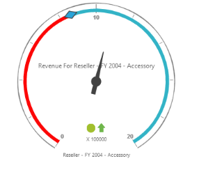
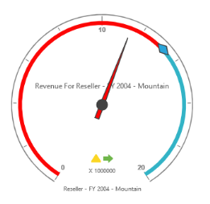
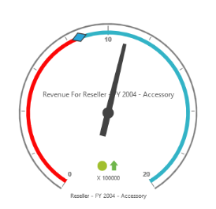

## Pointers

Pointers are used to indicate the range on scale area based on the values passed for the range values.

### Types of Pointers

Two different types of pointer available in OlapGuage are:

1. Needle
2. Marker
### Changing Pointer Types

You can set the pointer to Needle type by setting “pointerType”property to “Needle” and the pointer to Marker type by setting the “pointerType” properties to “Marker”.

[MVC]

@Html.EJ().Olap().OlapGauge("OlapGauge1").Url("../wcf/OlapGaugeService.svc").BackgroundColor("transparent").EnableTooltip(true).Scales(scale =>

{

    scale.ShowRanges(true).Radius(150).ShowScaleBar(true).Size(1).Border(bor=>bor.Width(0.5)).ShowIndicators(true).ShowLabels(true).

        Pointers(pointer =>

        {

pointer.Type(PointerType.Needle).ShowBackNeedle(true).BackNeedleLength(20).Length(120).Width(7).Add();

pointer.Type(PointerType.Marker).DistanceFromScale(5).Placement(PointerPlacement.Center).BackgroundColor("#29A4D9").Length(25).Width(15).MarkerType(MarkerType.Diamond).Add();

        }).

    Ticks(ticks =>

    {

        ticks.Type(CircularTickTypes.Major).DistanceFromScale(2).Height(16).Width(1).Color("#8c8c8c").Add();

        ticks.Type(CircularTickTypes.Minor).Height(6).Width(1).DistanceFromScale(2).Color("#8c8c8c").Add();

    })

    .Labels(labels => { labels.Color("#8c8c8c").Add(); })

    .Ranges(ranges =>

    {

        ranges.DistanceFromScale(-5).BackgroundColor("#fc0606").Border(bor=> bor.Color("#fc0606")).Add();

        ranges.DistanceFromScale(-5).Add();

    })

    .CustomLabels(customLabel =>

    {

        customLabel.Position(location => location.X(180).Y(290)).Font(font => font.Size("10px").FontFamily("Segoe UI").FontStyle("Normal")).Color("#666666").Add();

        customLabel.Position(location => location.X(180).Y(320)).Font(font => font.Size("10px").FontFamily("Segoe UI").FontStyle("Normal")).Color("#666666").Add();

        customLabel.Position(location => location.X(180).Y(150)).Font(font => font.Size("12px").FontFamily("Segoe UI").FontStyle("Normal")).Color("#666666").Add();

    }).Add();

})

{  | markdownify }
{:.image }

### Length and Width Customization

You can customize the Pointer length and width using the “pointerLength” and “pointerWidth” property.

[MVC]

@Html.EJ().Olap().OlapGauge("OlapGauge1").Url("../wcf/OlapGaugeService.svc").BackgroundColor("transparent").EnableTooltip(true).Scales(scale =>

{

    scale.ShowRanges(true).Radius(150).ShowScaleBar(true).Size(1).Border(bor=>bor.Width(0.5)).ShowIndicators(true).ShowLabels(true).

        Pointers(pointer =>

        {

            pointer.Type(PointerType.Needle).ShowBackNeedle(true).BackNeedleLength(20).Length(60).Width(9).Add();

            pointer.Type(PointerType.Marker).DistanceFromScale(5).Placement(PointerPlacement.Center).BackgroundColor("#29A4D9").Length(25).Width(15).MarkerType(MarkerType.Diamond).Add();

        }).

    Ticks(ticks =>

    {

        ticks.Type(CircularTickTypes.Major).DistanceFromScale(2).Height(16).Width(1).Color("#8c8c8c").Add();

        ticks.Type(CircularTickTypes.Minor).Height(6).Width(1).DistanceFromScale(2).Color("#8c8c8c").Add();

    })

    .Labels(labels => { labels.Color("#8c8c8c").Add(); })

    .Ranges(ranges =>

    {

        ranges.DistanceFromScale(-5).BackgroundColor("#fc0606").Border(bor=> bor.Color("#fc0606")).Add();

        ranges.DistanceFromScale(-5).Add();

    })

    .CustomLabels(customLabel =>

    {

        customLabel.Position(location => location.X(180).Y(290)).Font(font => font.Size("10px").FontFamily("Segoe UI").FontStyle("Normal")).Color("#666666").Add();

        customLabel.Position(location => location.X(180).Y(320)).Font(font => font.Size("10px").FontFamily("Segoe UI").FontStyle("Normal")).Color("#666666").Add();

        customLabel.Position(location => location.X(180).Y(150)).Font(font => font.Size("12px").FontFamily("Segoe UI").FontStyle("Normal")).Color("#666666").Add();

    }).Add();

})

{  | markdownify }
{:.image }

### Background Customization 

You can customize the Pointer background color using “backgroundcolor”property.

[MVC]

@Html.EJ().Olap().OlapGauge("OlapGauge1").Url("../wcf/OlapGaugeService.svc").BackgroundColor("transparent").EnableTooltip(true).Scales(scale =>

{

    scale.ShowRanges(true).Radius(150).ShowScaleBar(true).Size(1).Border(bor=>bor.Width(0.5)).ShowIndicators(true).ShowLabels(true).

        Pointers(pointer =>

        {

            pointer.Type(PointerType.Needle).ShowBackNeedle(true).BackNeedleLength(20).Length(120).BackgroundColor("red").Width(7).Add();

            pointer.Type(PointerType.Marker).DistanceFromScale(5).Placement(PointerPlacement.Center).BackgroundColor("#29A4D9").Length(25).Width(15).MarkerType(MarkerType.Diamond).Add();

        }).

    Ticks(ticks =>

    {

        ticks.Type(CircularTickTypes.Major).DistanceFromScale(2).Height(16).Width(1).Color("#8c8c8c").Add();

        ticks.Type(CircularTickTypes.Minor).Height(6).Width(1).DistanceFromScale(2).Color("#8c8c8c").Add();

    })

    .Labels(labels => { labels.Color("#8c8c8c").Add(); })

    .Ranges(ranges =>

    {

        ranges.DistanceFromScale(-5).BackgroundColor("#fc0606").Border(bor=> bor.Color("#fc0606")).Add();

        ranges.DistanceFromScale(-5).Add();

    })

    .CustomLabels(customLabel =>

    {

        customLabel.Position(location => location.X(180).Y(290)).Font(font => font.Size("10px").FontFamily("Segoe UI").FontStyle("Normal")).Color("#666666").Add();

        customLabel.Position(location => location.X(180).Y(320)).Font(font => font.Size("10px").FontFamily("Segoe UI").FontStyle("Normal")).Color("#666666").Add();

        customLabel.Position(location => location.X(180).Y(150)).Font(font => font.Size("12px").FontFamily("Segoe UI").FontStyle("Normal")).Color("#666666").Add();

    }).Add();

})

{  | markdownify }
{:.image }

### Shapes Customization

You can customize Pointershapes using the “needlestyle” property. 

[MVC]

@Html.EJ().Olap().OlapGauge("OlapGauge1").Url("../wcf/OlapGaugeService.svc").BackgroundColor("transparent").EnableTooltip(true).Scales(scale =>

{

    scale.ShowRanges(true).Radius(150).ShowScaleBar(true).Size(1).Border(bor=>bor.Width(0.5)).ShowIndicators(true).ShowLabels(true).

        Pointers(pointer =>

        {

            pointer.Type(PointerType.Needle).ShowBackNeedle(true).BackNeedleLength(20).Length(120).NeedleType(NeedleType.Rectangle).Width(7).Add();

            pointer.Type(PointerType.Marker).DistanceFromScale(5).Placement(PointerPlacement.Center).BackgroundColor("#29A4D9").Length(25).Width(15).MarkerType(MarkerType.Diamond).Add();

        }).

    Ticks(ticks =>

    {

        ticks.Type(CircularTickTypes.Major).DistanceFromScale(2).Height(16).Width(1).Color("#8c8c8c").Add();

        ticks.Type(CircularTickTypes.Minor).Height(6).Width(1).DistanceFromScale(2).Color("#8c8c8c").Add();

    })

    .Labels(labels => { labels.Color("#8c8c8c").Add(); })

    .Ranges(ranges =>

    {

        ranges.DistanceFromScale(-5).BackgroundColor("#fc0606").Border(bor=> bor.Color("#fc0606")).Add();

        ranges.DistanceFromScale(-5).Add();

    })

    .CustomLabels(customLabel =>

    {

        customLabel.Position(location => location.X(180).Y(290)).Font(font => font.Size("10px").FontFamily("Segoe UI").FontStyle("Normal")).Color("#666666").Add();

        customLabel.Position(location => location.X(180).Y(320)).Font(font => font.Size("10px").FontFamily("Segoe UI").FontStyle("Normal")).Color("#666666").Add();

        customLabel.Position(location => location.X(180).Y(150)).Font(font => font.Size("12px").FontFamily("Segoe UI").FontStyle("Normal")).Color("#666666").Add();

    }).Add();

})

{  | markdownify }
{:.image }

