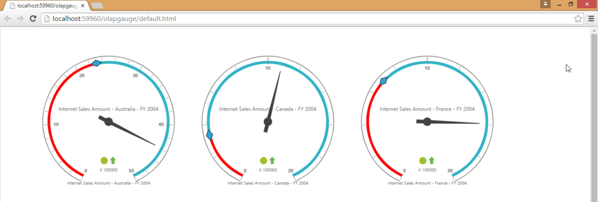
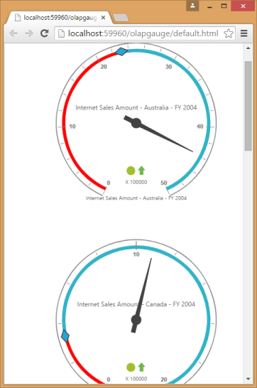

## Responsive Layout

Responsive layout is aimed at crafting sites to provide an optimal viewing experience - easy reading. It also provides navigation with a minimum of resizing, panning, and scrolling  across a wide range of devices from tablet to desktop. To get responsive layout for OLAP Gauge, enable IsResponsive API to true. By using this feature, you can achieve an effective view of the OLAP Gauge control in all devices including desktops, tablets, mobiles, etc. 

[MVC]

@using Syncfusion.JavaScript;

@using Syncfusion.JavaScript.Olap;

  @Html.EJ().Olap().OlapGauge("OlapGauge1").Url(Url.Content("~/wcf/OlapGaugeService.svc")).IsResponsive(true).BackgroundColor("transparent").EnableTooltip(true).Scales(scale =>

{

    scale.ShowRanges(true).Radius(150).ShowScaleBar(true).Size(1).Border(bor=>bor.Width(0.5)).ShowIndicators(true).ShowLabels(true).

        Pointers(pointer =>

        {

            pointer.ShowBackNeedle(true).BackNeedleLength(20).Length(120).Width(7).Add();

            pointer.Type(PointerType.Marker).DistanceFromScale(5).Placement(PointerPlacement.Center).BackgroundColor("#29A4D9").Length(25).Width(15).MarkerType(MarkerType.Diamond).Add();

        }).

    Ticks(ticks =>

    {

        ticks.Type(CircularTickTypes.Major).DistanceFromScale(2).Height(16).Width(1).Color("#8c8c8c").Add();

        ticks.Type(CircularTickTypes.Minor).Height(6).Width(1).DistanceFromScale(2).Color("#8c8c8c").Add();

    })

    .Labels(labels => { labels.Color("#8c8c8c").Add(); })

    .Ranges(ranges =>

    {

        ranges.DistanceFromScale(-5).BackgroundColor("#fc0606").Border(bor=> bor.Color("#fc0606")).Add();

        ranges.DistanceFromScale(-5).Add();

    })

    .CustomLabels(customLabel =>

    {

        customLabel.Position(location => location.X(180).Y(290)).Font(font => font.Size("10px").FontFamily("Segoe UI").FontStyle("Normal")).Color("#666666").Add();

        customLabel.Position(location => location.X(180).Y(320)).Font(font => font.Size("10px").FontFamily("Segoe UI").FontStyle("Normal")).Color("#666666").Add();

        customLabel.Position(location => location.X(180).Y(150)).Font(font => font.Size("12px").FontFamily("Segoe UI").FontStyle("Normal")).Color("#666666").Add();

    }).Add();

}).ClientSideEvents(oCli => { oCli.RenderSuccess("loadOLAPGaugeTheme"); })

{  | markdownify }
{:.image }

{  | markdownify }
{:.image }

