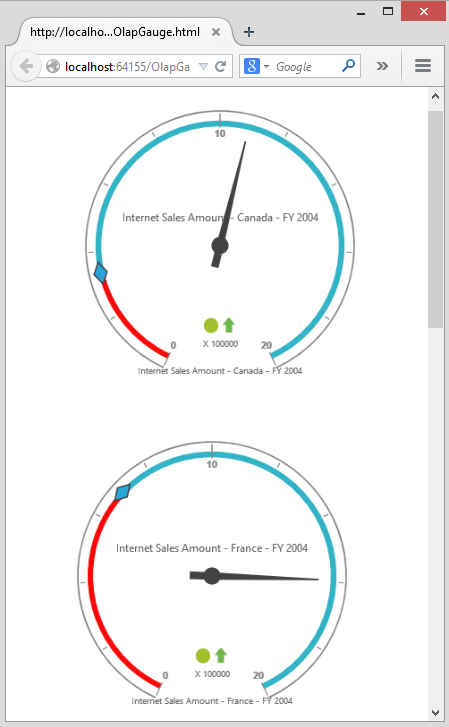

# Responsive Layout

OlapGauge widget supports responsive rendering based on the target device (desktop & tablet) resolution. It supports resolution upto 1024x600. You can enable responsiveness in OlapGauge by setting `IsResponsive` property to true.



@Html.EJ().Olap().OlapGauge("OlapGauge1").Url(Url.Content("~/OlapGauge")).IsResponsive(true)



_Normal View_

_Responsive View_

