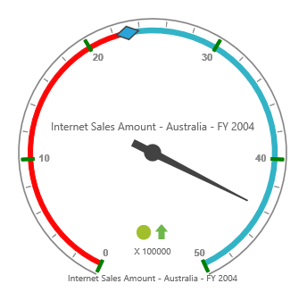

# Ticks

## Adding Tick Collection

Tick collection can be directly added to the scales option within the OlapGauge widget as an array.



@Html.EJ().Olap().OlapGauge("OlapGauge1").Url(Url.Content("~/OlapGauge")).Scales(scales => {
    scales.Ticks(ticks => { ticks.Type(CircularTickTypes.Major).Add(); }).Add();
})



## Tick Customization

The appearance of the tick can be customized through the following properties.

* **Type** – indicates whether ticks are for major or minor intervals. By default, the type is "Major".
* **Height** – sets the height of the ticks.
* **Width** – sets the width of the ticks.
* **Angle** – rotates the ticks to a specified angle. By default, the angle value is 0.
* **Color** – displays the ticks in specified color.
* **DistanceFromScale** – sets the distance between scale and ticks. By default, the values is 0.
* **Placement** – positions the ticks with respect to the scale.  By default, the value is set to "Far".



@Html.EJ().Olap().OlapGauge("OlapGauge1").Url(Url.Content("~/OlapGauge")).Scales(scales => {
    scales.Ticks(ticks => { ticks.Type(CircularTickTypes.Major).Height(15).Width(4).Angle(0).Color("green").DistanceFromScale(2).Placement(TickPlacement.Near).Add(); }).Add();
})



 
