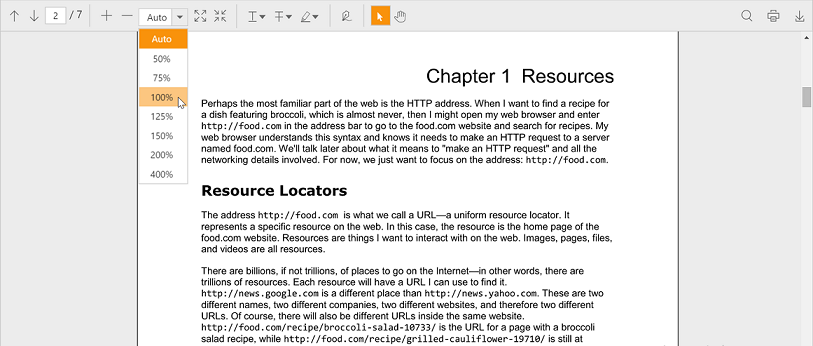

# Appearance in PDF Viewer

You can apply themes to the PDF viewer to match the themes of your application.

The following are the available built-in themes:

* Flat-azure
* Flat-lime
* Flat-lime-dark
* Flat-saffron
* Flat-saffron-dark
* Gradient-azure
* Gradient-azure-dark
* Gradient-lime
* Gradient-lime-dark
* Gradient-saffron
* Gradient-saffron-dark
* Bootstrap
* High-contrast-01
* High-contrast-02
* Material
* Office-365

By default, ‘flat-azure’ theme is applied to PDF viewer. You can change the theme by changing the stylesheet reference. Applying ‘gradient-saffron’ theme to PDF viewer is illustrated as follows.


<!—style sheet for ‘gradient-saffron’ theme.-->
<link href="https://cdn.syncfusion.com/16.1.0.24/js/web/gradient-saffron/ej.web.all.min.css" rel="stylesheet" />



The following screenshot shows the PDF viewer in ‘gradient-saffron’ theme:

