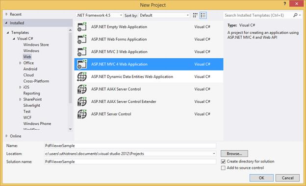

# Getting Started

This section explains how to add and use a PDF viewer control in your web application with ASP.NET MVC.

### Create your first PDF viewer application in ASP.NET MVC

Open Visual Studio and create a new project by clicking New Project. Select the Web category and ASP.NET MVC4 Web Application template, and then click OK. The following screenshot displays the Project Creation Wizard in Visual Studio 2012:

The following screenshot displays how to select the project template with razor view engine:

### Add Controller and View page

Add new MVC controller in the Controllers folder and name it as **PdfSampleController.cs**

Create a new folder **PdfSample** in views and add new view **Index.cshtml** in it.

### Modify RouteConfig.cs

Modify the routing to map to the **PdfSample** controller as follows.


using System;
using System.Collections.Generic;
using System.Linq;
using System.Web;
using System.Web.Mvc;
using System.Web.Routing;
namespace PdfViewerSample
{
    public class RouteConfig
    {
        public static void RegisterRoutes(RouteCollection routes)
        {
            routes.IgnoreRoute("{resource}.axd/{*pathInfo}");
            routes.MapRoute(
                name: "Default",
                url: "{controller}/{action}/{id}",
                defaults: new { controller = "PdfSample", action = "Index", id = UrlParameter.Optional }
            );
        }
    }
}


### Modify WebApiConfig.cs

Modify the routing to map to the API controller of **PdfViewerSample** project as follows.


using System;
using System.Collections.Generic;
using System.Linq;
using System.Web.Http;
namespace PdfViewerSample
{
    public static class WebApiConfig
    {
        public static void Register(HttpConfiguration config)
        {
            config.Routes.MapHttpRoute(
                name: "DefaultApi",
                routeTemplate: "api/{controller}/{action}/{id}",
                defaults: new { id = RouteParameter.Optional }
            );
        }
    }
}


### Configuring Global.asax.cs

The WebApiConfig.cs and RouteConfig.cs must be configured in the Application_Start() method of Global.asax.cs


protected void Application_Start()
{
    AreaRegistration.RegisterAllAreas();
    WebApiConfig.Register(GlobalConfiguration.Configuration);
    FilterConfig.RegisterGlobalFilters(GlobalFilters.Filters);
    RouteConfig.RegisterRoutes(RouteTable.Routes);
    BundleConfig.RegisterBundles(BundleTable.Bundles);
}


### Add References, Scripts, Styles

#### Add References

Add reference to the following assemblies from [NuGet package:](https://help.syncfusion.com/extension/syncfusion-nuget-packages/web-nuget-packages-details)

 * System.Web.Http
 * System. Web.Http.WebHost
 * System.Net.Http.WebRequest
 * System.Net.Http.Formatting

N> The System.Web.Routing and System.Net.Http assemblies are also required, which are referred by default when creating the project.

Add the following references that are necessary for the PDF viewer control and set the Copy Local property to **True**

* Syncfusion.Compression.Base
* Syncfusion.Pdf.Base
* Syncfusion.EJ
* Syncfusion.EJ.PdfViewer
* Syncfusion.EJ.MVC

#### Add Scripts and Styles

Find the scripts for the PDF viewer control and style sheets in any of the following locations: 

Local Disk: [Click here](https://help.syncfusion.com/js/installation-and-deployment# "Installation and deployment") to know more about script and style sheets installed in local machine.

CDN Link: [Click here](https://help.syncfusion.com/js/cdn# "CDN scripts and styles links") to know more about script and style sheets available online.

NuGet Package: [Click here](https://help.syncfusion.com/js/installation-and-deployment#configuring-syncfusion-nuget-packages "Configuring Syncfusion NuGet Packages") to know more about script and style sheets available in NuGet package.

N> For getting started, you can use the ej.web.all.min.js file, which encapsulates all the ej widgets and frameworks in a single file. In production, it is highly recommended to use [custom script generator](http://csg.syncfusion.com/) to create custom script file with required widgets and its dependencies to reduce the size of the script file.

Add the script files and CSS files in the &#60;title&#62; tag of View page.


<link href="https://cdn.syncfusion.com/16.1.0.24/js/web/flat-azure/ej.web.all.min.css" rel="stylesheet" />



N> If the _Layout.cshtml is available, refer to the script files and CSS files in the _Layout.cshtml.

### Modify Web.config

To render the PDF viewer in unobtrusive mode, refer to the **ej.unobtrusive.js** script file. Otherwise set **UnobtrusiveJavaScriptEnabled** to false in Web.config file. Add the following namespace in Web.config of Views.


<add namespace="Syncfusion.EJ"/>
<add namespace="Syncfusion.MVC.EJ"/>


### Add Control in View page

#### Initializing the PDF viewer control

#### 1.Setting ServiceUrl and PdfService

To initialize the PDF viewer control, use the ServiceUr property that is necessary to access the service from which the PDF document is loaded and processed for the control. The PdfService property can also be used to specify the location of the supporting PDF service.


@(Html.EJ().PdfViewer("pdfviewer").ServiceUrl("https://js.syncfusion.com/ejServices/api/PdfViewer").PdfService(“Local”))


#### 2.Provide Web API action methods

The Web API action methods must be available in the server (Web API controller) to load and process the PDF documents. The available API methods in the controller are Load, FileUpload, Download, and Unload. However, we can modify the name of the server action methods as used in the controller using the ServerActionSettings property in the PDF viewer control.


@(Html.EJ().PdfViewer("pdfviewer").ServiceUrl("https://js.syncfusion.com/ejServices/api/PdfViewer").ServerActionSettings(s=>s.Load(“LoadAction”).FileUpload(“FileUploadAction”).Download(“DownloadAction”)))


#### 3.Load PDF documents from client side

The PDF documents can be loaded in the PDF viewer control using the load() method in the client side. The path of the PDF document and the base64 string of the document can be used to load the PDF document.

N> If the name of the PDF document is only passed as parameter in the load() method, the PDF document must be available in the folder which is specified in the Load action method in the controller.


var pdfviewer=$(“#pdfviewer”).data(“ejPdfViewer”);
pdfviewer.load(“HTTP Succinctly”);


When the PDF document is loaded in the PDF viewer control, the documentLoad event will be triggered. We can define the event method using the DocumentLoaded property of the control.


@(Html.EJ().PdfViewer("pdfviewer").ServiceUrl("https://js.syncfusion.com/ejServices/api/PdfViewer").ClientSideEvents(e=>e.DocumentLoaded(“documentLoaded”)))



#### 4.Load the documents during control initialization

The PDF document can also be loaded during the PDF viewer control initialization using the DocumentPath property. The path of the PDF document and the base64 string of the document can be used to load the PDF document.

N> If the name of the PDF document is only set in the DocumentPath property, the PDF document must be available in the folder which is specified in the Load action method in the controller


@(Html.EJ().PdfViewer("pdfviewer").ServiceUrl("https://js.syncfusion.com/ejServices/api/PdfViewer").DocumentPath(“HTTP Succinctly”))


#### 5.Unload the documents from PDF viewer control

The PDF document loaded in the PDF viewer control can be unloaded using the unload() method in the client side.


var pdfviewer=$(“#pdfviewer”).data(“ejPdfViewer”);
pdfviewer.unload();


When the PDF document is unloaded from the PDF viewer control, the documentUnload event will be triggered. You can define the event method using the DocumentUnloaded property of the control.


@(Html.EJ().PdfViewer("pdfviewer").ServiceUrl("https://js.syncfusion.com/ejServices/api/PdfViewer").ClientSideEvents(e=>e.DocumentUnloaded(“documentUnloaded”)))



#### 6.Events available in the PDF viewer control

**Destroy** 

When the PDF viewer control is destroyed, the Destroy event will be triggered. You can define the event method using the Destroy property of the control.


@(Html.EJ().PdfViewer("pdfviewer").ServiceUrl("https://js.syncfusion.com/ejServices/api/PdfViewer").ClientSideEvents(e=>e.Destroy(“destroyed”)))



**HyperlinkClicked**

When the hyperlinks available in the PDF document is clicked, the hyperlinkClick event will be triggered. You can define the event method using the HyperlinkClicked property of the control


@(Html.EJ().PdfViewer("pdfviewer").ServiceUrl("https://js.syncfusion.com/ejServices/api/PdfViewer").ClientSideEvents(e=>e.HyperlinkClicked(“hyperlinkClick”)))



**AjaxRequestFailure**

When the AJAX requests from the client to the API controller is failed, ajaxRequestFailure event will be triggered. You can define the event method using the AjaxRequestFailure property of the control.


@(Html.EJ().PdfViewer("pdfviewer").ServiceUrl("https://js.syncfusion.com/ejServices/api/PdfViewer").ClientSideEvents(e=>e.AjaxRequestFailure(“ajaxFailureRequest”)))



### Displaying PDF document using Remote service

Add the following code snippet to Index.cshtml. Here, the PDF viewer uses hosted service in the remote machine to process the PDF.


@using Syncfusion.JavaScript
@using Syncfusion.MVC.EJ
<!DOCTYPE html>
<html>
<head>
    <meta name="viewport" content="width=device-width" />
    <title>PDF viewer</title>
    <link href="https://cdn.syncfusion.com/16.1.0.24/js/web/flat-azure/ej.web.all.min.css" rel="stylesheet" />
    
    
</head>
<body>
    

        

@(Html.EJ().PdfViewer("pdfviewer").ServiceUrl("https://js.syncfusion.com/ejServices/api/PdfViewer"))
        

    

    @(Html.EJ().ScriptManager())
</body>
</html>


### Displaying PDF document using Web API

Add new folder **WebApi** in the solution and add new Web API Controller Class. Name it as **PdfViewerController** and click OK

Replace the below code in the PdfViewerController.cs


using Newtonsoft.Json;
using Syncfusion.EJ.PdfViewer;
using System.Collections.Generic;
using System.IO;
using System.Web;
using System.Web.Http;
namespace PdfViewerSample.WebApi
{
    public class PdfViewerController : ApiController
    {
        //Post action for processing the PDF documents.
        public object Load(Dictionary<string, string> jsonResult)
        {
            PdfViewerHelper helper = new PdfViewerHelper();
            if (jsonResult.ContainsKey("isInitialLoading"))
                helper.Load(HttpContext.Current.Server.MapPath("~/App_Data/HTTP Succinctly.pdf"));
            return JsonConvert.SerializeObject(helper.ProcessPdf(jsonResult));
        }
        //Post action for processing the PDF documents when uploading to the ejPdfviewer widget.
        public object FileUpload(Dictionary<string, string> jsonResult)
        {
            PdfViewerHelper helper = new PdfViewerHelper();
            if (jsonResult.ContainsKey("uploadedFile"))
            {
                var fileUrl = jsonResult["uploadedFile"];
                byte[] byteArray = Convert.FromBase64String(fileUrl);
                MemoryStream stream = new MemoryStream(byteArray);
                helper.Load(stream);
            }
            return JsonConvert.SerializeObject(helper.ProcessPdf(jsonResult));
        }

        //Post action for downloading the PDF documents from the ejPdfviewer widget.
        public object Download(Dictionary<string, string> jsonResult)
        {
            PdfViewerHelper helper = new PdfViewerHelper();
            return helper.GetDocumentData(jsonResult);
        }
		
		//Post action for unloading and disposing the PDF document resources in server side from the ejPdfviewer widget.
		public void Unload()
        {
            PdfViewerHelper helper = new PdfViewerHelper();
            helper.UnLoad();
        }
    }
}


N> Add the PDF document to be viewed in App_Data folder of the project.

Add the following code snippet to Index.cshtml. Here, the PDF viewer uses the Web API to process the PDF.


@using Syncfusion.JavaScript
@using Syncfusion.MVC.EJ
<!DOCTYPE html>
<html>
<head>
    <meta name="viewport" content="width=device-width" />
    <title>PDF viewer</title>
    <link href="https://cdn.syncfusion.com/16.1.0.24/js/web/flat-azure/ej.web.all.min.css" rel="stylesheet" />
    
    
</head>
<body>
    

        

            @(Html.EJ().PdfViewer("pdfviewer").ServiceUrl(VirtualPathUtility.ToAbsolute("~/api/PdfViewer")))
        

    

    @(Html.EJ().ScriptManager())
</body>
</html>


**Sample:**

<http://www.syncfusion.com/downloads/support/directtrac/general/ze/PdfViewer_MVCsample517121195>

Run the sample and you will see the PDF viewer control as in the below screenshot.

