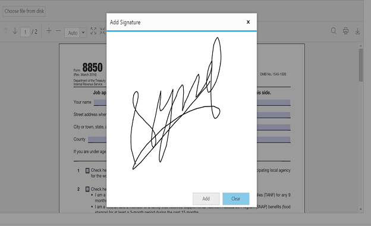
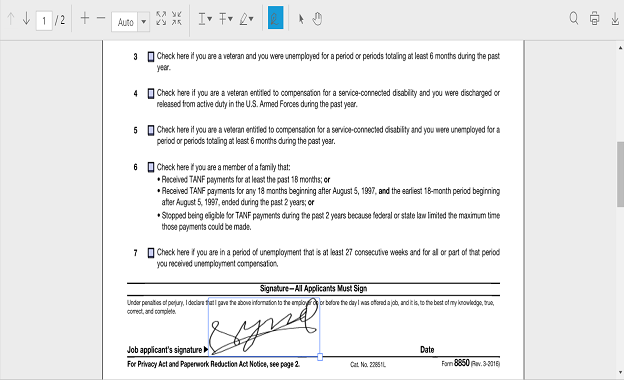
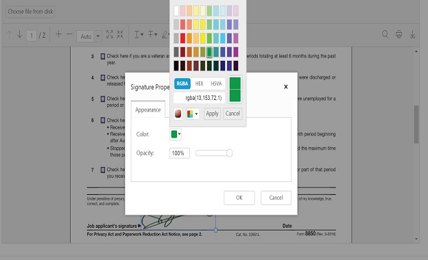

## Handwritten Signature

The PDF viewer supports adding handwritten signatures into the PDF document. The handwritten signature reduces the paper work of reviewing the content and verifies it digitally.

The PDF viewer control has an option in the toolbarSettings property to enable or disable the signature button in the default toolbar.

The following code snippet describes how to disable the signature tool in the widget.



    @(Html.EJ().PdfViewer("pdfviewer").ServiceUrl(VirtualPathUtility.ToAbsolute("~/api/PdfViewer"))
        .ToolbarSettings(t=>t.Items(Syncfusion.JavaScript.PdfViewerEnums.ToolbarItems.SignatureTool)))



**Enable or Disable handwritten signature**

The adding of handwritten signature feature in the PDF document can be enabled or disabled using the EnableSignture property.


@(Html.EJ().PdfViewer("pdfviewer").ServiceUrl("https://js.syncfusion.com/ejServices/api/PdfViewer").EnableSignature(true))


**Providing settings for hand written signature**

You can get or set the settings of the handwritten signature using the signatureSettings property. The signatureSettings property is used to set the color and opacity of the hand written signature.





**Adding signature in the PDF document**

The handwritten signature can be added by drawing the signature content in the signature panel and clicking the button labeled ADD. The following screenshots are the pictorial representation of this.

When the handwritten signature is added in the PDF document, the signatureAdd event will be triggered in the control. The event method can be defined using the SignatureAdd property of the control.


@(Html.EJ().PdfViewer("pdfviewer").ServiceUrl("https://js.syncfusion.com/ejServices/api/PdfViewer").ClientSideEvents(e=>e.SignatureAdd(“signatureAdded”)))



**Move, Resize and Delete the Handwritten Signature**

The handwritten signature content can be moved to the specified location within the page bounds by using touch gestures, arrow keys, and mouse. We can also resize the handwritten signature content by maintaining the aspect ratio.

When the handwritten signature is resized in the PDF viewer control, the signatureResize event will be triggered in the control. The event method can be defined using the SignatureResize property of the control.


@(Html.EJ().PdfViewer("pdfviewer").ServiceUrl("https://js.syncfusion.com/ejServices/api/PdfViewer").ClientSideEvents(e=>e.SignatureResize(“signatureResize”)))



The selected handwritten signature content can be deleted using the “Delete” option in the context menu or delete key. The following screenshots are the pictorial representation of this.

     

When the handwritten signature is deleted from the PDF document, the signatureDelete event will be triggered in the control. The event method can be defined using the SignatureDelete property of the control.       


@(Html.EJ().PdfViewer("pdfviewer").ServiceUrl("https://js.syncfusion.com/ejServices/api/PdfViewer").ClientSideEvents(e=>e.SignatureDelete(“signatureDelete”)))



You can undo and redo the changes made to the handwritten signatures included in the PDF document using the undo() and redo() methods. 





**Changing properties of handwritten signature**

The properties that is opacity and color of a handwritten signature can be modified by color palate and opacity slider, which is available in the “Properties” option in context menu. The following screenshots are the pictorial representation of this.

      

Select the desired color from the color palette and then click OK button.

  

The selected color will be updated on the signature.

  

You can also change the opacity of the added signature in the “properties” option.

  

When a property of the handwritten signature is changed in the PDF viewer control, the signaturePropertiesChange event will be triggered in the control. The event method can be defined using the SignaturePropertiesChange property of the control.


@(Html.EJ().PdfViewer("pdfviewer").ServiceUrl("https://js.syncfusion.com/ejServices/api/PdfViewer").ClientSideEvents(e=>e.SignaturePropertiesChange (“signaturePropertiesChanged”)))



**Saving the Signature**

The added signature can be saved to the PDF document and can be downloaded by clicking the download button in the toolbar. This action will not affect the original document.

 

**Printing the Signature**

When the print button is clicked in the toolbar, the PDF document will be printed along with the signature added to the pages. This action will not affect the original document.

