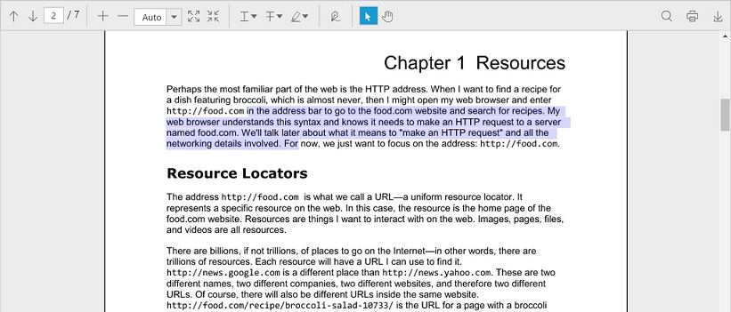
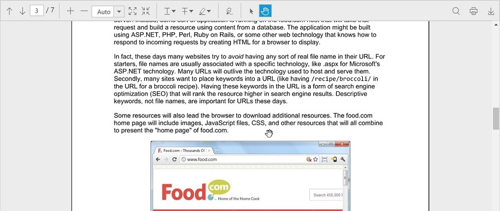

## Interaction Mode

The PDF viewer control provides interaction modes for easy interaction with the PDF documents in the control. Selection mode and Panning mode are the two interaction modes.

### Selection Mode

In this mode, the text selection can be performed in the PDF document loaded in the PDF viewer control. The panning and scrolling of the pages by touch cannot be performed in this mode.

### Enable or disable the Text selection

The text selection in the PDF viewer control can be enabled or disabled using the EnableTextSelection property.


@(Html.EJ().PdfViewer("pdfviewer").ServiceUrl("https://js.syncfusion.com/ejServices/api/PdfViewer").EnableTextSelection(true))


### Panning Mode

In this mode, the panning and scrolling of the pages by touch can be performed in the PDF document loaded in the PDF viewer control, but the text selection cannot be performed.

