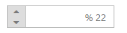

# RTL Support

PercentageTextBox provides RTL (Right-To-Left) support. The alignment of PercentageTextBox can be changed from Left-To-Right into Right-To-Left.

## Enable RTL

In the View page add PercentageTextBox helper, and configure the EnableRTL property.



@Html.EJ().PercentageTextbox("percentage").Value("22").EnableRTL(true)



Output of PercentageTextBox when EnableRTL is “True” is as follows. 

