## Behavior Settings

Decimal Places

DecimalPlaces property specifies number of values allowed after the decimal point.The default value of DecimalPlaces property is 0 i.e., by default you cannot specify decimal value in PercentageTextBox. We need to add this property to allow decimal values.

Configure Decimal Places

In the View page add PercentageTextBox helper, and configure the DecimalPlaces property as follows.

[_cshtml]

@Html.EJ().PercentageTextbox("percent").DecimalPlaces(2).Value("22")

The output is as follows.

{ 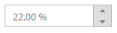 | markdownify }
{:.image }

Persistence Support

PercentageTextBox provides state maintenance support. You can maintain the previous changes made in the control after a page loads.

Configure Persistence Support 

In the View page add PercentageTextBox helper, and configure the EnablePersistence property as follows.

[_cshtml]

 @Html.EJ().PercentageTextbox("percent").Value("22").EnablePersistence(true)

Output of PercentageTextBox with EnablePersistence is as follows. 

1. { 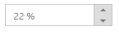 | markdownify }
{:.image }

{ 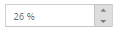 | markdownify }
{:.image }

Strict Mode Support

PercentageTextBox allows you to use the strict mode option by setting the EnableStrictMode property. You can set the MinValue and MaxValue to the controls to enable strict mode functionality. Default value of this property is false. When the textbox value exceeds the MaxValue, it restricts the exceeded value and returns the MaxValue. Likewise when the textbox value goes below MinValue, it restricts the new value and returns the MinValue. When this property is enabled, it does not restrict the specified value and an error class is added to indicate wrong value is provided to the textbox.

Configure Strict Mode Support 

2. In the View page add PercentageTextBox helper, and configure the EnableStrictMode property.

[_cshtml]

@Html.EJ().PercentageTextbox("percent").MinValue(-5).MaxValue(3).EnableStrictMode(true).Value(10)

Output when EnableStrictMode is “True” is as follows.

{ 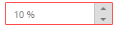 | markdownify }
{:.image }

Enabled or Disabled

PercentageTextBox has an option to enable or disable its element. You can set the Enabled property as “False” to enable the Textbox controls.

Configure Enabled or Disabled 

3. In the View page add PercentageTextBox helper, and configure the Enabled property.

[_cshtml]

@Html.EJ().PercentageTextbox("percent").Value("2").Enabled(false)

Output when Enabled is “True” and when Enabled is “False”.

{ 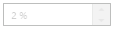 | markdownify }
{:.image }

{ 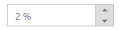 | markdownify }
{:.image }

Adjusting Textbox Size

PercentageTextBox size can be modified by using the Height and Width properties. 

Configure Height and Width 

4. In the View page add PercentageTextBox helper, and configure the Height and Width property.

[_cshtml]

@Html.EJ().PercentageTextbox("percent").Value("2").Width("100").Height("50")

Output of PercentageTextBox after setting “Height” and “Width” is as follows.

{ 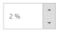 | markdownify }
{:.image }

Increment Step

The IncrementStep property is used to increase or decrease the amount of value in the Percentage textbox. 

Configure Increment Step

In the View page add PercentageTextBox helper, and configure the IncrementStep property.

5. 

[_cshtml]

@Html.EJ().PercentageTextbox("percent").IncrementStep(3).Value("1")

Output of Percentage textbox with IncrementStep is as follows.

{ 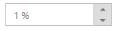 | markdownify }
{:.image }

{ 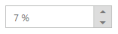 | markdownify }
{:.image }

Define Name

When you have placed the PercentageTextBox in a form, the Name property is used to send the field value at form submission. The default value of the Name property is null.

Configure Name

6. In the View page add PercentageTextBox helper, and configure the Name property.  

[_cshtml]

@Html.EJ().PercentageTextbox("percent").Name("Percentage")

Define Value

The value of PercentageTextBox can be assigned by using the Value property. The default value for Value property is null.

Configure Value

7. In the View page add PercentageTextBox helper, and configure the Value property.  

[_cshtml]

@Html.EJ().PercentageTextbox("percent").Value("21")

Output of PercentageTextBox with the value property is as follows.

{ 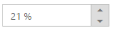 | markdownify }
{:.image }

Define MaxValue and MinValue

MaxValue

The maximum limit value can be assigned to the PercentageTextBox by using the MaxValue property. The default value of MaxValue property is 1.7976931348623157e+308. 

MinValue

The minimum limit value can be assigned to the PercentageTextBox by using the MinValue property. The default value of MinValue property is -1.7976931348623157e+308.

Configure MaxValue and MinValue

8. In the View page add PercentageTextBox helper, and configure the MinValue and MaxValue property.  .  

[_cshtml]

@Html.EJ().PercentageTextbox("percent").Value("3").MinValue(-2).MaxValue(3)

Output of PercentageTextBox with MaxValue and MinValue is as follows.

{ 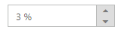 | markdownify }
{:.image }

{ 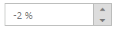 | markdownify }
{:.image }

Read Only Support

PercentageTextBox supports read only option. When you enable the ReadOnly property to the control, the value cannot be changed in the PercentageTextBox. You can set the ReadOnly property as “True” to enable this option.

Configure Read Only

In the View page add PercentageTextBox helper, and configure the ReadOnly property.

9. 

[_cshtml]

@Html.EJ().PercentageTextbox("percentage").Value("2").ReadOnly(true)

Output of PercentageTextBox when ReadOnly is “True” is as follows. PercentageTextBox values cannot be edited or changed.

{  | markdownify }
{:.image }

Appearance

Theme

PercentageTextBox control’s style and appearance can be controlled based on CSS classes. In order to apply styles you need to refer 2 files namely, ej.widgets.core.min.css and ej.theme.min.css. If the file ej.widgets.all.min.css is referred, then it is not necessary to include the files ej.widgets.core.min.css and ej.theme.min.css in your project, as ej.widgets.all.min.css is the combination of these two. 

By default, there are 12 themes support available namely:

* default-theme
* flat-azure-dark
* fat-lime
* flat-lime-dark
* flat-saffron
* flat-saffron-dark
* gradient-azure
* gradient-azure-dark
* gradient-lime
* gradient-lime-dark
* gradient-saffron
* gradient-saffron-dark

CSS Class

The CSS can be customized by using the CssClass in the PercentageTextBox. You can customize the PercentageTextBox with CssClass property to appear like your desired control.

Configure CSS Class

10. In the View page add PercentageTextBox helper, and configure the CssClass property. 

[_cshtml]

@Html.EJ().PercentageTextbox("percentage").Value("2").CssClass("customCss")

1. Customize the CSS properties in custom CSS class.

[CSS]

    &lt;style&gt;

        .customCss .e-box {

            border-color: #9d241b;

        }

        .customCss .e-input {

            background-color: #f6db8d;            

        }

        .customCss .e-select {

            background-color: #ecf6ac;

            border-color: #3c36e7;

        }

    &lt;/style&gt;

Output of PercentageTextBox after applying CssClass is as follows.

{ 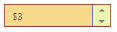 | markdownify }
{:.image }

Rounded Corner Support

PercentageTextBox provides you with rounded corner support whose appearance is different from normal textbox controls.

Configure Rounded Corner Support

2. In the View page add PercentageTextBox helper, and configure the ShowRoundedCorner property. 

[_cshtml]

@Html.EJ().PercentageTextbox("percentage").Value("2").ShowRoundedCorner(true)

Output of PercentageTextBox when ShowRoundedCorner is “True”.

{ 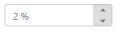 | markdownify }
{:.image }

Spin Button Support

PercentageTextBox provides you the option as to whether to display the split button in the widget or remove it from the control by using showSpinButton property.

Configure Spin Button

In the View page add PercentageTextBox helper, and configure the ShowSpinButton property. 

[_cshtml]

@Html.EJ().PercentageTextbox("percentage").Value("2").ShowSpinButton(false)

Output of PercentageTextBox when ShowSpinButton is “False”.

{ 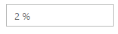 | markdownify }
{:.image }

Water Mark Text Support

The PercentageTextBox provide water mark text support. You can display the initial value in the control by water mark.

Configure Water Mark Text

In the View page add PercentageTextBox helper, and configure the ShowSpinButton property.

[_cshtml]

@Html.EJ().PercentageTextbox("percentage").WatermarkText("Percentage")

Output of PercentageTextBox after applying WaterMarkText is as follows.

{ 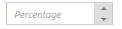 | markdownify }
{:.image }

