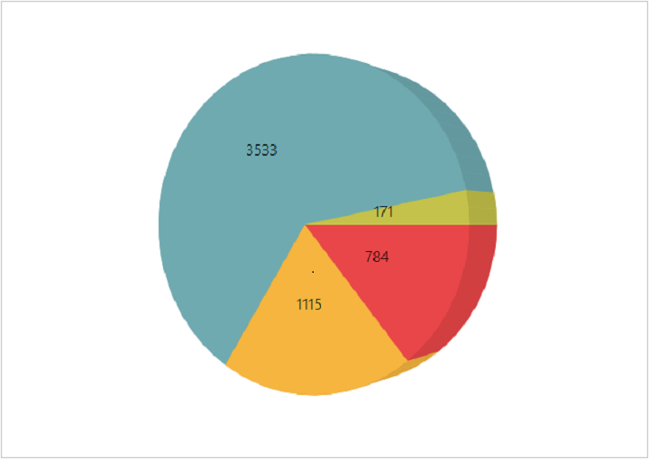
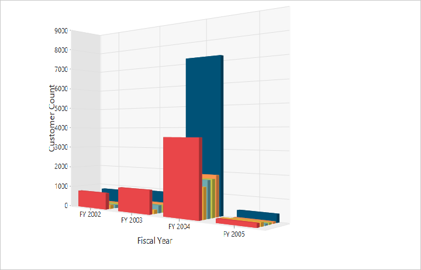

# 3D Visualization

The PivotChart control allows you to view the data in a 3D view. Following are the chart types that are supported:

* Bar
* Column
* Stacking Bar
* Stocking Column 
* Pie

## 3D Column Chart

3D Column Chart is rendered by specifying the chart type as **“Column”** in the **“CommonSeriesOptions”** enumeration property as well as by setting the `Enable3D` property to **“true”.**



@Html.EJ().Pivot().PivotChart("PivotChart1").Url(Url.Content("/RelationalChartService.svc")).Rotation(24).CommonSeriesOptions(comm => { comm.Type(SeriesType.Column); }).Size(size => size.Height("450px").Width("100%")).Enable3D(true)



## 3D Bar Chart

3D Bar Chart is rendered by specifying the chart type as **“Bar”** in the **“CommonSeriesOptions”** enumeration property as well as by setting the `Enable3D` property to **“true”.**



@Html.EJ().Pivot().PivotChart("PivotChart1").Url(Url.Content("/RelationalChartService.svc")).Rotation(24).CommonSeriesOptions(comm => { comm.Type(SeriesType.Bar); }).Size(size => size.Height("450px").Width("100%")).Enable3D(true)



## 3D Stacking Bar Chart
3D Stacking Bar Chart is rendered by specifying the chart type as **“Stacking Bar”** in the **“CommonSeriesOptions”** enumeration property as well as by setting the `Enable3D` property to **“true”.**



@Html.EJ().Pivot().PivotChart("PivotChart1").Url(Url.Content("/RelationalChartService.svc")).Rotation(24).CommonSeriesOptions(comm => { comm.Type(SeriesType.StackingBar); }).Size(size => size.Height("450px").Width("100%")).Enable3D(true)



## 3D Stacking Column Chart
3D Stacking Column Chart is rendered by specifying the chart type as **“Stacking Column”** in the **“CommonSeriesOptions”** enumeration property as well as by setting the `Enable3D` property to **“true”.**



@Html.EJ().Pivot().PivotChart("PivotChart1").Url(Url.Content("/RelationalChartService.svc")).Rotation(24).CommonSeriesOptions(comm => { comm.Type(SeriesType.StackingColumn); }).Size(size => size.Height("450px").Width("100%")).Enable3D(true)



## 3D Pie Chart
3D Pie Chart is rendered by specifying the chart type as **"Pie"** in the **"CommonSeriesOptions"** enumeration property as well as by setting the `Enable3D` property to **“true”.**



@Html.EJ().Pivot().PivotChart("PivotChart1").Url(Url.Content("/RelationalChartService.svc")).Rotation(24).CommonSeriesOptions(comm => { comm.Type(SeriesType.Pie); }).Size(size => size.Height("450px").Width("100%")).Enable3D(true)

   

## Rotating 3D Chart
We can rotate the 3D Chart towards left or right by setting an appropriate angle value to the `Rotation` property. The direction of the Chart display depends upon the positive or negative angle value.



@Html.EJ().Pivot().PivotChart("PivotChart1").Url(Url.Content("/RelationalChartService.svc")).Rotation(40).CommonSeriesOptions(comm => { comm.Type(SeriesType.Column); }).Size(size => size.Height("450px").Width("100%")).Enable3D(true)

 

