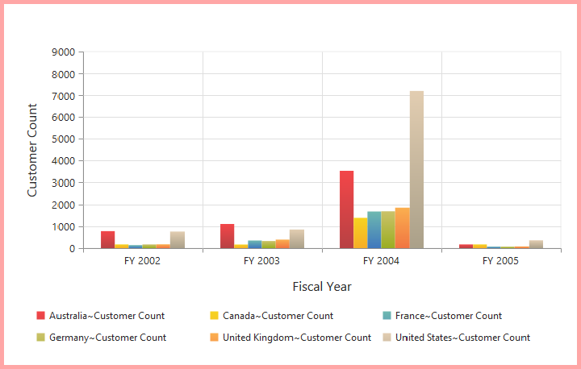
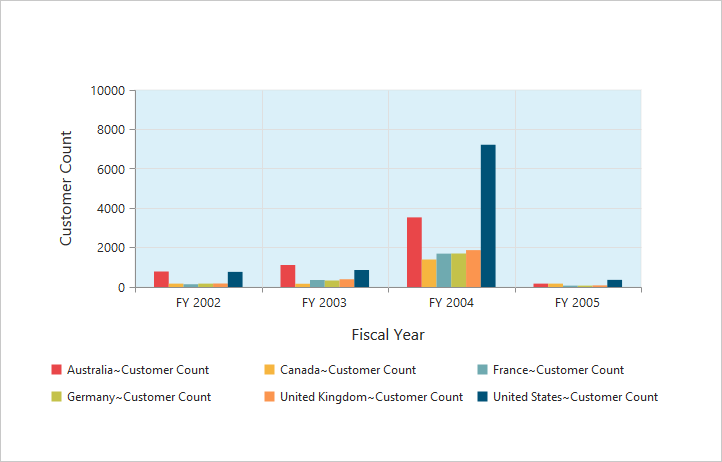
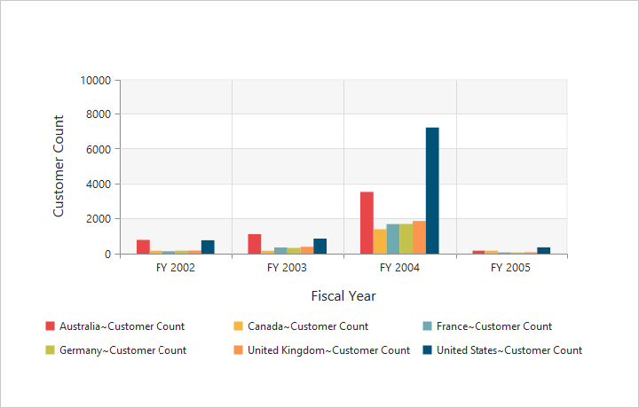

# Appearance

## Built-in Themes

Following are the built-in themes available in the PivotChart.

* flatlight
* gradientlight
* gradientdark
* azure
* azuredark
* lime
* limedark
* saffron
* saffrondark
* gradientlight
* gradientdark
* highcontrast01
* highcontrast02
* material
* office365
* bootstrap

By using the `Theme` property, you can set the desired theme in PivotChart. By default, **"Flat Light"** theme is applied to PivotChart.



//Using gradient theme
@Html.EJ().Pivot().PivotChart("PivotChart1").Theme(Syncfusion.JavaScript.DataVisualization.ChartTheme.GradientLight).Url(Url.Content("/RelationalChartService.svc")).Size(size => size.Height("460px").Width("950px"))



## PivotChart - Area Customization

### Border Customization
To customize the PivotChart border, use `Border` property in PivotChart.



//Customize the chart border and opacity
@Html.EJ().Pivot().PivotChart("PivotChart1").Border(border => border.Color("#FF0000").Width(5)).Url(Url.Content("/RelationalChartService.svc")).Size(size => size.Height("460px").Width("950px"))



### Background Customization
The PivotChart control background can be customized by using the `Background` property in the Chart area.



//Setting background for Chart area
@Html.EJ().Pivot().PivotChart("PivotChart1").ChartArea(area => area.Background("skyblue")).Url(Url.Content("/RelationalChartService.svc")).Size(size => size.Height("460px").Width("950px"))



### Grid Bands Customization
By using the `AlternateGridBand` property of the axis, you can provide different color for grid rows and columns formed by the grid lines in the Chart area. The properties `odd` and `even` are used to customize the grid bands at odd and even positions respectively.



//Customizing horizontal grid bands at even position
@Html.EJ().Pivot().PivotChart("PivotChart1").PrimaryYAxis(primaryYAxis => primaryYAxis.AlternateGridBand(gridband => gridband.Even(even => even.Fill("#A7A9AB").Opacity(0.1)))).Url(Url.Content("/RelationalChartService.svc")).Size(size => size.Height("460px").Width("950px"))



### Animation
You can enable animation by using the `EnableAnimation` property under `CommonSeriesOptions` of the PivotChart control. This animates the Chart series on two occasions - when the Chart is loaded for the first time and when you change the series type by using the `Type` property.



//Enabling animation in series
@Html.EJ().Pivot().PivotChart("PivotChart1").Url(Url.Content("/RelationalChartService.svc")).CommonSeriesOptions(comm => { comm.EnableAnimation(true); }).Size(size => size.Height("460px").Width("100%"))


