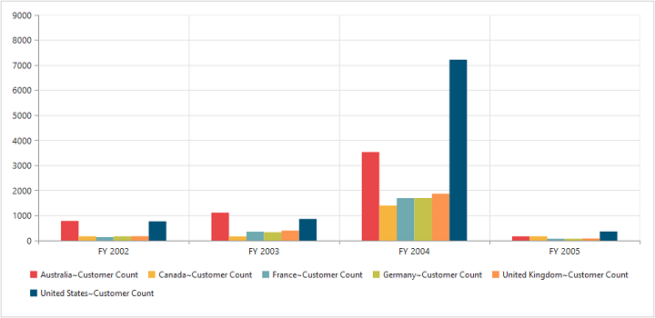

# Dimensions

## Set size in percentage

You can customize the PivotChart dimension by setting the width and height of the control in percentage.



//Set size to Chart container
@Html.EJ().Pivot().PivotChart("PivotChart1").Url(Url.Content("/RelationalChartService.svc")).Size(size => size.Height("80%").Width("80%"))

    
    


## Set size in pixels

You can customize the PivotChart dimension by setting the width and height of the control in pixels.



//Set size to Chart container
@Html.EJ().Pivot().PivotChart("PivotChart1").Url(Url.Content("/RelationalChartService.svc")).Size(size => size.Height("460px").Width("950px"))

    
    


 

## Responsive

PivotChart control supports responsive rendering based on the target device (desktop & tablet) resolution. It supports resolution upto 1024x600. You can enable responsiveness in PivotChart by setting `isResponsive` property to true.



//Enable responsiveness to change the Chart size dynamically.
@Html.EJ().Pivot().PivotChart("PivotChart1").Url(Url.Content("/RelationalChartService.svc")).Size(size => size.Height("460px").Width("950px")).IsResponsive(true)

    
    


_Normal View_

_ResponsiveView_