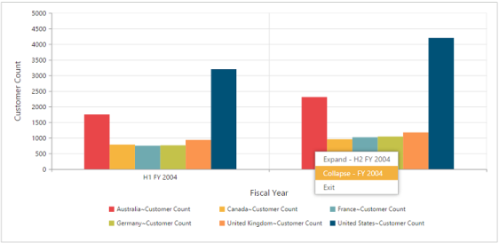

# Drill Operation

This is a basic feature of PivotChart through which the amount of information can be limited, for a better view. It allows you to drill down to access the detailed level of data or drill up to see the summarized data by using the Context Menu present in the PivotChart.

Drill up, also called roll up, navigates from more detailed data to less detailed data, by climbing up a concept hierarchy for a dimension.

Drill down, also called roll down, is the reverse of drill up. It navigates from less detailed data to more detailed data, by climbing down a concept hierarchy for a dimension.

DrillSuccess event gets triggered when you right-click on the PivotChart and select any option available in the context menu to perform drill up or drill down operation.


@Html.EJ().Pivot().PivotChart("PivotChart1").Url(Url.Content("/RelationalChartService.svc")).Size(size => size.Height("460px").Width("950px")).ClientSideEvents(oEve => {oEve.DrillSuccess("DrillSuccess")});



