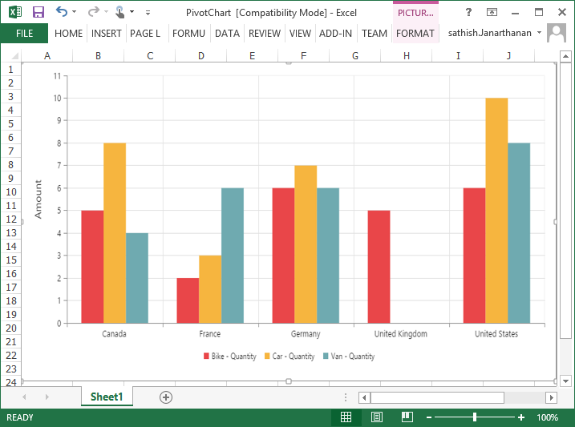

#Exporting

The PivotChart control can be exported to the following file formats.

* Excel
* Word
* PDF
* Image

The PivotChart control can be exported by invoking **“exportPivotChart”** method, with an appropriate export option as parameter.



//If you want to render PivotChart in Client Mode.
  @Html.EJ().Pivot().PivotChart("PivotChart1").CommonSeriesOptions(comm => { comm.Type(SeriesType.Column).Tooltip(tool => { tool.Visible(true); }).EnableAnimation(true); }).Size(size => size.Height("460px").Width("100%")).PrimaryYAxis(primaryYAxis => primaryYAxis.Title(title => title.Text("Amount"))).Legend(legend => legend.Visible(true)).ClientSideEvents(oEve => { oEve.Load("load"); }).IsResponsive(true).DataSource(dataSource => dataSource.Rows(rows => { rows.FieldName("Country").FieldCaption("Country").Add(); rows.FieldName("State").FieldCaption("State").Add(); }).Columns(columns => { columns.FieldName("Product").FieldCaption("Product").Add(); }).Values(values => { values.FieldName("Amount").Add(); }))
                  
//If you want to render PivotChart in Server Mode.
  @Html.EJ().Pivot().PivotChart("PivotChart1").Url(Url.Content("/RelationalChartService.svc"))..Size(size => size.Height("460px").Width("100%"))

  @Html.EJ().Button("Button1").ClientSideEvents(clientSideEvents => { clientSideEvents.Click("exportBtnClick"); }).Text("Export")
  
    


To achieve exporting in client mode, we need to add **"Syncfusion.EJ.Export"** dependency library into the application.

When PivotChart is rendered in Client Mode, a method needs to be added in MVC controller file of the application and we need to import **"Syncfusion.EJ.Export"** namespace in the controller file. 



public void ExcelExport()
{
    System.Web.Script.Serialization.JavaScriptSerializer serializer = new System.Web.Script.Serialization.JavaScriptSerializer() { MaxJsonLength = Int32.MaxValue };
    PivotChartExcelExport pivotChartExcelExport = new PivotChartExcelExport();
    string args = System.Web.HttpContext.Current.Request.Form.GetValues(0)[0];
    Dictionary<string, string> chartParams = serializer.Deserialize<Dictionary<string, string>>(args);
    pivotChartExcelExport.ExportToExcel(chartParams);
}
        


When PivotChart is rendered in Server Mode, a service method needs to be added in WCF/WebAPI for server side operations.

For WebAPI controller, the below method needs to be added.



[System.Web.Http.ActionName("Export")]
[System.Web.Http.HttpPost]
public void Export() {
   string args = HttpContext.Current.Request.Form.GetValues(0)[0];
   string fileName = "Sample";
   htmlHelper.ExportPivotChart(args, fileName, System.Web.HttpContext.Current.Response);
}



For WCF service, the below method needs to be added.



public void Export(System.IO.Stream stream) {
   System.IO.StreamReader sReader = new System.IO.StreamReader(stream);
   string args = System.Web.HttpContext.Current.Server.UrlDecode(sReader.ReadToEnd()).Remove(0, 5);
   string fileName = "Sample";
   htmlHelper.ExportPivotChart(args, fileName, System.Web.HttpContext.Current.Response);
}



##Excel Export

User can export contents of the PivotChart to Excel document for future archival, references and analysis purposes.

###Client Mode

To achieve Excel export, method name **"ExcelExport"** and file name is sent as the parameter.



   
    
  

Following method need to be added in MVC controller file of the application.



public void ExcelExport()
{
    System.Web.Script.Serialization.JavaScriptSerializer serializer = new System.Web.Script.Serialization.JavaScriptSerializer() { MaxJsonLength = Int32.MaxValue };
    PivotChartExcelExport pivotChartExcelExport = new PivotChartExcelExport();
    string args = System.Web.HttpContext.Current.Request.Form.GetValues(0)[0];
    Dictionary<string, string> chartParams = serializer.Deserialize<Dictionary<string, string>>(args);
    pivotChartExcelExport.ExportToExcel(chartParams);
}



###Server Mode

To achieve Excel export, we need to add the following dependency libraries into the application.

* Syncfusion.Compression.Base
* Syncfusion.XlsIO.Base

For Excel export, **“ej.PivotChart.ExportOptions.Excel”** enumeration value is sent as the parameter.



function exportBtnClick(args)
{
    var chartObj = $('#PivotChart1').data("ejPivotChart");
    //Setting export option as Excel in the exportPivotChart method for ServerMode
    chartObj.exportPivotChart(ej.PivotChart.ExportOptions.Excel);
}

  

##Word Export
User can export contents of the PivotChart to Word document for future archival, references and analysis purposes.

###Client Mode

To achieve Word export, method name **"WordExport"** and file name is sent as the parameter.



   
    
  

Following method need to be added in MVC controller file of the application.



public void WordExport()
{
    System.Web.Script.Serialization.JavaScriptSerializer serializer = new System.Web.Script.Serialization.JavaScriptSerializer() { MaxJsonLength = Int32.MaxValue };
    PivotChartWordExport pivotChartWordExport = new PivotChartWordExport();
    string args = System.Web.HttpContext.Current.Request.Form.GetValues(0)[0];
    Dictionary<string, string> chartParams = serializer.Deserialize<Dictionary<string, string>>(args);
    pivotChartWordExport.ExportToWord(chartParams);
}



###Server Mode

 To achieve Word export, we need to add the following dependency libraries into the application.

* Syncfusion.Compression.Base
* Syncfusion.DocIO.Base

For Word export, **“ej.PivotChart.ExportOptions.Word”** enumeration value is sent as the parameter.



function exportBtnClick(args)
{
    var chartObj = $('#PivotChart1').data("ejPivotChart");
    //Setting export option as Word in the exportPivotChart method
    chartObj.exportPivotChart(ej.PivotChart.ExportOptions.Word);
}



##PDF Export

User can export contents of the PivotChart to PDF document for future archival, references and analysis purposes.

###Client Mode

To achieve Word export, method name **"PDFExport"** and file name is sent as the parameter.



   
    
  

Following method need to be added in MVC controller file of the application.



public void PDFExport()
{ 
    System.Web.Script.Serialization.JavaScriptSerializer serializer = new System.Web.Script.Serialization.JavaScriptSerializer() { MaxJsonLength = Int32.MaxValue };
    PivotChartPDFExport pivotChartPDFExport = new PivotChartPDFExport();
    string args = System.Web.HttpContext.Current.Request.Form.GetValues(0)[0];
    Dictionary<string, string> chartParams = serializer.Deserialize<Dictionary<string, string>>(args);
    pivotChartPDFExport.ExportToPDF(chartParams);
}        



###Server Mode

To achieve PDF export, we need to add the following dependency libraries into the application.

* Syncfusion.Compression.Base
* Syncfusion.Pdf.Base

For PDF export, **“ej.PivotChart.ExportOptions.PDF”** enumeration value is sent as the parameter.



function exportBtnClick(args)
{
    var chartObj = $('#PivotChart1').data("ejPivotChart ");
    //Setting export option as PDF in the exportPivotChart method
    chartObj.exportPivotChart(ej.PivotChart.ExportOptions.PDF);
}

 

##Image Export
User can export contents of the PivotChart to image format for future archival, references and analysis purposes. We can export PivotChart to the following image formats.

* PNG
* EMF
* JPG
* GIF
* BMP

###Client Mode

To achieve image export, method name **"ImageExport"** ,**“ej.PivotChart.ExportOptions.PNG”** and file name is sent as the parameter.This is similar to other image formats.



   
    
  

Following method need to be added in MVC controller file of the application.



public void ImageExport()
{
   System.Web.Script.Serialization.JavaScriptSerializer serializer = new System.Web.Script.Serialization.JavaScriptSerializer() { MaxJsonLength = Int32.MaxValue };
   PivotChartImageExport pivotChartImageExport = new PivotChartImageExport();
   string args = System.Web.HttpContext.Current.Request.Form.GetValues(0)[0];
   Dictionary<string, string> chartParams = serializer.Deserialize<Dictionary<string, string>>(args);
   pivotChartImageExport.ExportToImage(chartParams);
}



###Server Mode

To export PivotChart in PNG format, **“ej.PivotChart.ExportOptions.PNG”** enumeration value is sent as the parameter. This is similar to other image formats.



function exportBtnClick(args)
{
    var chartObj = $('#PivotChart1').data("ejPivotChart ");
    //Setting export option as PNG in the exportPivotChart method
    chartObj.exportPivotChart(ej.PivotChart.ExportOptions.PNG);
}

  

##Customize the export document name

###Client Mode

For customizing file name, we need to send file name as parameter to the **“exportPivotChart”**  method along with method name.



function exportBtnClick(args)
{
    var chartObj = $('#PivotChart1').data("ejPivotChart ");
    chartObj.exportPivotChart("ExcelExport","fileName");


    
###Server Mode

For customizing name in WebAPI controller, below code snippet is used.



[System.Web.Http.ActionName("Export")]
[System.Web.Http.HttpPost]
public void Export() {
    string args = HttpContext.Current.Request.Form.GetValues(0)[0];
    string fileName = " File name is customized here ";
    htmlHelper.ExportPivotChart(args, fileName, System.Web.HttpContext.Current.Response);
}



For customizing name in WCF Service, below code snippet is used.



public void Export(System.IO.Stream stream) {
    System.IO.StreamReader sReader = new System.IO.StreamReader(stream);
    string args = System.Web.HttpContext.Current.Server.UrlDecode(sReader.ReadToEnd()).Remove(0, 5);
    string fileName = " File name is customized here ";
    htmlHelper.ExportPivotChart(args, fileName, System.Web.HttpContext.Current.Response);
}



