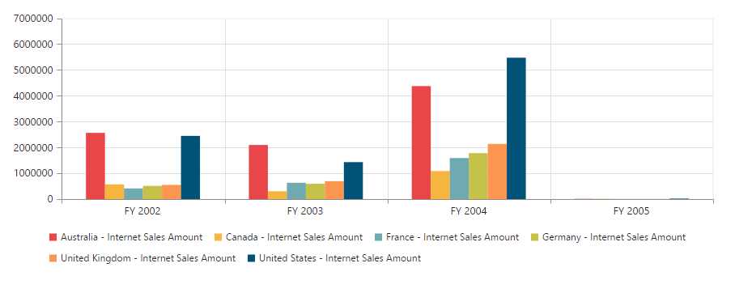

# How to

## Configure pivot chart through the model properties

There comes a time when you want to set pivot chart properties other than using `PivotChartPropertiesBuilder` i.e., in the Controller side. At that time, you can pass `PivotChartProperties` model instance as a parameter to the pivot chart helper method.

We can set properties to pivot chart control in server-side using the `PivotChartProperties` class and it is used in the view page with the help of pivot chart helper overload.

In addition to the `id` parameter of pivot chart helper method, we can also pass `PivotChartProperties` model as another parameter to the pivot chart helper method.

### Relational

The following code example explains how to render the pivot chart control in relational mode.





    @model Syncfusion.JavaScript.Models.PivotChartProperties
    @(Html.EJ().Pivot().PivotChart("PivotChart", Model))

    





namespace PivotChart
{
    public class PivotChartController: Controller
    {
        public ActionResult PivotChartFeatures()
        {
            Syncfusion.JavaScript.Models.PivotChartProperties pchart = new Syncfusion.JavaScript.Models.PivotChartProperties();

            PivotDataSource pchartDS = new PivotDataSource();

            List<Field> rows = new List<Field>();
            rows.Add(new Field() { FieldName = "Country", FieldCaption = "Country" });
            rows.Add(new Field() { FieldName = "State", FieldCaption = "State" });
            pchartDS.Rows = rows;

            List<Field> cols = new List<Field>();
            cols.Add(new Field() { FieldName = "Product", FieldCaption = "Product" });
            pchartDS.Columns = cols;

            pchart.Load = "load";

            List<Field> values = new List<Field>();
            values.Add(new Field() { FieldName = "Amount" });
            pchartDS.Values = values;
            pchart.DataSource = pchartDS;
            return View(pchart);
        }
    }
}





As a result of the previous code example, the pivot chart will be displayed as shown below:

### OLAP

The following code example explains how to render the pivot chart control in OLAP mode.





    @model Syncfusion.JavaScript.Models.PivotChartProperties
    @(Html.EJ().Pivot().PivotChart("PivotChart", Model))





namespace PivotChart
{
    public class PivotChartController: Controller
    {
        public ActionResult PivotChartFeatures()
        {
            Syncfusion.JavaScript.Models.PivotChartProperties pchart = new Syncfusion.JavaScript.Models.PivotChartProperties();

            PivotDataSource pchartDS = new PivotDataSource();
            pchartDS.Data = "https://bi.syncfusion.com/olap/msmdpump.dll";
            pchartDS.Cube = "Adventure Works";
            pchartDS.Catalog = "Adventure Works DW 2008 SE";

            List<Field> rows = new List<Field>();
            rows.Add(new Field() { FieldName = "[Date].[Fiscal]" });
            pchartDS.Rows = rows;

            List<Field> cols = new List<Field>();
            cols.Add(new Field() { FieldName = "[Customer].[Customer Geography]" });
            pchartDS.Rows = cols;

            List<MeasuresItems> measures = new List<MeasuresItems>();
            measures.Add(new MeasuresItems() { FieldName = "[Measures].[Internet Sales Amount]" });
            List<Field> values = new List<Field>();
            values.Add(new Field() { Measures = measures, Axis = Syncfusion.JavaScript.AxisName.Column });
            pchartDS.Values = values;
            pchart.DataSource = pchartDS;
            return View(pchart);
        }
    }
}





As a result of the previous code example, the pivot chart will be displayed as shown below:

