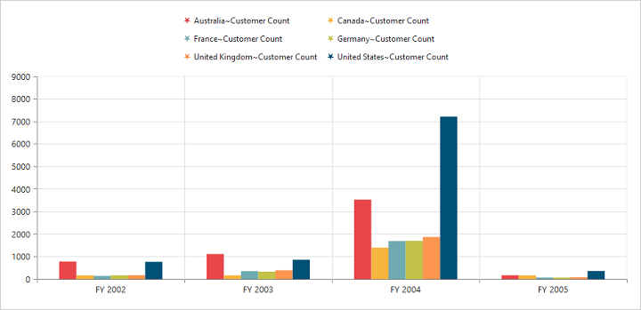

# Legend

## Legend Visibility

You can enable or disable legend using the `Visible` property inside the `Legend` object.

N> By default, the legend is visible in PivotChart.



//Legend Visibility set as true
@Html.EJ().Pivot().PivotChart("PivotChart1").Url(Url.Content("/RelationalChartService.svc")).Size(size => size.Height("460px").Width("950px")).Legend(legend => legend.Visible(true))



## Legend Shape
You can customize the legend `Shape` in PivotChart control. Default value of legend shape is “Rectangle”. Following legend shapes that are supported:

* Rectangle
* Circle
* Cross
* Diamond
* Pentagon
* Hexagon
* Star
* Ellipse
* Triangle etc.



//Applying legend shape
@Html.EJ().Pivot().PivotChart("PivotChart1").Url(Url.Content("/RelationalChartService.svc")).Size(size => size.Height("460px").Width("950px")).Legend(legend => legend.Visible(true).Shape(ChartShape.Star))



## Legend Position
By using the `Position` property, you can place the legend at top, bottom, left or right of the PivotChart.

N> Default value of legend position is "bottom" in PivotChart.



//Place the legend at top of the Chart
@Html.EJ().Pivot().PivotChart("PivotChart1").Url(Url.Content("/RelationalChartService.svc")).Size(size => size.Height("460px").Width("950px")).Legend(legend => legend.Visible(true).Shape(ChartShape.Star).Position(LegendPosition.Top))



## Legend Title
To add the legend title, you have to specify the title text in `title.Text` property.



//Add title to the Chart legend
@Html.EJ().Pivot().PivotChart("PivotChart1").Url(Url.Content("/RelationalChartService.svc")).Size(size => size.Height("460px").Width("950px")).Legend(legend => legend.Visible(true).Title(title => title.Text("Countries")))



## Legend Alignment
You can align the legend to center, far and near based on its position in the Chart area using the `Alignment` option.



//Aligning the legend near to the Chart
@Html.EJ().Pivot().PivotChart("PivotChart1").Url(Url.Content("/RelationalChartService.svc")).Size(size => size.Height("460px").Width("950px")).Legend(legend => legend.Visible(true).Alignment(TextAlignment.Near))



## Legend Items - Size and Border
By using the legend `ItemStyle.width`, `ItemStyle.height` and `ItemStyle.border` properties, you can change the legend items - size and border.



//Changing legend items border, height and width
@Html.EJ().Pivot().PivotChart("PivotChart1").Url(Url.Content("/RelationalChartService.svc")).Size(size => size.Height("460px").Width("950px")).Legend(legend => legend.Visible(true).ItemStyle(ItemSize => ItemSize.Border(border => border.Color("magenta").Width(1.5)).Height(12).Width(12)))



## Legend Border
By using the `Border` option in legend, you can customize border color and width.



//Setting border color and width to legend
@Html.EJ().Pivot().PivotChart("PivotChart1").Url(Url.Content("/RelationalChartService.svc")).Size(size => size.Height("460px").Width("950px")).Legend(legend => legend.Visible(true).Border(border => border.Color("#FFC342").Width(2)))



## Legend Text
By using the `Font` option, you can customize the font family, font style, font weight and size of the legend text.



///Customizing the legend text
@Html.EJ().Pivot().PivotChart("PivotChart1").Url(Url.Content("/RelationalChartService.svc")).Size(size => size.Height("460px").Width("950px")).Legend(legend => legend.Visible(true).Font(font => font.FontFamily("Segoe UI").FontWeight(ChartFontWeight.Bold).FontStyle(ChartFontStyle.Italic).Size("13px")))



