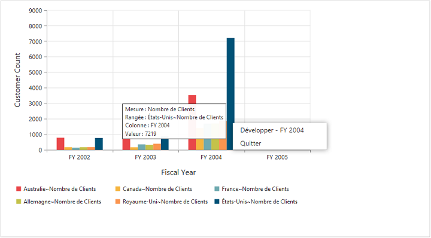

# Localization

## Localization in PivotChart

We can localize the PivotChart controls text with a collection of localized strings using **ej.PivotChart.Locale** for different cultures. By default, the PivotChart control is localized in **“en-US”.**

Following code example illustrates on how to localize PivotChart based on **“French”** culture.



@Html.EJ().Pivot().PivotChart("PivotChart1").Url(Url.Content("/RelationalChartService.svc")).Locale("fr-FR").Size(size => size.Height("320px").Width("100%"))



Following table localizes the in-built keywords to **“French”** culture for PivotChart.

<table>
<tr>
<th>
Keywords</th><th>
Values</th>
</tr>
<tr><td>
Measure</td><td>
“Mesure”</td>
</tr>
<tr><td>
Row</td><td>
"Rangée "</td>
</tr>
<tr><td>
Column</td><td>
"Colonne”</td>
</tr>
<tr><td>
Value</td><td>
"Valeur "</td>
</tr>
<tr><td>
Expand</td><td>
"Développer "</td>
</tr>
<tr><td>
Collapse</td><td>
"Effondrement "</td>
</tr>
<tr><td>
Exit</td><td>
“Quitter "</td>
</tr>
</table>

## Localization and Globalization of Cube Info (Client Mode)

Content displayed within the PivotChart control are obtained from the OLAP Cube. So following are the steps that needs to be done to get the localized and globalized Cube content.

* To get localized data from OLAP Cube, we need to set **"Locale Identifier"** in the connection string to a specific culture in the **"Data"** property present inside **"DataSource"**.
* To bind the globalized content in PivotChart control, we need to set **"Locale"** property to a specific culture and want to refer specific culture file in the sample.

N> Culture files are present under **"[installed drive]:\Users\[user name]\AppData\Local\Syncfusion\EssentialStudio\X.X.X.X\MVC\Samples\web\Scripts\cultures".**



//1036 refers to “fr-FR” culture.
 @Html.EJ().Pivot().PivotChart("PivotChart1").Locale("fr-FR").CommonSeriesOptions(comm => { comm.Type(SeriesType.Column).Tooltip(tool => { tool.Visible(true); }).EnableAnimation(true); }).Size(size => size.Height("350px").Width("100%")).PrimaryXAxis(primaryXAxis => primaryXAxis.Title(title => title.Text("Date - Fiscal")).LabelRotation(0)).PrimaryYAxis(primaryYAxis => primaryYAxis.Title(title => title.Text("Internet Sales Amount"))).Legend(legend => legend.Visible(true).RowCount(2)).ClientSideEvents(
                  oEve => { oEve.Load("loadTheme"); }).IsResponsive(true).DataSource(dataSource => dataSource.Rows(rows=>{rows.FieldName("[Date].[Fiscal]").Add();}).Columns(columns=>{columns.FieldName("[Customer].[Customer Geography]").Add();}).Values(values => { values.Measures(measures => { measures.FieldName("[Measures].[Internet Sales Amount]").Add(); }).Axis(AxisName.Column).Add();})
.Data("https://bi.syncfusion.com/olap/msmdpump.dll;Locale Identifier=1036;").Catalog("Adventure Works DW 2008 SE").Cube("Adventure Works"))



## Localization and Globalization of Cube Info

Content displayed within the PivotChart control are obtained from the OLAP Cube. So following are the steps that needs to be done to get the localized and globalized Cube content.

* To get the localized string based on different cultures, from OLAP Cube, we need to set **"Locale Identifier"** in the connection string to a specific culture.
* To bind the globalized content in PivotGrid control, we need to set **"Culture"** and **"OverrideDefaultFormatStrings"** properties in OlapDataManager class to a specific culture.



//1036 refers to “fr-FR” culture.
string connectionString = "Data Source=localhost; Initial Catalog=Adventure Works DW; Locale Identifier=1036;";
DataManager = new OlapDataManager(connectionString);
DataManager.Culture = new System.Globalization.CultureInfo(1036);
DataManager.OverrideDefaultFormatStrings = true;



