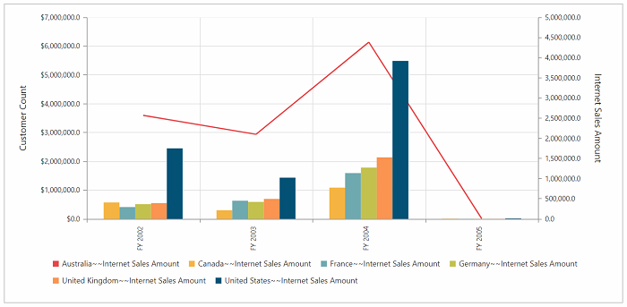
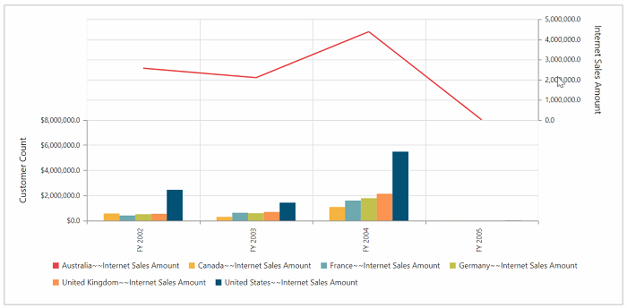
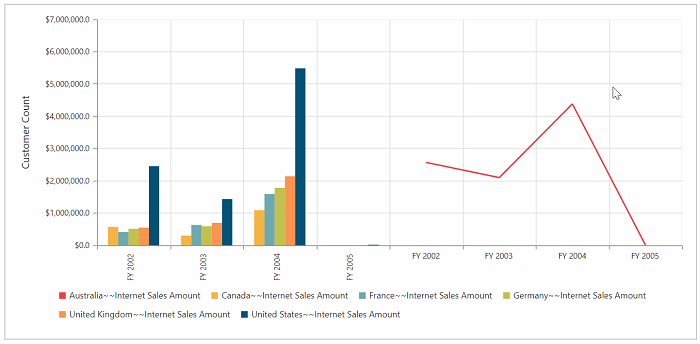
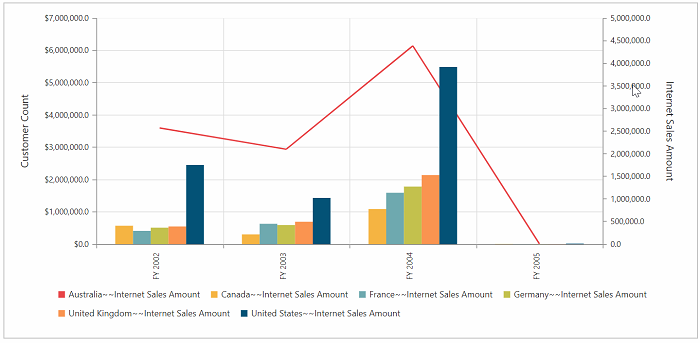
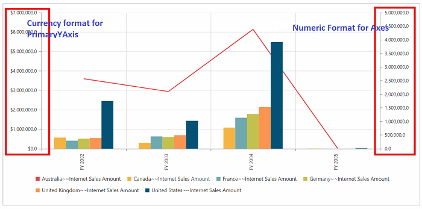
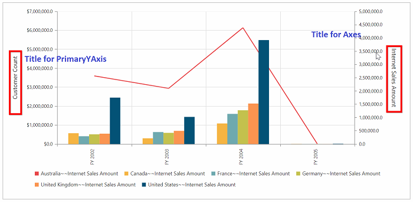

# Multiple Axes

You can split the pivot chart and its area into multiple panes to draw multiple series with multiple axes. Additional vertical/horizontal axes in the pivot chart can be created by the [`axes`](/api/js/ejpivotchart#members:axes) property.

Before rendering multiple axes in the pivot chart, you should know some important properties of axes and series of the pivot chart.

### Properties of axes

* **rowIndex**: Specifies the index of the row where the axis is associated.
* **columnIndex**: Specifies the index of the column where the axis is associated.
* **opposedPosition**: Specifies whether to render the axis at the opposite side of its default position.
* **labelFormat**: Provides custom formatting for axis label and supports all standard formatting types of numerical and date time values.
* **title**: You can customize the title of the axis by the following properties.
       * **enableTrim**: Specifies whether to trim the axis title when it exceeds the chart area or the maximum width of the title.
       * **maximumTitleWidth**: When the title exceeds the maximum width, the title gets trimmed by setting enableTrim to true.
       * **visible**: Controls the visibility of the axis title.
* **name**: Unique name of the axis. To associate an axis with the series, you have to set this name to the xAxisName/yAxisName property of the series.

To know more about axes properties, [`Click Here`](https://help.syncfusion.com/api/js/ejchart#members:axes)

### Properties of series

* **xAxisName**: Specifies the name of the X-axis that has to be associated with this series. Add an axis instance with this name to axes collection.
* **yAxisName**: Specifies the name of the Y-axis that has to be associated with this series. Add an axis instance with this name to axes collection.

## Customizing axes at row index of zero
You can customize the axes in the primary pivot chart itself. To achieve this, you should give the following properties:



@Html.EJ().Pivot().PivotChart("PivotChart1").Axes(ax => { ax.RowIndex(0).Name("yAxisConfig").Add(); }).ClientSideEvents(clientSideEvents => clientSideEvents.Load("onLoad").BeforeSeriesRender("onBeforeRender"))
//....







## Customizing axes at row index one



@Html.EJ().Pivot().PivotChart("PivotChart1").Axes(ax => { ax.RowIndex(1).Name("yAxisConfig").Add(); }).ClientSideEvents(clientSideEvents => clientSideEvents.Load("onLoad").BeforeSeriesRender("onBeforeRender"))
//....







## Customizing axes at column index of zero



@Html.EJ().Pivot().PivotChart("PivotChart1").Axes(ax => { ax.ColumnIndex(0).Name("xAxisConfig").Add(); }).ClientSideEvents(clientSideEvents => clientSideEvents.Load("onLoad").BeforeSeriesRender("onBeforeRender"))
//....







## Customizing axes at column index of one



@Html.EJ().Pivot().PivotChart("PivotChart1").Axes(ax => { ax.ColumnIndex(1).Name("xAxisConfig").Add(); }).ClientSideEvents(clientSideEvents => clientSideEvents.Load("onLoad").BeforeSeriesRender("onBeforeRender"))
//....







## Customizing series
You can customize the series in multiple axes support with the help of **beforeSeriesRender** event. You can change the series type through the **onBeforeRender** event.



@Html.EJ().Pivot().PivotChart("PivotChart1").Axes(ax => { ax.Name("yAxisConfig").Add(); }).ClientSideEvents(clientSideEvents => clientSideEvents.Load("onLoad").BeforeSeriesRender("onBeforeRender"))
//....







**Note:** You have to use the same name in both name property of axes and xAxisName/yAxisName property of series in the above **beforeSeriesRender** event.

To learn more about series properties, [`click here`](https://help.syncfusion.com/api/js/ejchart#members:series).

## Multiple axes support by series index

You can render the pivot chart with multiple axes by series index.

**Note:** This is the default behavior of multiple axes support, if you are not triggering the beforeSeriesRender event.



@Html.EJ().Pivot().PivotChart("PivotChart1").Axes(ax => { ax.Name("y:0").Add();ax.Name("x:1").Add() })
//....





 Name("y:0") => //you can create separate y axes for the series which you want
                //y indicates(yAxisName) axis in which series needs to be added.
                //0 indicates the series index of pivot chart.
                //you can also use pass multiple series index separated by comma(y:0,2)

 Name("x:1") =>  //you can create separate x axes for the series which you want
                 // x indicates(xAxisName) axis in which series needs to be added.
                 // 0 indicates the series index of pivot chart.
                 // you can also use pass multiple series index separated by comma(x:0,2)



### For Y-axes



@Html.EJ().Pivot().PivotChart("PivotChart1").Axes(ax => { ax.Name("y:0").Add(); })
//....



### For X-axes



@Html.EJ().Pivot().PivotChart("PivotChart1").Axes(ax => { ax.Name("x:0").Add(); })
//....



## Customizing PrimaryYAxis and axes properties

### labelFormat
You can customize the **labelFormat** for both PrimaryYAxis and custom axes.



@Html.EJ().Pivot().PivotChart("PivotChart1").Axes(ax => { ax.LabelFormat("n1").Add(); }).PrimaryYAxis(primary => { primary.LabelFormat("c1").Add(); })
//....



### title
You can customize the title for axes by the **title** property.



@Html.EJ().Pivot().PivotChart("PivotChart1").Axes(ax => { ax.Title(title=>title.Text("Internet Sales Amount")).Add(); }).PrimaryYAxis(primary => { primary.Title(title=>title.Text("Customer Count")).Add(); })
//....



