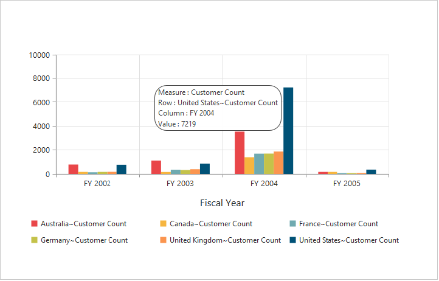
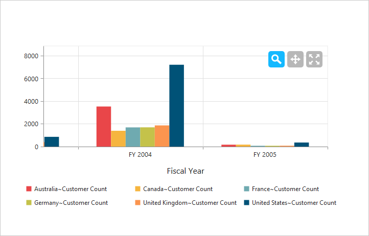
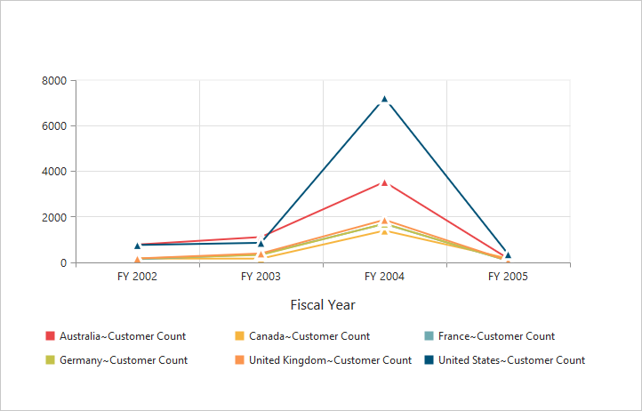
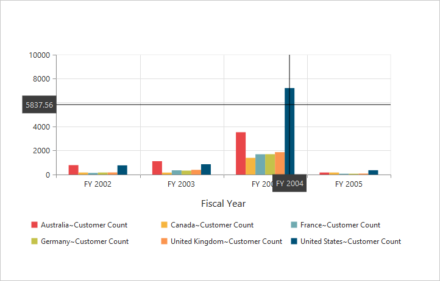
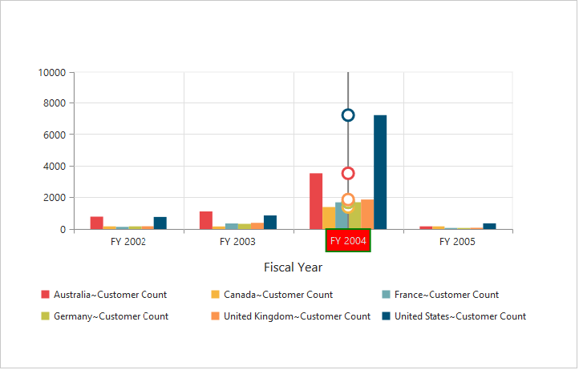
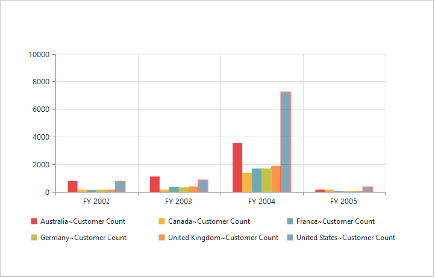

# User Interactions

## Tooltip

### Enable Tooltip for Data Points
Tooltip for the data points can be enabled using the **"Visible"** option of the `Tooltip` property under **"CommonSeriesOptions"** of the PivotChart.



//Enabling tooltip of data point
@Html.EJ().Pivot().PivotChart("PivotChart1").Url(Url.Content("/RelationalChartService.svc")).CommonSeriesOptions(comm => { comm.Tooltip(tool => { tool.Visible(true); })}).Size(size => size.Height("460px").Width("100%"))



 

### Tooltip Template
HTML elements can be displayed inside the tooltip by using the `Template` option. The template option takes the value of the “id” attribute from the HTML element. You can use the **#point.x#** and **#point.y#** as place holders in the HTML element to display the X and Y values of the corresponding data points.



    
 
 
  

    

        

            <label id="ccvalue">&nbsp;#point.y# </label>
            <label id="cc">Customer Count </label>
        

    

//Enabling tooltip of data point
@Html.EJ().Pivot().PivotChart("PivotChart1").Url(Url.Content("/RelationalChartService.svc")).CommonSeriesOptions(comm => { comm.Tooltip(tool => { tool.Visible(true).Template("Tooltip"); });}).Size(size => size.Height("460px").Width("100%"))



 

### Tooltip Customization
By using `Fill` and `Border` properties of tooltip, you can customize its background color, border color and border width.



//Change tooltip color and border
@Html.EJ().Pivot().PivotChart("PivotChart1").Url(Url.Content("/RelationalChartService.svc")).CommonSeriesOptions(comm => { comm.Tooltip(tool => { tool.Visible(true). Fill("#FF9933").Border(border => border.Width(1).Color("#993300")); });}).Size(size => size.Height("460px").Width("100%"))

   

 

### Tooltip with Rounded Corners
The tooltip properties, `RX` and `RY` are used to customize its corner radius.



//Customize the corner radius of the tooltip rectangle.
@Html.EJ().Pivot().PivotChart("PivotChart1").Url(Url.Content("/RelationalChartService.svc")).CommonSeriesOptions(comm => { comm.Tooltip(tool => { tool.Visible(true).RX(50).RY(50);});}).Size(size => size.Height("460px").Width("100%"))

 

 

## Zooming and Panning

### Enable Zooming

There are two ways to zoom the Chart:

* When `zooming.Enable` option is set to true, you can zoom the Chart by using rubber band selection.
* When `zooming.EnableMouseWheel` option is set to true, you can zoom the Chart on mouse wheel scrolling.



//Enable zooming in chart
@Html.EJ().Pivot().PivotChart("PivotChart1").Zooming(zoom=> zoom.Enable(true)).Url(Url.Content("/RelationalChartService.svc")).Size(size => size.Height("460px").Width("950px"))

 

 

After zooming the Chart, a zooming toolbar will appear with options to *zoom, pan and reset*. Selecting the **“Pan”** option will allow to view the Chart and selecting the **“Reset”** option will reset the zoomed Chart.

 

### Types of Zooming
You can zoom the particular axis like horizontal axis or vertical axis or both axis using `Type` option in zooming.

N> By default, the value for the `Type` option in zooming is “x,y” (indicating both axis) in PivotChart.



//Enable horizontal zooming 
@Html.EJ().Pivot().PivotChart("PivotChart1").Zooming(zoom=> zoom.Enable(true).Type("x")).Url(Url.Content("/RelationalChartService.svc")).Size(size => size.Height("460px").Width("950px"))



### Enable Scrollbar

* When `zooming.EnableScrollbar` option is set to true, the PivotChart is rendered along with the scroll bars for precise view of data. The data can be viewed by using scroll bar or by using mouse wheel scrolling.



@Html.EJ().Pivot().PivotChart("PivotChart1").Zooming(zoom => { zoom.EnableScrollbar(true); })

 

## Marker and Crosshair

### Marker Shape Customization
In PivotChart, you can customize the marker `shape` with following symbols.

* Rectangle
* Circle
* Cross
* Diamond 
* Pentagon
* Hexagon
* Star
* Ellipse
* Triangle etc.



@Html.EJ().Pivot().PivotChart("PivotChart1").Url(Url.Content("/RelationalChartService.svc")).CommonSeriesOptions(comm => { comm.Type(SeriesType.Line);}).Size(size => size.Height("460px").Width("950px")).ClientSideEvents(
    oEve => { oEve.SeriesRendering("onSeriesRenders"); })



 

### Enable Crosshair and Crosshair Label
Crosshair helps you to view the value at mouse position or touch contact point. Crosshair can be enabled by using the `Visible` option in `CrossHair` property. Crosshair label can be enabled by using the **“Visible”** option in `CrosshairLabel` property within its corresponding axis.



//Initializing Crosshair and crosshair label  
@Html.EJ().Pivot().PivotChart("PivotChart1").CrossHair(crossHair => crossHair.Visible(true)).PrimaryXAxis(primaryX => primaryX.CrosshairLabel(crosshairlabel => crosshairlabel.Visible(true))).Url(Url.Content("/RelationalChartService.svc")).Size(size => size.Height("460px").Width("950px"))



 

### Crosshair Line and Label Customization
By using `Line` property of crosshair, you can customize its line color and width. Also by using `Fill` and `Border` properties of crosshair label, you can customize its background color, border color and border width.



//Customizing the crosshair label background color and border 
@Html.EJ().Pivot().PivotChart("PivotChart1").CrossHair(crossHair => crossHair.Line(line => line.Color("gray").Width(2)).Visible(true)).PrimaryXAxis(primaryX => primaryX.CrosshairLabel(crosshairlabel => crosshairlabel.Visible(true).Fill("red").Border(border => border.Color("green").Width(2)))).PrimaryYAxis(primaryy => primaryy.CrosshairLabel(crosshairlabel => crosshairlabel.Visible(true))).Url(Url.Content("/RelationalChartService.svc")).Size(size => size.Height("460px").Width("950px")) 



 

## Trackball

### Enable trackball
Trackball can be enabled by setting both - 'Visible' option of the crosshair to true and `Type` option of the crosshair to **“Trackball”.** The default value of type is **“Crosshair”.**



//Change crosshair type to track ball
@Html.EJ().Pivot().PivotChart("PivotChart1").CrossHair(crossHair => crossHair.Visible(true).Type(CrosshairType.Trackball)).Url(Url.Content("/RelationalChartService.svc")).Size(size => size.Height("460px").Width("950px"))



 

### Trackball Marker and Line Customization
Shape and size of the trackball marker can be customized using the `Shape` and `Size` options of the crosshair marker. Color and width of the trackball line can be customized using the **“Line”** option in the crosshair.



//Customize the trackball line color and width and Marker visible and shape 
@Html.EJ().Pivot().PivotChart("PivotChart1").CrossHair(crossHair => crossHair.Visible(true).Type(CrosshairType.Trackball).Line(line => line.Color("#800000").Width(2)).Marker(marker => marker.Shape(ChartShape.Pentagon).Size(size => size.Height(9).Width(9)).Visible(true))).Url(Url.Content("/RelationalChartService.svc")).Size(size => size.Height("460px").Width("950px"))

 

 

## Highlight
PivotChart provides highlighting support for the series and data points on mouse hover. To enable highlighting, set the **“enable”** property to true in the `highlightSettings` option of the series.



@Html.EJ().Pivot().PivotChart("PivotChart1").Url(Url.Content("/RelationalChartService.svc")).Size(size => size.Height("460px").Width("950px")).ClientSideEvents(
    oEve => { oEve.SeriesRendering("onSeriesRenders"); })

 

### Highlight Mode
You can set three different modes for highlighting data points and series by using the `mode` property of the `highlightSettings`.
 
* series
* points
* cluster



@Html.EJ().Pivot().PivotChart("PivotChart1").Url(Url.Content("/RelationalChartService.svc")).Size(size => size.Height("460px").Width("950px")).ClientSideEvents(
    oEve => { oEve.SeriesRendering("onSeriesRenders"); })

 

 

### Customize the Highlight Styles
To customize the highlighted series, use `border.color`, `border.width` and `opacity`
 options in the `highlightSettings` property.



@Html.EJ().Pivot().PivotChart("PivotChart1").Url(Url.Content("/RelationalChartService.svc")).Size(size => size.Height("460px").Width("950px")).ClientSideEvents(
    oEve => { oEve.SeriesRendering("onSeriesRenders"); })

 

 

### Patterns to Highlight
PivotChart provides pattern support for highlighting the data by setting an appropriate value to the `pattern` property of the `highlightSettings`. The different types of highlight patterns are as follows.

* chessboard
* crosshatch
* dots
* pacman
* grid
* turquoise
* star
* triangle
* circle
* tile
* horizontalDash
* verticalDash
* rectangle
* box
* verticalStripe
* horizontalStripe
* bubble
* diagonalBackward
* diagonalForward



@Html.EJ().Pivot().PivotChart("PivotChart1").Url(Url.Content("/RelationalChartService.svc")).Size(size => size.Height("460px").Width("950px")).ClientSideEvents(
    oEve => { oEve.SeriesRendering("onSeriesRenders"); })

 

 

## Selection
PivotChart provides selection support for the series and data points on mouse click. To enable selection, set the **“enable”** property to true in the `selectionSettings` option of the series.



@Html.EJ().Pivot().PivotChart("PivotChart1").Url(Url.Content("/RelationalChartService.svc")).Size(size => size.Height("460px").Width("950px")).ClientSideEvents(
    oEve => { oEve.SeriesRendering("onSeriesRenders"); })



### Selection Mode

You can set three different selection mode for highlighting the data points and series by using the `mode` property of the `selectionSettings`.

* series
* points
* cluster



@Html.EJ().Pivot().PivotChart("PivotChart1").Url(Url.Content("/RelationalChartService.svc")).Size(size => size.Height("460px").Width("950px")).ClientSideEvents(
    oEve => { oEve.SeriesRendering("onSeriesRenders"); })



 

### Customize the Selection Styles
To customize the selection styles, use the `border.color`, `border.width` and `opacity` options in the `selectionSettings`.



@Html.EJ().Pivot().PivotChart("PivotChart1").Url(Url.Content("/RelationalChartService.svc")).Size(size => size.Height("460px").Width("950px")).ClientSideEvents(
    oEve => { oEve.SeriesRendering("onSeriesRenders"); })



 

### Patterns for Selection
PivotChart provides pattern support for the selecting the data by setting an appropriate value to the `pattern` property of the `selectionSettings` option. The different types of selection patterns are as follows.

* chessboard
* crosshatch
* dots
* pacman
* grid
* turquoise
* star
* triangle
* circle
* tile
* horizontalDash
* verticalDash
* rectangle
* box
* verticalStripe
* horizontalStripe
* bubble
* diagonalBackward
* diagonalForward



@Html.EJ().Pivot().PivotChart("PivotChart1").Url(Url.Content("/RelationalChartService.svc")).Size(size => size.Height("460px").Width("950px")).ClientSideEvents(
    oEve => { oEve.SeriesRendering("onSeriesRenders"); })



 
