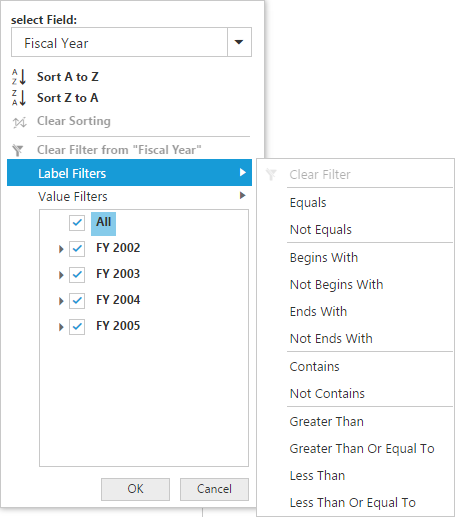

# Advanced Filtering and Sorting

It allows to filter and sort the field members in PivotClient.

### Client Mode

In client mode, you can enable Advanced Filtering and Sorting option in PivotClient by setting the `EnableAdvancedFilter` property under `DataSource` to true.



@Html.EJ().Pivot().PivotClient("PivotClient1").DataSource(dataSource => dataSource.EnableAdvancedFilter(true))



### Server Mode

In server mode, you can enable the Advanced Filtering and Sorting option in PivotClient by setting the `EnableAdvancedFilter` property to true.



@Html.EJ().Pivot().PivotClient("PivotClient1").EnableAdvancedFilter(true)



## Sorting

Sorting provides an option to sort the members of a field either in ascending or descending order.

## Label Filtering

Label filtering provides an option to filter the members of a field purely based on their caption.

## Value Filtering

Value filtering provides an option to filter members based on the total values of the appropriate measure between the members of the level.

