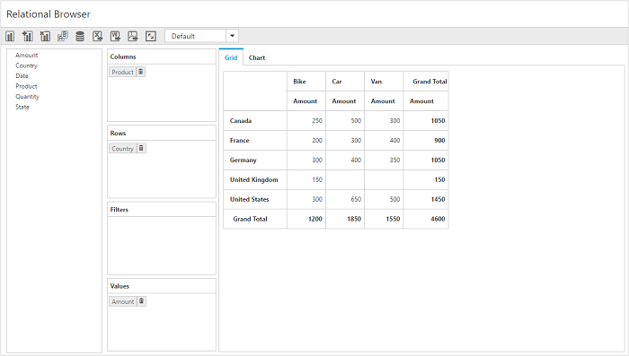
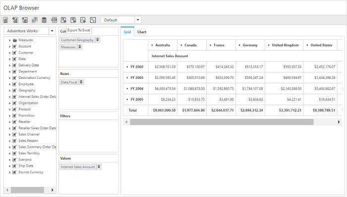

# How to

## Configure pivot client through the model properties

There comes a time when you want to set pivot client properties other than using `PivotClientPropertiesBuilder` i.e., in the Controller side. At that time, you can pass `PivotClientProperties` model instance as a parameter to the pivot client helper method.

We can set properties to pivot client control in server-side using the `PivotClientProperties` class and it is used in the view page with the help of pivot client helper overload.

In addition to the `id` parameter of pivot client helper method, we can also pass `PivotClientProperties` model as another parameter to the pivot client helper method.

### Relational

The following code example explains how to render the pivot client control in relational mode.





    @model Syncfusion.JavaScript.Models.PivotClientProperties
    @(Html.EJ().Pivot().PivotClient("PivotClient", Model))

    





namespace PivotClient
{
    public class PivotClientController: Controller
    {
        public ActionResult PivotClientFeatures()
        {
            Syncfusion.JavaScript.Models.PivotClientProperties pclient = new Syncfusion.JavaScript.Models.PivotClientProperties();

            PivotDataSource pclientDS = new PivotDataSource();

            List<Field> rows = new List<Field>();
            rows.Add(new Field() { FieldName = "Country", FieldCaption = "Country" });
            rows.Add(new Field() { FieldName = "State", FieldCaption = "State" });
            pclientDS.Rows = rows;

            List<Field> cols = new List<Field>();
            cols.Add(new Field() { FieldName = "Product", FieldCaption = "Product" });
            pclientDS.Columns = cols;

             pclient.Load = "load";

            List<Field> values = new List<Field>();
            values.Add(new Field() { FieldName = "Amount" });
            pclientDS.Values = values;
            pclient.DataSource = pclientDS;
            return View(pclient);
        }
    }
}





As a result of the previous code example, the pivot client will be displayed as shown below:

### OLAP

The following code example explains how to render the pivot client control in OLAP mode.





    @model Syncfusion.JavaScript.Models.PivotClientProperties
    @(Html.EJ().Pivot().PivotClient("PivotClient", Model))





namespace PivotClient
{
    public class PivotClientController: Controller
    {
        public ActionResult PivotClientFeatures()
        {
            Syncfusion.JavaScript.Models.PivotClientProperties pclient = new Syncfusion.JavaScript.Models.PivotClientProperties();

            PivotDataSource pclientDS = new PivotDataSource();
            pclientDS.Data = "https://bi.syncfusion.com/olap/msmdpump.dll";
            pclientDS.Cube = "Adventure Works";
            pclientDS.Catalog = "Adventure Works DW 2008 SE";

            List<Field> rows = new List<Field>();
            rows.Add(new Field() { FieldName = "[Date].[Fiscal]" });
            pclientDS.Rows = rows;

            List<Field> cols = new List<Field>();
            cols.Add(new Field() { FieldName = "[Customer].[Customer Geography]" });
            pclientDS.Columns = cols;

            List<MeasuresItems> measures = new List<MeasuresItems>();
            measures.Add(new MeasuresItems() { FieldName = "[Measures].[Internet Sales Amount]" });
            List<Field> values = new List<Field>();
            values.Add(new Field() { Measures = measures, Axis = Syncfusion.JavaScript.AxisName.Column });
            pclientDS.Values = values;
            pclient.DataSource = pclientDS;
            return View(pclient);
        }
    }
}





As a result of the previous code example, the pivot client will be displayed as shown below:

