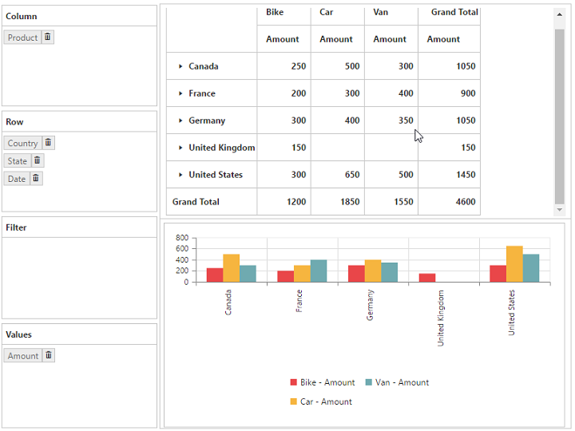
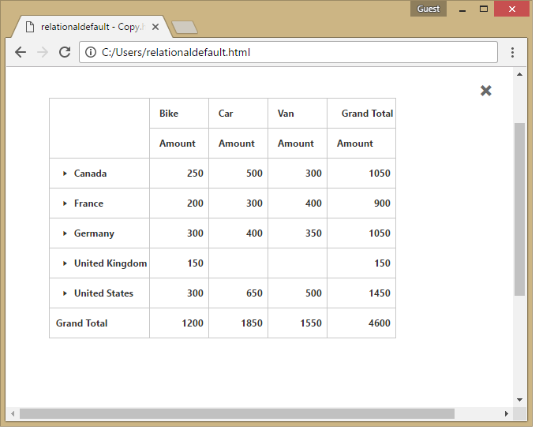
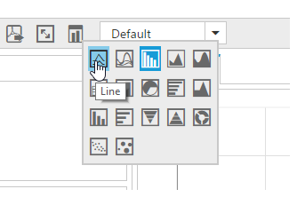
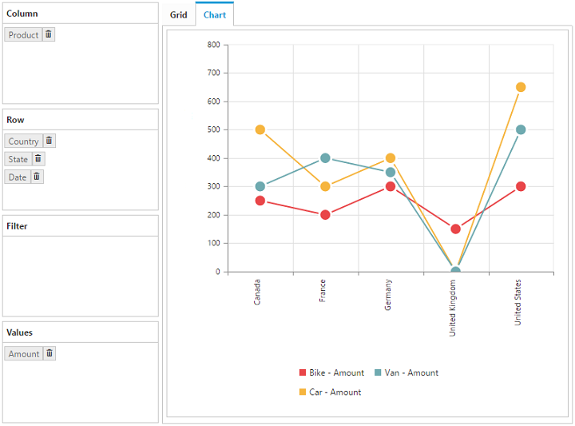
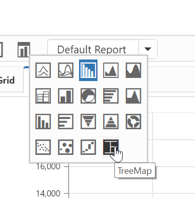
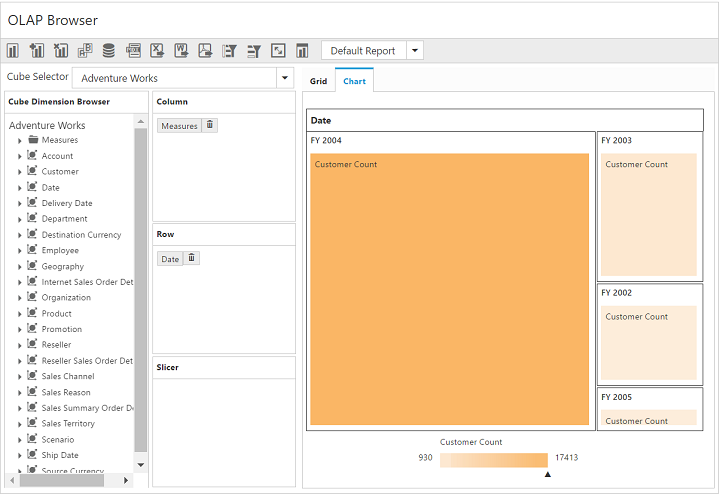

# Layout Customization

## Size

Allows you to render PivotClient in different sizes. You can set height and width under `size` property.

### Set size in Pixels



    @Html.EJ().Pivot().PivotClient("PivotClient1").ClientSideEvents(clientSideEvents => clientSideEvents.Load("onLoad")).DataSource(dataSource => dataSource.Rows(rows => { rows.FieldName("Country").FieldCaption("Country").Add(); }).Columns(columns => { columns.FieldName("Product").FieldCaption("Product").Add(); }).Values(values => { values.FieldName("Amount").Format("currency").Add(); })).size(siz => { siz.Height("685px"); siz.Width("1000px"); })



PivotClient with decreased size from default size.

### Set size in percentage

You can set the PivotClient size in percentage also.

N> Size of the parent container should be set in Pixels.



    @Html.EJ().Pivot().PivotClient("PivotClient1").ClientSideEvents(clientSideEvents => clientSideEvents.Load("onLoad")).DataSource(dataSource => dataSource.Rows(rows => { rows.FieldName("Country").FieldCaption("Country").Add(); }).Columns(columns => { columns.FieldName("Product").FieldCaption("Product").Add(); }).Values(values => { values.FieldName("Amount").Format("currency").Add(); })).size(siz => { siz.Height("80%"); siz.Width("50%"); })



## Control Placement

### Tab View

In Tab view representation, both Grid and Chart will be displayed in separate tabs.  This could be set by using the `ControlPlacement` property under the `DisplaySettings` option.  By default, **Tab** value is set.



    @Html.EJ().Pivot().PivotClient("PivotClient1").ClientSideEvents(clientSideEvents => clientSideEvents.Load("onLoad")).DataSource(dataSource => dataSource.Rows(rows => { rows.FieldName("Country").FieldCaption("Country").Add(); }).Columns(columns => { columns.FieldName("Product").FieldCaption("Product").Add(); }).Values(values => { values.FieldName("Amount").Format("currency").Add(); })).DisplaySettings(displaySettings=>displaySettings.ControlPlacement( PivotClientControlPlacement.Tab))



### Tile View

In Tile View representation, both Grid and Chart will be displayed one above the other, in the same layout. Tile view can be set by using the `ControlPlacement` property under the `DisplaySettings` option.



    @Html.EJ().Pivot().PivotClient("PivotClient1").ClientSideEvents(clientSideEvents => clientSideEvents.Load("onLoad")).DataSource(dataSource => dataSource.Rows(rows => { rows.FieldName("Country").FieldCaption("Country").Add(); }).Columns(columns => { columns.FieldName("Product").FieldCaption("Product").Add(); }).Values(values => { values.FieldName("Amount").Format("currency").Add(); })).DisplaySettings(displaySettings=>displaySettings.ControlPlacement(PivotClientControlPlacement.Tile))



## Default View

### Grid View

To display Grid control by default, set `DefaultView` property under `DisplaySettings` option to **Grid**, which is the default value of the property.



    @Html.EJ().Pivot().PivotClient("PivotClient1").ClientSideEvents(clientSideEvents => clientSideEvents.Load("onLoad")).DataSource(dataSource => dataSource.Rows(rows => { rows.FieldName("Country").FieldCaption("Country").Add(); }).Columns(columns => { columns.FieldName("Product").FieldCaption("Product").Add(); }).Values(values => { values.FieldName("Amount").Format("currency").Add(); })).DisplaySettings(displaySettings=>displaySettings.DefaultView( PivotClientDefaultView.Grid))



### Chart View

To display Chart control by default, set the `DefaultView` property to **Chart**.



    @Html.EJ().Pivot().PivotClient("PivotClient1").ClientSideEvents(clientSideEvents => clientSideEvents.Load("onLoad")).DataSource(dataSource => dataSource.Rows(rows => { rows.FieldName("Country").FieldCaption("Country").Add(); }).Columns(columns => { columns.FieldName("Product").FieldCaption("Product").Add(); }).Values(values => { values.FieldName("Amount").Format("currency").Add(); })).DisplaySettings(displaySettings=>displaySettings.DefaultView( PivotClientDefaultView.Chart))



## Display Mode

### Grid Only

By the `Mode` property under `DisplaySettings` option to **GridOnly**, PivotGrid component alone will get rendered and PivotChart will not be rendered.



    @Html.EJ().Pivot().PivotClient("PivotClient1").ClientSideEvents(clientSideEvents => clientSideEvents.Load("onLoad")).DataSource(dataSource => dataSource.Rows(rows => { rows.FieldName("Country").FieldCaption("Country").Add(); }).Columns(columns => { columns.FieldName("Product").FieldCaption("Product").Add(); }).Values(values => { values.FieldName("Amount").Format("currency").Add(); })).DisplaySettings(displaySettings=>displaySettings.Mode( PivotClientDisplayMode.GridOnly))



### Chart Only

By the `Mode` property under `DisplaySettings` option to **ChartOnly**, PivotChart component alone will get rendered and PivotGrid will not be rendered.



    @Html.EJ().Pivot().PivotClient("PivotClient1").ClientSideEvents(clientSideEvents => clientSideEvents.Load("onLoad")).DataSource(dataSource => dataSource.Rows(rows => { rows.FieldName("Country").FieldCaption("Country").Add(); }).Columns(columns => { columns.FieldName("Product").FieldCaption("Product").Add(); }).Values(values => { values.FieldName("Amount").Format("currency").Add(); })).DisplaySettings(displaySettings=>displaySettings.Mode( PivotClientDisplayMode.ChartOnly))



### Both Chart and Grid

By the `Mode` property under `DisplaySettings` option to **ChartAndGrid**, data is displayed in both Grid and Chart.  This is the default value of the property.



    @Html.EJ().Pivot().PivotClient("PivotClient1").ClientSideEvents(clientSideEvents => clientSideEvents.Load("onLoad")).DataSource(dataSource => dataSource.Rows(rows => { rows.FieldName("Country").FieldCaption("Country").Add(); }).Columns(columns => { columns.FieldName("Product").FieldCaption("Product").Add(); }).Values(values => { values.FieldName("Amount").Format("currency").Add(); })).DisplaySettings(displaySettings=>displaySettings.Mode( PivotClientDisplayMode.ChartAndGrid))



## Toggle Panel

Toggle panel option lets the user to toggle the visibility of Axis Element Builder and Cube Dimension Browser panels in PivotClient with a use of a button. The button could be added to the control by enabling the `EnableTogglePanel` property under `DisplaySettings` option.  This property is disabled by default.



    @Html.EJ().Pivot().PivotClient("PivotClient1").ClientSideEvents(clientSideEvents => clientSideEvents.Load("onLoad")).DataSource(dataSource => dataSource.Rows(rows => { rows.FieldName("Country").FieldCaption("Country").Add(); }).Columns(columns => { columns.FieldName("Product").FieldCaption("Product").Add(); }).Values(values => { values.FieldName("Amount").Format("currency").Add(); })).DisplaySettings(displaySettings=>displaySettings.EnableTogglePanel(true))



## Collapse Toggle Panel By Default

Allows the user to hide “Cube Browser” and “Axis Element Builder” panels while initiating the widget. You can enable this option in PivotClient by setting the `CollapseCubeBrowserByDefault` property to true.



    @Html.EJ().Pivot().PivotClient("PivotClient1").ClientSideEvents(clientSideEvents => clientSideEvents.Load("onLoad")).DataSource(dataSource => dataSource.Rows(rows => { rows.FieldName("Country").FieldCaption("Country").Add(); }).Columns(columns => { columns.FieldName("Product").FieldCaption("Product").Add(); }).Values(values => { values.FieldName("Amount").Format("currency").Add(); })).CollapseCubeBrowserByDefault(true)



## Maximized/Full Screen View

Full screen view helps to visualize the PivotGrid and PivotChart controls inside PivotClient precisely according to the browser window size.  By selecting full screen icon in the toolbar, the control which is in the view gets maximized.  Drilldown action can also be performed in both PivotGrid and PivotChart in the maximized view.  This option is enabled by setting the `EnableFullScreen` property under `DisplaySettings` option to true.  The value is false by default.



    @Html.EJ().Pivot().PivotClient("PivotClient1").ClientSideEvents(clientSideEvents => clientSideEvents.Load("onLoad")).DataSource(dataSource => dataSource.Rows(rows => { rows.FieldName("Country").FieldCaption("Country").Add(); }).Columns(columns => { columns.FieldName("Product").FieldCaption("Product").Add(); }).Values(values => { values.FieldName("Amount").Format("currency").Add(); })).DisplaySettings(displaySettings=>displaySettings.EnableFullScreen(true))



The following screenshot shows the maximized view of PivotGrid.

## Chart Types

While loading the PivotClient initially, the PivotChart widget can be rendered in any one of the available chart types using the `ChartType` property.



    @Html.EJ().Pivot().PivotClient("PivotClient1").ClientSideEvents(clientSideEvents => clientSideEvents.Load("onLoad")).DataSource(dataSource => dataSource.Rows(rows => { rows.FieldName("Country").FieldCaption("Country").Add(); }).Columns(columns => { columns.FieldName("Product").FieldCaption("Product").Add(); }).Values(values => { values.FieldName("Amount").Format("currency").Add(); })).ChartType(PivotChartType.Column)



The `ChartType` property takes Column Chart by default. The types available are Column, Stacking Column, Bar, Stacking Bar, Line, Spline, Step Line, Area, Spline Area, Step Area, Stacking Area, Pie, Funnel and Pyramid.

The Chart Type can also be changed dynamically through the toolbar icon.

### PivotTreeMap

I> This feature is applicable only for OLAP data source bound from server-side.

You can include the PivotTreeMap component as one of the chart types by setting `EnablePivotTreeMap` property to true.



    @Html.EJ().Pivot().PivotClient("PivotClient1").ClientSideEvents(clientSideEvents => clientSideEvents.Load("onLoad")).DataSource(dataSource => dataSource.Rows(rows => { rows.FieldName("Country").FieldCaption("Country").Add(); }).Columns(columns => { columns.FieldName("Product").FieldCaption("Product").Add(); }).Values(values => { values.FieldName("Amount").Format("currency").Add(); })).EnablePivotTreeMap(true)



## Report Toolbar

You can customize the display of toolbar by enabling/disabling the visibility of each of the icons. This can be achieved by setting the properties under `ToolbarIconSettings` option to false. The values are true by default.​​​



    @Html.EJ().Pivot().PivotClient("PivotClient1”).ToolbarIconSettings(toolbaricon => { toolbaricon.EnableAddReport(false).EnableNewReport(false).EnableRemoveReport(false); })



The following screenshot shows after disabling the toolbar icons.

