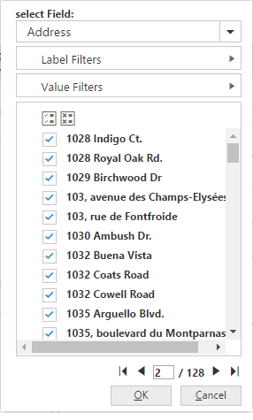

# Member Editor Paging

Member editor paging helps to improve the rendering performance of the dialog by dividing large amount of data into sections and displaying them.

You can enable member editor paging and set member editor page size in PivotClient control by setting the [`EnableMemberEditorPaging`](/js/api/ejpivotclient#members:enableMemberEditorPaging) and [`MemberEditorPageSize`](/js/api/ejpivotclient#members:memberEditorPageSize) properties.



@Html.EJ().Pivot().PivotClient("PivotClient1").EnableMemberEditorPaging(true).MemberEditorPageSize(100)



Following are the navigation option available in Member Editor Pager.
* Move First - Navigates to the first page.
* Move Previous - Navigates to the previous page from the current page.
* Move Next - Navigates to the next page from the current page.
* Move Last - Navigates to the last page.
* Numeric Box - Navigates to the desired page by entering an appropriate page number in numeric value.

