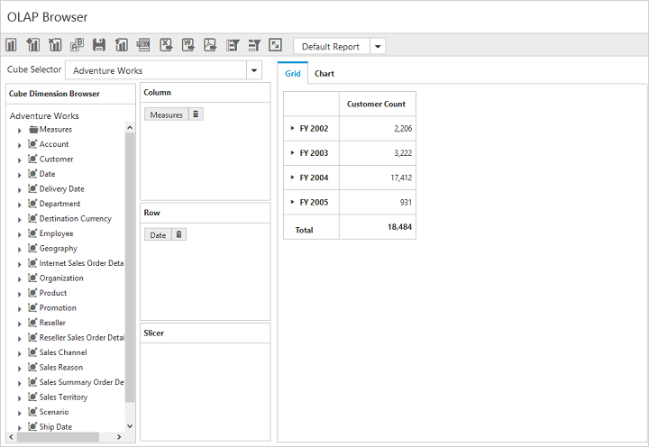

# Data Exploration

## Filtering

### Filtering by Member

After clicking Split button of a dimension, Member Editor dialog opens through which members are filtered by checking and unchecking the check boxes corresponding to the members.  On clicking the "OK" button, based on the selected members in the Member Editor dialog, OlapReport gets updated and refreshes the PivotGrid and PivotChart controls.  The "Cancel" button is used to cancel the selection.

The above filter illustrates that the members France and Germany, along with New South Wales and Queensland are excluded from the Grid and Chart controls.

### Filtering by Value

I> This feature is applicable only for OLAP data source bound from server-side.

The Filtering tab in the Sorting and Filtering dialog box of PivotClient provides the options to apply custom filters on the multi-dimensional data. It enables the user to filter the rows and columns of the selected Measure.

* **Column Filter** - Filters the columns related to the specified measure according to the condition applied for filtering. 
* **Row Filter** - Filters the rows related to the specified measure according to the condition applied for filtering.

Sorting and Filtering dialog box for rows and columns are opened by clicking the corresponding icon in the toolbar.

The following screenshot displays the Filtering tab in Sorting and Filtering dialog box.  

The options in the Filtering tab are as follows:

* **Enabling Filtering** – Enables/Disables the Filtering option.
* **Measure** – The measure for filtering is selected from the collection of measures in drop down list.
* **Condition** – Condition with which the filtering is applied.
* **Value** – Value to compare with each data according to the condition.

The following screenshot displays data before Filtering.

The following screenshot displays the data after Filtering.

## Sorting

The Sorting tab in the Sorting And Filtering dialog box provides the option to sort the results by rows/columns, either in ascending or descending order.
  
* **Column sorting** - Sorts the columns based on the summary values of each column.
* **Row sorting** - Sorts the rows based on the summary values of each row.

Sorting And Filtering dialog box for rows and columns are opened by clicking the corresponding icon in the toolbar.

The following screenshot displays the Sorting And Filtering dialog box.  

The options in the Sorting tab are as follows:

* **Measure** – The measure for sorting is selected from the collection of measures in drop-down list.
* **Order** – Specifies the sorting order.
* **Preserve Hierarchy** – Sorts the records without changing the hierarchy order.

The following screenshot displays the data after applying sorting in ascending order for rows.

## Grouping

The data can be grouped when more than one dimension element is added to column or row in Axis Element Builder.  Based on the order of addition, data is grouped and the report is updated. In the following example, members of the **Date** dimension get grouped, with respect to the members of **Customer** dimension.  Likewise, multiple dimension members can be grouped by dragging the elements from Cube Dimension Browser to Axis Element Builder. 

## Searching

Members can be searched and displayed from the members list inside the Member Editor dialog.

 
