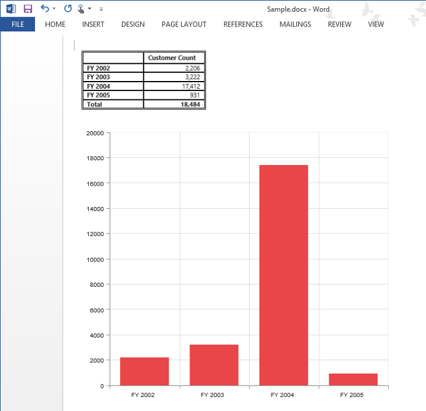

# Exporting

Chart and Grid in the PivotClient widget can be exported to Excel, Word and PDF documents by clicking the respective toolbar icons.

Exporting feature provides an option that allows you to export either PivotChart or PivotGrid or both with the use of the property `ClientExportMode`.  The following code example illustrates the same. 

## JOSN Export

I>By default exporting mode JSON Export will be applied for both server and client mode



    @Html.EJ().Pivot().PivotClient("PivotClient1").ClientSideEvents(clientSideEvents => clientSideEvents.Load("onLoad").BeforeExport("Export")).DataSource(dataSource => dataSource.Rows(rows => { rows.FieldName("Country").FieldCaption("Country").Add(); }).Columns(columns => { columns.FieldName("Product").FieldCaption("Product").Add(); }).Values(values => { values.FieldName("Amount").Format("currency").Add(); })).ClientExportMode(ClientExportMode.ChartAndGrid)

   
    


When PivotGrid is rendered in Client Mode, a method needs to be added in MVC controller file of the application.


       
    public void ExportPivotClient()
    {
       JavaScriptSerializer serializer = new JavaScriptSerializer() { MaxJsonLength = Int32.MaxValue };
       PivotClientExport pivotClient = new PivotClientExport();
       string args = System.Web.HttpContext.Current.Request.Form.GetValues(0)[0];
       pivotClient.ExportPivotClient(string.Empty, args, System.Web.HttpContext.Current.Response);
     }
        


### Customize the export document name

The document name could be customized inside the method in WebAPI Controller. Following code sample illustrates the same.



   @Html.EJ().Pivot().PivotClient("PivotClient1").ClientSideEvents(clientSideEvents => clientSideEvents.Load("onLoad").BeforeExport("Export")).DataSource(dataSource => dataSource.Rows(rows => { rows.FieldName("Country").FieldCaption("Country").Add(); }).Columns(columns => { columns.FieldName("Product").FieldCaption("Product").Add(); }).Values(values => { values.FieldName("Amount").Format("currency").Add(); })).ClientExportMode(ClientExportMode.ChartAndGrid)
   
   
    


The property `ClientExportMode` takes any one of the following value:

* **ChartAndGrid** – Exports both PivotChart and PivotGrid controls. This is the default mode.
* **ChartOnly** – Exports PivotChart control alone.
* **GridOnly** – Exports PivotGrid control alone.

## Pivot Engine Export

I> This feature is applicable only at Server Mode.



    @Html.EJ().Pivot().PivotClient("PivotClient1").Url(Url.Content("/RelationalPivotClient")).ClientExportMode(ClientExportMode.ChartAndGrid).ClientSideEvents(oEve => { oEve.BeforeExport("Export"); })
   
    


For WebAPI controller, the below method needs to be added to perform exporting.



        [System.Web.Http.ActionName("Export")]
        [System.Web.Http.HttpPost]
        public void Export()
        {
            string args = HttpContext.Current.Request.Form.GetValues(0)[0];
            Dictionary<string, string> gridParams = serializer.Deserialize<Dictionary<string, string>>(args);
            pivotClient.PopulateData(gridParams["currentReport"]);
            string fileName = "Sample";
            pivotClient.ExportPivotClient(ProductSales.GetSalesData(), args, fileName, System.Web.HttpContext.Current.Response);
        }



For WCF service, the below service method needs to be added to perform exporting.



        public void Export(System.IO.Stream stream)
        {
            System.IO.StreamReader sReader = new System.IO.StreamReader(stream);
            string args = System.Web.HttpContext.Current.Server.UrlDecode(sReader.ReadToEnd()).Remove(0, 5);
            Dictionary<string, string> gridParams = serializer.Deserialize<Dictionary<string, string>>(args);
            pivotClient.PopulateData(gridParams["currentReport"]);
            string fileName = "Sample";
            pivotClient.ExportPivotClient(ProductSales.GetSalesData(), args, fileName, System.Web.HttpContext.Current.Response);
        }



The below screenshot shows the PivotGrid and PivotChart controls exported to Excel document.

The below screenshot shows the PivotGrid and PivotChart controls exported to Word document.

The below screenshot shows the PivotGrid and PivotChart controls exported to PDF document.

### Customize the export document name

The document name could be customized inside the method in WebAPI Controller. Following code sample illustrates the same.



        [System.Web.Http.ActionName("Export")]
        [System.Web.Http.HttpPost]
        public void Export()
        {
            string args = HttpContext.Current.Request.Form.GetValues(0)[0];
            Dictionary<string, string> gridParams = serializer.Deserialize<Dictionary<string, string>>(args);
            pivotClient.PopulateData(gridParams["currentReport"]);
            string fileName = " File name is customized here ";
            pivotClient.ExportPivotClient(ProductSales.GetSalesData(), args, fileName, System.Web.HttpContext.Current.Response);
        }
        


For customizing name in WCF Service, below code snippet is used.



        public void Export(System.IO.Stream stream)
        {
            System.IO.StreamReader sReader = new System.IO.StreamReader(stream);
            string args = System.Web.HttpContext.Current.Server.UrlDecode(sReader.ReadToEnd()).Remove(0, 5);
            Dictionary<string, string> gridParams = serializer.Deserialize<Dictionary<string, string>>(args);
            pivotClient.PopulateData(gridParams["currentReport"]);
            string fileName = " File name is customized here ";
            pivotClient.ExportPivotClient(ProductSales.GetSalesData(), args, fileName, System.Web.HttpContext.Current.Response);
        }

