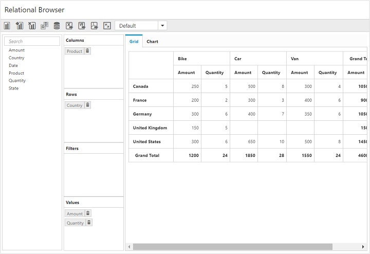
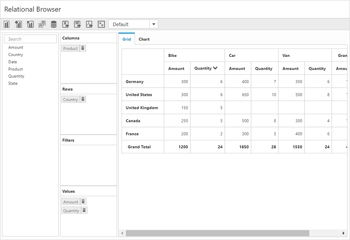

# Value Sorting

I> This feature is applicable only for the relational datasource.

PivotClient provides support for value sorting that allows you to sort columns and rows based on value fields.

The headers of the column to be sorted are given in the `HeaderText` property under `ValueSortSettings` in field wise order separated by a string. The string which is used to separate the headers is given in the `HeaderDelimiters` property.

Also, you can sort the column by clicking the column header. By clicking the same header once again, the sorting direction will be reversed. The sorting operation is performed by the using the `sortOrder` property.

The following code snippet shows how to sort values in descending order.



@Html.EJ().Pivot().PivotClient("PivotClient1").DataSource(dataSource => dataSource.Rows(rows => { rows.FieldName("Country").FieldCaption("Country").Add(); }).Columns(columns => { columns.FieldName("Product").FieldCaption("Product").Add(); }).Values(values => { values.FieldName("Amount").Add(); values.FieldName("Quantity").Add(); })).ValueSortSettings(valuesortsettings=>valuesortsettings.HeaderText("Bike##Quantity").HeaderDelimiters("##").SortOrder(SortOrder.Descending))



The below screenshot shows PivotClient before applying value sorting.

The below screenshot shows PivotClient after applying value sorting.
