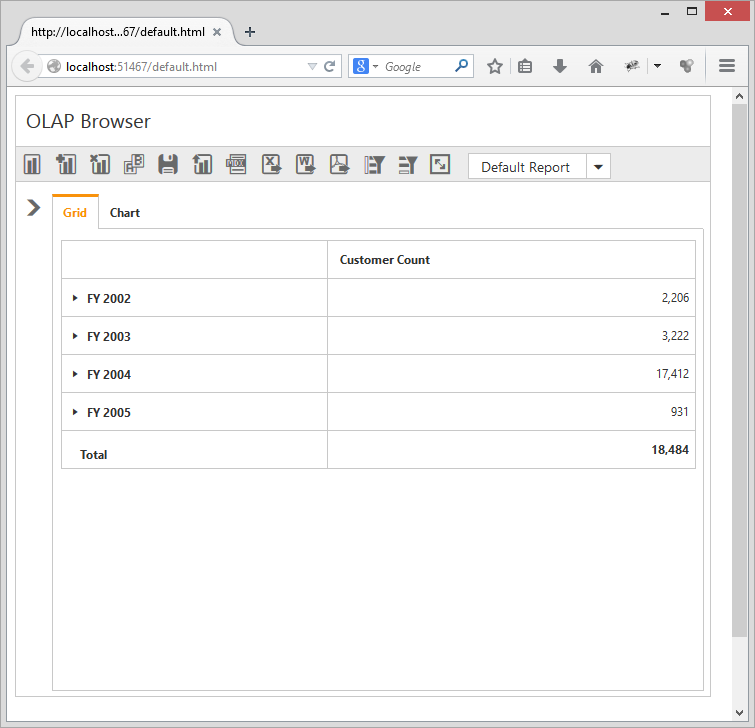

# Responsive Layout

PivotClient widget supports responsive rendering based on the target device (desktop and tablet) resolution. It supports resolution up to 1024x600. You can enable responsiveness in PivotClient by setting `IsResponsive` property to true.



    @Html.EJ().Pivot().PivotClient("PivotClient1").ClientSideEvents(clientSideEvents => clientSideEvents.Load("onLoad")).DataSource(dataSource => dataSource.Rows(rows => { rows.FieldName("Country").FieldCaption("Country").Add(); }).Columns(columns => { columns.FieldName("Product").FieldCaption("Product").Add(); }).Values(values => { values.FieldName("Amount").Format("currency").Add(); })).IsResponsive(true)



