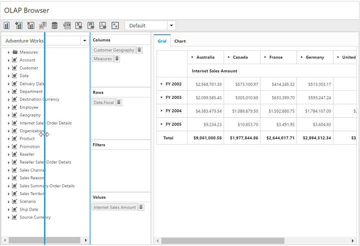

# Splitter

I> This feature is not applicable for OLAP datasource  bound from server-side. 

You can resize Cube Dimension Browser and Axis Element Builder by setting `EnableSplitter` property to true.This property is disabled by default.



    @Html.EJ().Pivot().PivotClient("PivotClient1").ClientSideEvents(clientSideEvents => clientSideEvents.Load("onLoad")).DataSource(dataSource => dataSource.Rows(rows => { rows.FieldName("Country").FieldCaption("Country").Add(); }).Columns(columns => { columns.FieldName("Product").FieldCaption("Product").Add(); }).Values(values => { values.FieldName("Amount").Format("currency").Add(); })).EnableSplitter(true)



