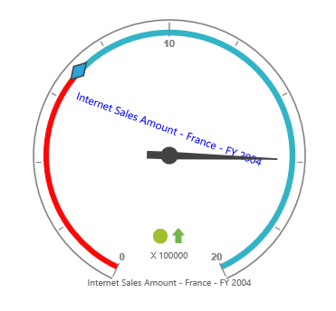
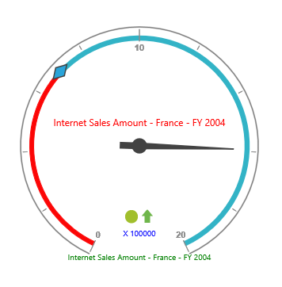

# Custom labels

## Adding Custom Label Collection

Custom label collection can be directly added to the scales option within the PivotGauge control as an array.



    @Html.EJ().Pivot().PivotGauge("PivotGauge1").Scales(scales => {
        scales.CustomLabels(customLabels => { customLabels.Position(position => position.X(180).Y(290)).Add(); }).Add();
    })



## Appearance Customization

The appearance of the custom labels can be customized through the following properties.

* **Position** – used to set the position of the labels.
* **Font** – sets the font size, font style and font family of the label text.
* **Color** – sets the color of the label text.
* **TextAngle** – rotates the label to a specified angle. By default, the value is 0.



    @Html.EJ().Pivot().PivotGauge("PivotGauge1").Scales(scales => {
        scales.CustomLabels(customLabels =>
        {
            customLabels.Position(position => position.X(180).Y(320)).Font(font => font.Size("12px").FontFamily("Segoe UI").FontStyle("Normal")).Color("blue").TextAngle(20).Add();
        }).Add();
    })



 

## Multiple Custom Labels

Multiple custom labels can be set to a PivotGauge Control by adding an array of objects within the `CustomLabels` option.



    @Html.EJ().Pivot().PivotGauge("PivotGauge1").Scales(scales => {
        scales.CustomLabels(customLabels =>
        {
            customLabels.Position(position => position.X(180).Y(150)).Color("red").Add();
            customLabels.Position(position => position.X(180).Y(320)).Color("green").Add();
            customLabels.Position(position => position.X(180).Y(290)).Color("blue").Add();
        }).Add();
    })



 
